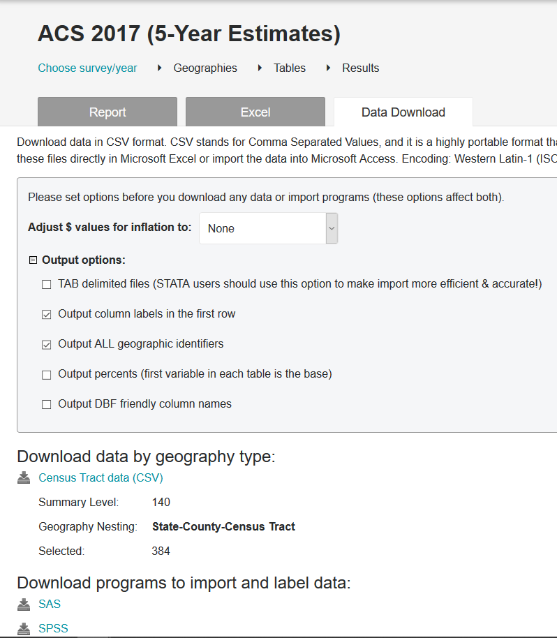

# Census Data from Social Explorer


## Getting Census data from Social Explorer

Social Explorer is a convenient tool to let us get Census data in a relatively clean format. The tool has interactive graphs for a huge number of variables and different levels of geographies for data in the United States. For our purposes we will focus on their Tables feature which lets you select different data sets (we will focus on Census data), select the variables you want, and get an Excel file with that data. We will do this to get tract-level Census data and merge it in with the tract-level shooting data to make some basic scatterplots and correlations. 

For students on Penn's campus you can go directly to [Social Explorer's Website](https://www.socialexplorer.com/explore-maps) since Penn pays for a license to use the site. Otherwise you can go through a link in the school's library website [here](https://franklin.library.upenn.edu/catalog/FRANKLIN_9941110333503681), click "Connect to resource." near the bottom. For those going through the library website, click "Use as guest" on the page it opens up. 

We want a table to click Tables on the left side of the page. And we'll get data from the American Community Surveys (5-Year Estimates). 




Once you click "Census Tract data (CSV)" it'll download a .csv file. I have renamed the file "philly_census_tract_essentials.csv" to give it a more descriptive name. Now we are ready to work with this data and merge it with the shootings data. 


```r
library(readr)
```


```r
tracts <- read_csv("data/philly_census_tract_essentials.csv")
#> Warning: Duplicated column names deduplicated: 'Total Population' =>
#> 'Total Population_1' [59], 'Area (Land)' => 'Area (Land)_1' [61], 'Total
#> Population:' => 'Total Population:_1' [65], 'Total Population:' => 'Total
#> Population:_2' [78]
#> Parsed with column specification:
#> cols(
#>   .default = col_character()
#> )
#> See spec(...) for full column specifications.
```

