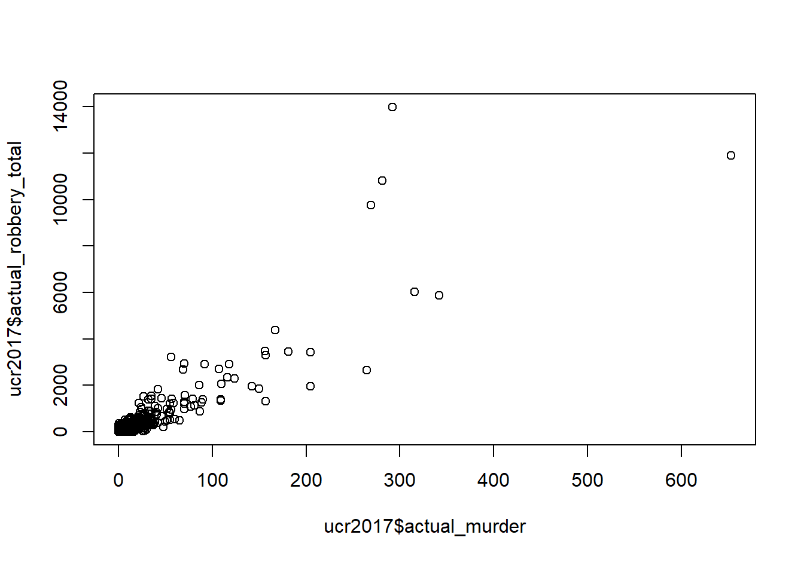
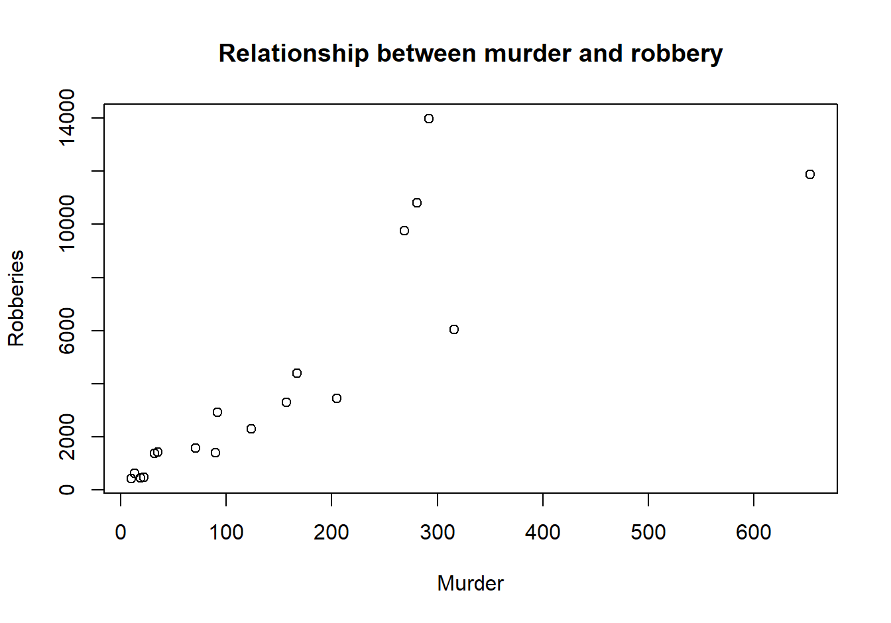

# Exploratory data analysis {#explore}

For this chapter you'll need the following files, which are available for download [here](https://github.com/jacobkap/r4crimz/tree/master/data): ucr2017.rda and offenses_known_yearly_1960_2020.rds.

When you first start working on new data it is important to spend some time getting familiar with the data. This includes understanding how many rows and columns it has, what each row means (is each row an offender? a victim? crime in a city over a day/month/year?, etc.), and what columns it has. **Basically you want to know if the data is capable of answering the question you are asking.**

While not a comprehensive list, the following is a good start for exploratory data analysis of new data sets.

  + What are the units (what does each row represent?)?
  + What variables are available?
  + What time period does it cover?
  + Are there outliers? How many?
  + Are there missing values? How many?

For this lesson we will use a data set of FBI Uniform Crime Reporting (UCR) data for 2017. This data includes every agency that reported their data for all 12 months of the year. Throughout this lesson we will look at some summary statistics for the variables we are interested in and make some basic graphs to visualize the data. 

First, we need to load the data. Make sure your working directory is set to the folder where the data is.


```r
load("data/ucr2017.rda")
```

The function `head()` will print out the first 6 rows of every column in the data. Since we only have 9 columns, we will use this function. Be careful when you have many columns (100+) as printing all of them out makes it read to read.


```r
head(ucr2017)
#>       ori year agency_name  state population actual_murder
#> 1 AK00101 2017   anchorage alaska     296188            27
#> 2 AK00102 2017   fairbanks alaska      32937            10
#> 3 AK00103 2017      juneau alaska      32344             1
#> 4 AK00104 2017   ketchikan alaska       8230             1
#> 5 AK00105 2017      kodiak alaska       6198             0
#> 6 AK00106 2017        nome alaska       3829             0
#>   actual_rape_total actual_robbery_total actual_assault_aggravated
#> 1               391                  778                      2368
#> 2                24                   40                       131
#> 3                50                   46                       206
#> 4                19                    0                        14
#> 5                15                    4                        41
#> 6                 7                    0                        52
```

From these results it appears that each row is a single agency's annual data for 2017 and the columns show the number of crimes for four crime categories included (the full UCR data contains many more crimes which we'll see in a later lesson). 

Finally, we can run `names()` to print out every column name. We can already see every name from `head()` but this is useful when we have many columns and don't want to use `head()`.


```r
names(ucr2017)
#> [1] "ori"                       "year"                     
#> [3] "agency_name"               "state"                    
#> [5] "population"                "actual_murder"            
#> [7] "actual_rape_total"         "actual_robbery_total"     
#> [9] "actual_assault_aggravated"
```

## Summary and Table

An important function in understanding the data you have is `summary()` which, as discussed in Section \@ref(first-steps-to-exploring-data), provides summary statistics on the numeric columns you have. Let's take a look at the results before seeing how to do something similar for categorical columns.


```r
summary(ucr2017)
#>      ori                 year      agency_name       
#>  Length:15764       Min.   :2017   Length:15764      
#>  Class :character   1st Qu.:2017   Class :character  
#>  Mode  :character   Median :2017   Mode  :character  
#>                     Mean   :2017                     
#>                     3rd Qu.:2017                     
#>                     Max.   :2017                     
#>     state             population      actual_murder    
#>  Length:15764       Min.   :      0   Min.   :  0.000  
#>  Class :character   1st Qu.:    914   1st Qu.:  0.000  
#>  Mode  :character   Median :   4460   Median :  0.000  
#>                     Mean   :  19872   Mean   :  1.069  
#>                     3rd Qu.:  15390   3rd Qu.:  0.000  
#>                     Max.   :8616333   Max.   :653.000  
#>  actual_rape_total  actual_robbery_total actual_assault_aggravated
#>  Min.   :  -2.000   Min.   :   -1.00     Min.   :   -1.00         
#>  1st Qu.:   0.000   1st Qu.:    0.00     1st Qu.:    1.00         
#>  Median :   1.000   Median :    0.00     Median :    5.00         
#>  Mean   :   8.262   Mean   :   19.85     Mean   :   49.98         
#>  3rd Qu.:   5.000   3rd Qu.:    4.00     3rd Qu.:   21.00         
#>  Max.   :2455.000   Max.   :13995.00     Max.   :29771.00
```

The `table()` function returns every unique value in a category **and** how often that value appears. Unlike `summary()` we can't just put the entire data set into the (), we need to specify a single column. To specify a column you use the dollar sign notation which is `data$column`. For most functions we use to examine the data as a whole, you can do the same for a specific column. 


```r
head(ucr2017$agency_name)
#> [1] "anchorage" "fairbanks" "juneau"    "ketchikan" "kodiak"   
#> [6] "nome"
```

There are only two columns in our data with categorical values that we can use - *year* and *state* so let's use `table()` on both of them. The columns *ori* and *agency_name* are also categorical but as each row of data has a unique ORI and name, running `table()` on those columns would not be helpful.


```r
table(ucr2017$year)
#> 
#>  2017 
#> 15764
```

We can see that every year in our data is 2017, as expected based on the data name. *year* is a numerical column so why can we use `table()` on it? R doesn't differentiate between numbers and characters when seeing how often each value appears. If we ran `table()` on the column "actual_murder" it would tell us how many times each unique value in the column appeared in the data. That wouldn't be very useful as we don't really care how many times an agency has 7 murders, for example (though looking for how often a numeric column has the value 0 can be helpful in finding likely erroneous data). As numeric variables often have many more unique values than character variables, it also leads to many values being printed, making it harder to understand. For columns where the number of categories is important to us, such as years, states, neighborhoods, we should use `table()`. 


```r
table(ucr2017$state)
#> 
#>              alabama               alaska              arizona 
#>                  305                   32                  107 
#>             arkansas           california             colorado 
#>                  273                  732                  213 
#>          connecticut             delaware district of columbia 
#>                  107                   63                    3 
#>              florida              georgia                 guam 
#>                  603                  522                    1 
#>               hawaii                idaho             illinois 
#>                    4                   95                  696 
#>              indiana                 iowa               kansas 
#>                  247                  216                  309 
#>             kentucky            louisiana                maine 
#>                  352                  192                  135 
#>             maryland        massachusetts             michigan 
#>                  152                  346                  625 
#>            minnesota          mississippi             missouri 
#>                  397                   71                  580 
#>              montana             nebraska               nevada 
#>                  108                  225                   59 
#>        new hampshire           new jersey           new mexico 
#>                  176                  576                  116 
#>             new york       north carolina         north dakota 
#>                  532                  310                  108 
#>                 ohio             oklahoma               oregon 
#>                  532                  409                  172 
#>         pennsylvania         rhode island       south carolina 
#>                 1473                   49                  427 
#>         south dakota            tennessee                texas 
#>                   92                  466                  999 
#>                 utah              vermont             virginia 
#>                  125                   85                  407 
#>           washington        west virginia            wisconsin 
#>                  250                  200                  433 
#>              wyoming 
#>                   57
```

This shows us how many times each state is present in the data. States with a larger population tend to appear more often, this makes sense as those states have more agencies to report. Right now the results are in alphabetical order, but when knowing how frequently something appears, we usually want it ordered by frequency. We can use the `sort()` function to order the results from `table()`. Just put the entire `table()` function inside of the () in `sort()`.


```r
sort(table(ucr2017$state))
#> 
#>                 guam district of columbia               hawaii 
#>                    1                    3                    4 
#>               alaska         rhode island              wyoming 
#>                   32                   49                   57 
#>               nevada             delaware          mississippi 
#>                   59                   63                   71 
#>              vermont         south dakota                idaho 
#>                   85                   92                   95 
#>              arizona          connecticut              montana 
#>                  107                  107                  108 
#>         north dakota           new mexico                 utah 
#>                  108                  116                  125 
#>                maine             maryland               oregon 
#>                  135                  152                  172 
#>        new hampshire            louisiana        west virginia 
#>                  176                  192                  200 
#>             colorado                 iowa             nebraska 
#>                  213                  216                  225 
#>              indiana           washington             arkansas 
#>                  247                  250                  273 
#>              alabama               kansas       north carolina 
#>                  305                  309                  310 
#>        massachusetts             kentucky            minnesota 
#>                  346                  352                  397 
#>             virginia             oklahoma       south carolina 
#>                  407                  409                  427 
#>            wisconsin            tennessee              georgia 
#>                  433                  466                  522 
#>             new york                 ohio           new jersey 
#>                  532                  532                  576 
#>             missouri              florida             michigan 
#>                  580                  603                  625 
#>             illinois           california                texas 
#>                  696                  732                  999 
#>         pennsylvania 
#>                 1473
```

And if we want to sort it in decreasing order of frequency, we can use the parameter `decreasing` in `sort()` and set it to TRUE. A parameter is just an option used in an R function to change the way the function is used or what output it gives. Almost all functions have these parameters and they are useful if you don't want to use the default setting in the function. This parameter, `decreasing` changes the `sort()` output to print from largest to smallest. By default this parameter is set to FALSE and here we say it is equal to TRUE.


```r
sort(table(ucr2017$state), decreasing = TRUE)
#> 
#>         pennsylvania                texas           california 
#>                 1473                  999                  732 
#>             illinois             michigan              florida 
#>                  696                  625                  603 
#>             missouri           new jersey             new york 
#>                  580                  576                  532 
#>                 ohio              georgia            tennessee 
#>                  532                  522                  466 
#>            wisconsin       south carolina             oklahoma 
#>                  433                  427                  409 
#>             virginia            minnesota             kentucky 
#>                  407                  397                  352 
#>        massachusetts       north carolina               kansas 
#>                  346                  310                  309 
#>              alabama             arkansas           washington 
#>                  305                  273                  250 
#>              indiana             nebraska                 iowa 
#>                  247                  225                  216 
#>             colorado        west virginia            louisiana 
#>                  213                  200                  192 
#>        new hampshire               oregon             maryland 
#>                  176                  172                  152 
#>                maine                 utah           new mexico 
#>                  135                  125                  116 
#>              montana         north dakota              arizona 
#>                  108                  108                  107 
#>          connecticut                idaho         south dakota 
#>                  107                   95                   92 
#>              vermont          mississippi             delaware 
#>                   85                   71                   63 
#>               nevada              wyoming         rhode island 
#>                   59                   57                   49 
#>               alaska               hawaii district of columbia 
#>                   32                    4                    3 
#>                 guam 
#>                    1
```
 
## Graphing

We often want to make quick plots of our data to get a visual understanding of the data. We will learn a different - and in my opinion a superior - way to make graphs in Chapters \@ref(graphing-intro) but for now let's use the function `plot()`. The `plot()` function is built into R so we don't need to use any packages for it.

Let's make a few scatterplots showing the relationship between two variables. With `plot()` the syntax (how you write the code) is `plot(x_axis_variable, y_axis_variable)`. So all we need to do is give it the variable for the x- and y-axis. Each dot will represent a single agency (a single row in our data).


```r
plot(ucr2017$actual_murder, ucr2017$actual_robbery_total)
```



Above we are telling R to plot the number of murders on the x-axis and the number of robberies on the y-axis. This shows the relationship between a city's number of murders and number of robberies. We can see that there is a relationship where more murders is correlated with more robberies. However, there are a huge number of agencies in the bottom-left corner which have very few murders or robberies. This makes sense as - as we see in the `summary()` above - most agencies are small, with the median population under 5,000 people. 

To try to avoid that clump of small agencies at the bottom, let's make a new data set of only agencies with a population over 1 million. We will use the `filter()` function from the `dplyr` package that was introduced in Chapter \@ref(subsetting-intro). For `filter()` we need to first include our dataset name, which is ucr2017, and then say our conditional statement. Our conditional statement is that rows in the "population" column have a value of over 1 million. For the `dplyr` functions we don't put our column name in quotes. 

And we'll save our results into a new object called ucr2017_big_cities Since we're using the `dplyr` package we need to tell R that we want to use it by using `library(dplyr)`.


```r
library(dplyr)
#> 
#> Attaching package: 'dplyr'
#> The following objects are masked from 'package:stats':
#> 
#>     filter, lag
#> The following objects are masked from 'package:base':
#> 
#>     intersect, setdiff, setequal, union
ucr2017_big_cities <- filter(ucr2017, population > 1000000) 
```

Now we have 18 agencies with a population of over 1 million people. 

Now we can do the same graph as above but using this new data set.


```r
plot(ucr2017_big_cities$actual_murder, ucr2017_big_cities$actual_robbery_total)
```


The problem is somewhat solved. There is still a small clumping of agencies with few robberies or aggravated assaults but the issue is much better. And interestingly the trend is similar with this small subset of data as with all agencies included.

To make our graph look better, we can add labels for the axes and a title (there are many options for changing the appears of this graph, we will just use these three).

  + xlab - X-axis label
  + ylab - Y-axis label
  + main - Graph title
  
Like all parameters, we add them in the () of `plot()` and separate each parameter by a comma. Since we are adding text to write in the plot, all of these parameter inputs must be in quotes.


```r
plot(ucr2017_big_cities$actual_murder, ucr2017_big_cities$actual_robbery_total,
     xlab = "Murder",
     ylab = "Robberies",
     main = "Relationship between murder and robbery")
```



## Aggregating (summaries of groups) {#aggregate}

Right now we have the number of crimes in each agency. For many policy analyses we'd be looking at the effect on the state as a whole, rather than at the agency-level. If we wanted to do this in our data, we would need to **aggregate** up to the state level. Aggregating data means that we group values at some higher level than they currently are (e.g. from agency to state, from day to month, from city street to city neighborhood) and then do some mathematical operation of our choosing (in our case usually sum) to that group. 

In Section \@ref(subset-colorado-data) we started to see if marijuana legalization affected murder in Colorado. We subsetted the data to only include agencies in Colorado from 2011-2017. Now we can continue to answer the question by aggregating to the state-level to see the total number of murders per year.

Let's think about how our data are and how we would (theoretically, before we write any code) find that out. 

Our data is a single row for each agency and we have a column indicating the year the agency reported. So how would be find out how many murders happened in Colorado for each year? Well, first we take all the agencies in 2011 (the first year available) and add up the murders for all agencies that reported that year. Then take all the rows in 2012 and add up their murders. And so on for all the years. 

To do this in R we'll be using two new functions from the `dplyr` package: `group_by()` and `summarize()`. 

These functions do the aggregation process in two steps. First we use `group_by()` to tell R which columns we want to group our data by - these are the higher level of aggregation columns so in our case will be the year of data (as we will already subset data to only Colorado and only the years 2011 through 2017). Then we need to sum up the number of murders each year. We do this using `summarize()` and we'll specify in the function that we want to sum up the data, rather than use some other math on it like finding the average number of murders each year. 

First, let's load back in the data and then repeat the subsetting code we did in Chapter \@ref(subset-colorado-data) to keep only data for Colorado from 2011 through 2017. We'll also include the "actual_robbery_total" column that we excluded in Chapter \@ref(subset-colorado-data) so we can see how easy it is to aggregate multiple columns at once using this method.


```r
offenses_known_yearly_1960_2020 <- readRDS("data/offenses_known_yearly_1960_2020.rds")
colorado <- filter(offenses_known_yearly_1960_2020, state == "colorado", year %in% 2011:2017)
colorado <- select(colorado, actual_murder, actual_robbery_total, state, year, population, ori, agency_name)
```

First we must group the data by using the `group()` by function. Here we're just grouping the data by year, but we could group it by multiple columns if we want by adding a comma and then the next column we want. 


```r
colorado <- group_by(colorado, year)
```

Now we can summarize the data using the `summarize()` function. As with other `dplyr` functions the first input is the dataset name. Then we choose our math function (sum, mean, median, etc.) and just apply that function on the column we want. So in our case we want the sum of murders so we use `sum()` and include the column we want to aggregate inside of `sum()`'s parentheses. 


```r
summarize(colorado, sum(actual_murder))
#> # A tibble: 7 x 2
#>    year `sum(actual_murder)`
#>   <dbl>                <dbl>
#> 1  2011                  154
#> 2  2012                  163
#> 3  2013                  172
#> 4  2014                  148
#> 5  2015                  173
#> 6  2016                  203
#> 7  2017                  218
```

If we want to aggregate another column we just add a comma after our initial column and add another math operation function and the column we want. Here we're also using `sum()` but we could use different math operations if we want - they don't need to be the same.


```r
summarize(colorado, sum(actual_murder), sum(actual_robbery_total))
#> # A tibble: 7 x 3
#>    year `sum(actual_murder)` `sum(actual_robbery_total)`
#>   <dbl>                <dbl>                       <dbl>
#> 1  2011                  154                        3287
#> 2  2012                  163                        3369
#> 3  2013                  172                        3122
#> 4  2014                  148                        3021
#> 5  2015                  173                        3305
#> 6  2016                  203                        3513
#> 7  2017                  218                        3811
```

We could even do different math operations on the same column and we'd get multiple columns from it. Let's add another column showing the average number of robberies as an example.


```r
summarize(colorado, sum(actual_murder), sum(actual_robbery_total), mean(actual_robbery_total))
#> # A tibble: 7 x 4
#>    year `sum(actual_murder)` `sum(actual_robbery~ `mean(actual_robber~
#>   <dbl>                <dbl>                <dbl>                <dbl>
#> 1  2011                  154                 3287                11.2 
#> 2  2012                  163                 3369                11.2 
#> 3  2013                  172                 3122                10.3 
#> 4  2014                  148                 3021                 9.94
#> 5  2015                  173                 3305                10.9 
#> 6  2016                  203                 3513                11.6 
#> 7  2017                  218                 3811                12.5
```

By default `summarize()` calls the columns it makes using what we include in the parentheses. Since we said "sum(actual_murder)" to get the sum of the murder column, it names that new column "sum(actual_murder)". Usually we'll want to name the columns ourselves. We can do this by assigning the summarized column to a name using "name = " before it. For example, we could write "murders = sum(actual_murder)" and it will name that column "murders" instead of "sum(actual_murder)". Like other things in `dplyr` functions, we don't need to put quotes around our new column name. We'll save this final summarized data into an object called "colorado_agg" so we can use it to make graphs. And to be able to create crime rates per population, we'll also find the sum of the population for each year.


```r
colorado_agg <- summarize(colorado, murders = sum(actual_murder), robberies = sum(actual_robbery_total), population = sum(population))
colorado_agg
#> # A tibble: 7 x 4
#>    year murders robberies population
#>   <dbl>   <dbl>     <dbl>      <dbl>
#> 1  2011     154      3287    5155993
#> 2  2012     163      3369    5227884
#> 3  2013     172      3122    5308236
#> 4  2014     148      3021    5402555
#> 5  2015     173      3305    5505856
#> 6  2016     203      3513    5590124
#> 7  2017     218      3811    5661529
```

Now we can see that the total number of murders increased over time. So can we conclude that marijuana legalization increases murder? No, all this analysis shows is that the years following marijuana legalization, murders increased in Colorado. But that can be due to many reasons other than marijuana. For a proper analysis you'd need a comparison area that is similar to Colorado prior to legalization (and didn't legalize marijuana) and see if their murders changes following Colorado's legalization.

To control for population, we'll standardize our murder data by creating a murder rate per 100,000 people. We can do this by dividing the murder column by the population column and then multiplying by 100,000. Let's do that and save the result into a new column called "murder_rate".


```r
colorado_agg$murder_rate <- colorado_agg$murders / colorado_agg$population * 100000
```

If we also wanted a robbery rate we'd do the same with the robberies column.


```r
colorado_agg$robbery_rate <- colorado_agg$robberies / colorado_agg$population * 100000
```

The `dplyr` package has a helpful function that can do this too, and allows us to do it while writing less code. The `mutate()` function lets us create or alter columns in our data. Like other `dplyr` functions we start by including our dataset in the parentheses, and then we can follow standard assignment (covered in Section \@ref(assignment)) though we must use `=` here and not `<-`. A benefit of using `mutate()` is that we don't have to write out our dataset name each time. So we'd write `murder_rate = murders / population * 100000`. And if we wanted to make two (or more) columns at the same time we just add a comma after our first assignment and then do the next assignment. 


```r
mutate(colorado_agg, murder_rate = murders / population * 100000, robbery_rate = robberies / population * 100000)
#> # A tibble: 7 x 6
#>    year murders robberies population murder_rate robbery_rate
#>   <dbl>   <dbl>     <dbl>      <dbl>       <dbl>        <dbl>
#> 1  2011     154      3287    5155993        2.99         63.8
#> 2  2012     163      3369    5227884        3.12         64.4
#> 3  2013     172      3122    5308236        3.24         58.8
#> 4  2014     148      3021    5402555        2.74         55.9
#> 5  2015     173      3305    5505856        3.14         60.0
#> 6  2016     203      3513    5590124        3.63         62.8
#> 7  2017     218      3811    5661529        3.85         67.3
```


Mpw let's make a plot of this data showing the murder rate over time. With time-series graphs we want the time variable to be on the x-axis and the numeric variable we are measuring to the on the y-axis.


```r
plot(x = colorado_agg$year, y = colorado_agg$murder_rate)
```


By default `plot()` makes a scatterplot. If we set the parameter `type` to "l" it will be a **l**ine plot. 


```r
plot(x = colorado_agg$year, y = colorado_agg$murder_rate, type = "l")
```


We can add some labels and a title to make this graph easier to read.


```r
plot(x = colorado_agg$year, y = colorado_agg$murder_rate, type = "l",
     xlab = "Year",
     ylab = "Murders per 100k Population",
     main = "Murder Rate in Colorado, 2011-2017")
```


## Pipes in `dplyr` {#dplyr-pipes}

To end this chapter we'll talk about something called a pipe that is a very useful and powerful part of `dplyr`. 

Think about the math equation 1 + 2 + 3 + 4. Here we know that we add 1 and 2 together, and then add the result to 3 and then add the result of that to 4. This is much simpler to write than splitting everything up and summing each value together in a different line. In terms of R, we have so far been doing things as if we could only add two numbers together and then need a separate line to add the third (and another line to add the fourth) number. For example, below are the two lines of code we used to subset the data to just the right state and years we wanted, and the columns we wanted. We did this in two separate lines. In our math example, we did 1 + 2. And then found the answer, and separately did 3 + 3. And then again found the answer and did 6 + 4.


```r
colorado <- filter(offenses_known_yearly_1960_2020, state == "colorado", year %in% 2011:2017)
colorado <- select(colorado, actual_murder, actual_robbery_total, state, year, population, ori, agency_name)
head(colorado)
#>   actual_murder actual_robbery_total    state year population     ori
#> 1             7                   80 colorado 2017      99940 CO00100
#> 2            11                   93 colorado 2016     100526 CO00100
#> 3             6                   68 colorado 2015     100266 CO00100
#> 4             6                   58 colorado 2014      98569 CO00100
#> 5             7                   44 colorado 2013      97146 CO00100
#> 6             7                   55 colorado 2012      93542 CO00100
#>   agency_name
#> 1       adams
#> 2       adams
#> 3       adams
#> 4       adams
#> 5       adams
#> 6       adams
```

In R we actually do have a way to chain together functions; to do the programming equivalent of 1 + 2 + 3 + 4 all at once. We do this through what is called a pipe, which allows us to take the result of one function and immediately put it into another function without having to save the initial result or start a new line of code. To use a pipe we put the following code after the end of a function: `%>%`. These three characters, `%>%` are the pipe and they must be written exactly like this. The pipe is itself actually a function, but is a special type of function we won't go into detail about. Personally I don't think this really looks like a pipe at all but it is called a pipe so that's the terminology I'll be using. How a pipe technically works is that it takes the output of the initial function (which is usually a data.frame) and puts it automatically is the first input in the next function. This won't work for all functions but nearly all functions from the tidyverse collection of packages have a dataset as the first input so it will work here. The benefit is that we don't need to keep saving out output from functions or specify which dataset to include in each function.

As an example, we'll rewrite the above code using a pipe. We start with our data.frame which is normally the first input the the function, and then immediately have a pipe `%>%` into a `dplyr` function, which here is `filter()`. Now we don't need to say what the dataset is because we it takes the last thing that was piped into the function, which in our case is the entire data.frame offenses_known_yearly_1960_2020. After our `filter()` is done we have another pipe and go into `select()`. Now `select()` will use as its first input (which is the data it is working with) as whatever is outputting from the `filter()`. So the input to `select()` will be the subsetted data output from `filter()`. We can have as many pipes as we wish, and chain many different `dplyr` functions together, but we just use two functions here so we'll end after our `select()` function. 


```r
colorado <- offenses_known_yearly_1960_2020 %>%  filter(state == "colorado", year %in% 2011:2017) %>%   select(actual_murder, actual_robbery_total, state, year, population, ori, agency_name)
```

If we check results using `head()`, we can see that this code is exactly the same as not using pipes.


```r
head(colorado)
#>   actual_murder actual_robbery_total    state year population     ori
#> 1             7                   80 colorado 2017      99940 CO00100
#> 2            11                   93 colorado 2016     100526 CO00100
#> 3             6                   68 colorado 2015     100266 CO00100
#> 4             6                   58 colorado 2014      98569 CO00100
#> 5             7                   44 colorado 2013      97146 CO00100
#> 6             7                   55 colorado 2012      93542 CO00100
#>   agency_name
#> 1       adams
#> 2       adams
#> 3       adams
#> 4       adams
#> 5       adams
#> 6       adams
```


The normal way to write code using pipes is to have a new line after the pipe and after each comma in `filter()` and `select()`. This doesn't change how the code works at all, but is easier to read now because it has less code bunched together in a single line.


```r
colorado <- offenses_known_yearly_1960_2020 %>%
  filter(state == "colorado",
         year %in% 2011:2017) %>%
  select(actual_murder, 
         actual_robbery_total,
         state, 
         year,
         population,
         ori, 
         agency_name)
```


