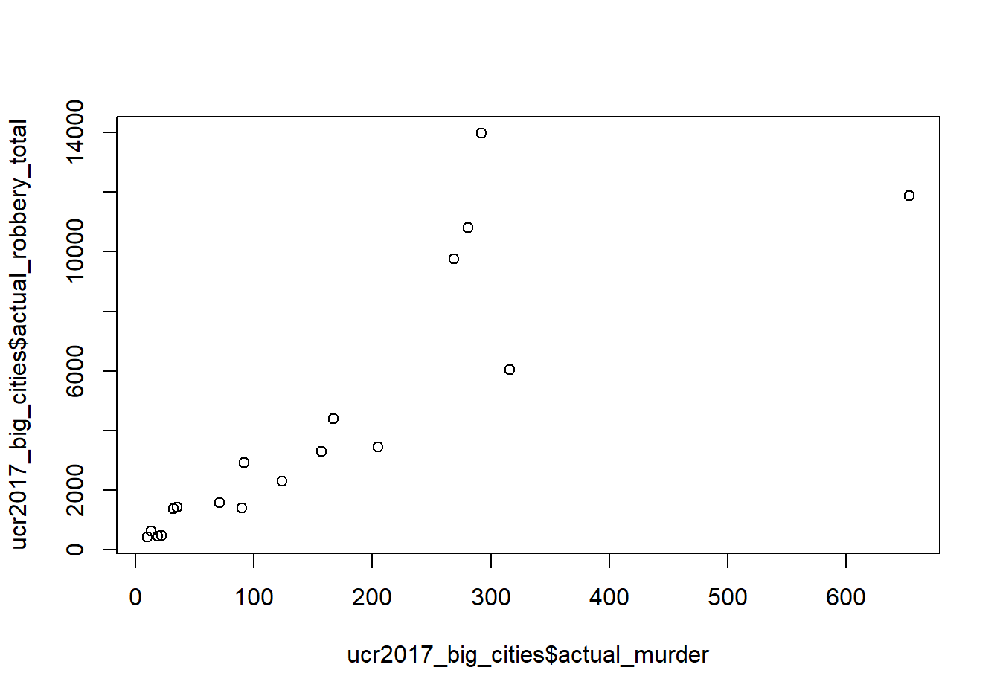
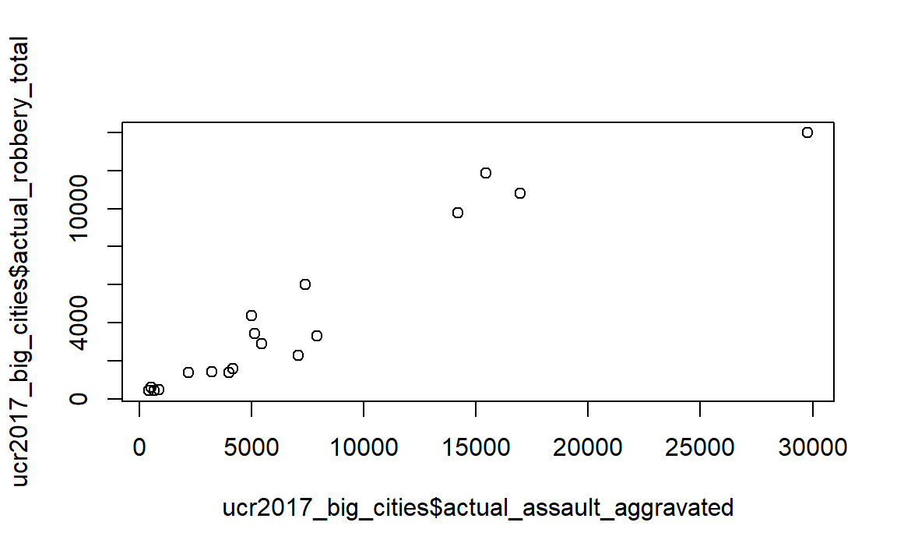
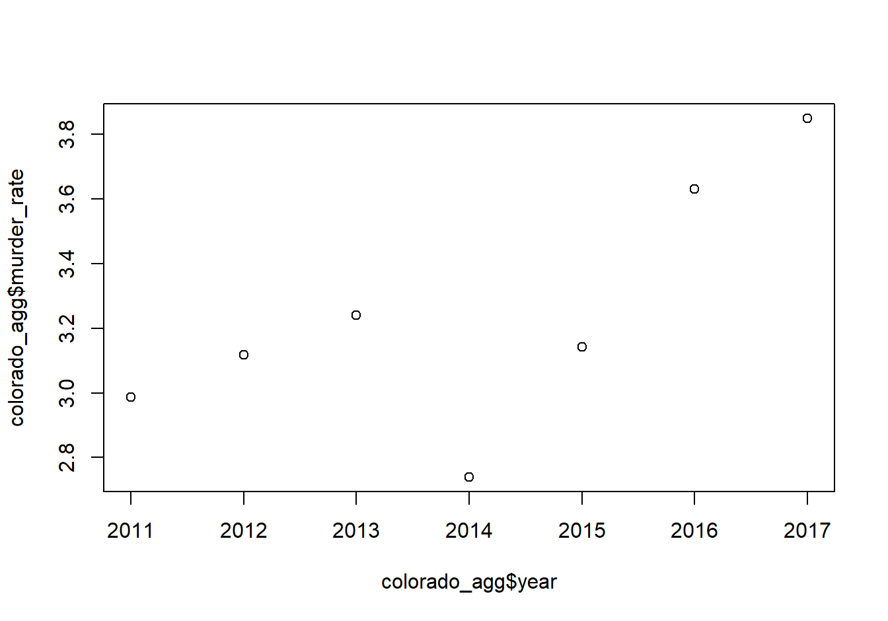
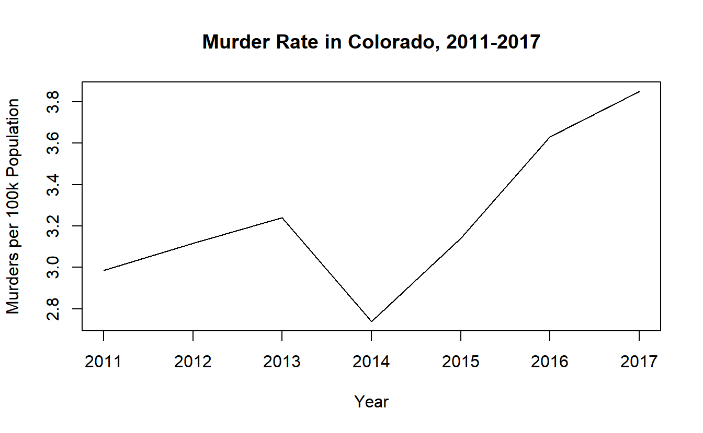

# Exploratory data analysis {#explore}

For this chapter you'll need the following files, which are available for download [here](https://github.com/jacobkap/r4crimz/tree/master/data): ucr2017.rda and offenses_known_yearly_1960_2020.rds.

When you first start working on new data it is important to spend some time getting familiar with the data. This includes understanding how many rows and columns it has, what each row means (is each row an offender? a victim? crime in a city over a day/month/year?, etc.), and what columns it has. **Basically you want to know if the data is capable of answering the question you are asking.**

While not a comprehensive list, the following is a good start for exploratory data analysis of new data sets.

  + What are the units (what does each row represent?)?
  + What variables are available?
  + What time period does it cover?
  + Are there outliers? How many?
  + Are there missing values? How many?

For this lesson we will use a data set of FBI Uniform Crime Reporting (UCR) data for 2017. This data includes every agency that reported their data for all 12 months of the year. Throughout this lesson we will look at some summary statistics for the variables we are interested in and make some basic graphs to visualize the data. 

First, we need to load the data. Make sure your working directory is set to the folder where the data is.


```r
load("data/ucr2017.rda")
```

As a first step, let's see how many rows and columns are in the data, and glance at the first several rows from each column. `nrow()` and `ncol()` tell us the number of rows and columns it has, respectively. Like most functions, what you need to do is put the data set name inside the () (exactly as it is spelled without any quotes).


```r
nrow(ucr2017)
#> [1] 15764
```


```r
ncol(ucr2017)
#> [1] 9
```

The function `head()` will print out the first 6 rows of every column in the data. Since we only have 9 columns, we will use this function. Be careful when you have many columns (100+) as printing all of them out makes it read to read.


```r
head(ucr2017)
#>       ori year agency_name  state population
#> 1 AK00101 2017   anchorage alaska     296188
#> 2 AK00102 2017   fairbanks alaska      32937
#> 3 AK00103 2017      juneau alaska      32344
#> 4 AK00104 2017   ketchikan alaska       8230
#> 5 AK00105 2017      kodiak alaska       6198
#> 6 AK00106 2017        nome alaska       3829
#>   actual_murder actual_rape_total actual_robbery_total
#> 1            27               391                  778
#> 2            10                24                   40
#> 3             1                50                   46
#> 4             1                19                    0
#> 5             0                15                    4
#> 6             0                 7                    0
#>   actual_assault_aggravated
#> 1                      2368
#> 2                       131
#> 3                       206
#> 4                        14
#> 5                        41
#> 6                        52
```

From these results it appears that each row is a single agency's annual data for 2017 and the columns show the number of crimes for four crime categories included (the full UCR data contains many more crimes which we'll see in a later lesson). 

Finally, we can run `names()` to print out every column name. We can already see every name from `head()` but this is useful when we have many columns and don't want to use `head()`.


```r
names(ucr2017)
#> [1] "ori"                      
#> [2] "year"                     
#> [3] "agency_name"              
#> [4] "state"                    
#> [5] "population"               
#> [6] "actual_murder"            
#> [7] "actual_rape_total"        
#> [8] "actual_robbery_total"     
#> [9] "actual_assault_aggravated"
```

## Summary and Table

An important function in understanding the data you have is `summary()` which, as discussed in Section \@ref(first-steps-to-exploring-data), provides summary statistics on the numeric columns you have. Let's take a look at the results before seeing how to do something similar for categorical columns.


```r
summary(ucr2017)
#>      ori                 year      agency_name       
#>  Length:15764       Min.   :2017   Length:15764      
#>  Class :character   1st Qu.:2017   Class :character  
#>  Mode  :character   Median :2017   Mode  :character  
#>                     Mean   :2017                     
#>                     3rd Qu.:2017                     
#>                     Max.   :2017                     
#>     state             population      actual_murder    
#>  Length:15764       Min.   :      0   Min.   :  0.000  
#>  Class :character   1st Qu.:    914   1st Qu.:  0.000  
#>  Mode  :character   Median :   4460   Median :  0.000  
#>                     Mean   :  19872   Mean   :  1.069  
#>                     3rd Qu.:  15390   3rd Qu.:  0.000  
#>                     Max.   :8616333   Max.   :653.000  
#>  actual_rape_total  actual_robbery_total
#>  Min.   :  -2.000   Min.   :   -1.00    
#>  1st Qu.:   0.000   1st Qu.:    0.00    
#>  Median :   1.000   Median :    0.00    
#>  Mean   :   8.262   Mean   :   19.85    
#>  3rd Qu.:   5.000   3rd Qu.:    4.00    
#>  Max.   :2455.000   Max.   :13995.00    
#>  actual_assault_aggravated
#>  Min.   :   -1.00         
#>  1st Qu.:    1.00         
#>  Median :    5.00         
#>  Mean   :   49.98         
#>  3rd Qu.:   21.00         
#>  Max.   :29771.00
```

The `table()` function returns every unique value in a category **and** how often that value appears. Unlike `summary()` we can't just put the entire data set into the (), we need to specify a single column. To specify a column you use the dollar sign notation which is `data$column`. For most functions we use to examine the data as a whole, you can do the same for a specific column. 


```r
head(ucr2017$agency_name)
#> [1] "anchorage" "fairbanks" "juneau"    "ketchikan"
#> [5] "kodiak"    "nome"
```

There are only two columns in our data with categorical values that we can use - *year* and *state* so let's use `table()` on both of them. The columns *ori* and *agency_name* are also categorical but as each row of data has a unique ORI and name, running `table()` on those columns would not be helpful.


```r
table(ucr2017$year)
#> 
#>  2017 
#> 15764
```

We can see that every year in our data is 2017, as expected based on the data name. *year* is a numerical column so why can we use `table()` on it? R doesn't differentiate between numbers and characters when seeing how often each value appears. If we ran `table()` on the column "actual_murder" it would tell us how many times each unique value in the column appeared in the data. That wouldn't be very useful as we don't really care how many times an agency has 7 murders, for example (though looking for how often a numeric column has the value 0 can be helpful in finding likely erroneous data). As numeric variables often have many more unique values than character variables, it also leads to many values being printed, making it harder to understand. For columns where the number of categories is important to us, such as years, states, neighborhoods, we should use `table()`. 


```r
table(ucr2017$state)
#> 
#>              alabama               alaska 
#>                  305                   32 
#>              arizona             arkansas 
#>                  107                  273 
#>           california             colorado 
#>                  732                  213 
#>          connecticut             delaware 
#>                  107                   63 
#> district of columbia              florida 
#>                    3                  603 
#>              georgia                 guam 
#>                  522                    1 
#>               hawaii                idaho 
#>                    4                   95 
#>             illinois              indiana 
#>                  696                  247 
#>                 iowa               kansas 
#>                  216                  309 
#>             kentucky            louisiana 
#>                  352                  192 
#>                maine             maryland 
#>                  135                  152 
#>        massachusetts             michigan 
#>                  346                  625 
#>            minnesota          mississippi 
#>                  397                   71 
#>             missouri              montana 
#>                  580                  108 
#>             nebraska               nevada 
#>                  225                   59 
#>        new hampshire           new jersey 
#>                  176                  576 
#>           new mexico             new york 
#>                  116                  532 
#>       north carolina         north dakota 
#>                  310                  108 
#>                 ohio             oklahoma 
#>                  532                  409 
#>               oregon         pennsylvania 
#>                  172                 1473 
#>         rhode island       south carolina 
#>                   49                  427 
#>         south dakota            tennessee 
#>                   92                  466 
#>                texas                 utah 
#>                  999                  125 
#>              vermont             virginia 
#>                   85                  407 
#>           washington        west virginia 
#>                  250                  200 
#>            wisconsin              wyoming 
#>                  433                   57
```

This shows us how many times each state is present in the data. States with a larger population tend to appear more often, this makes sense as those states have more agencies to report. Right now the results are in alphabetical order, but when knowing how frequently something appears, we usually want it ordered by frequency. We can use the `sort()` function to order the results from `table()`. Just put the entire `table()` function inside of the () in `sort()`.


```r
sort(table(ucr2017$state))
#> 
#>                 guam district of columbia 
#>                    1                    3 
#>               hawaii               alaska 
#>                    4                   32 
#>         rhode island              wyoming 
#>                   49                   57 
#>               nevada             delaware 
#>                   59                   63 
#>          mississippi              vermont 
#>                   71                   85 
#>         south dakota                idaho 
#>                   92                   95 
#>              arizona          connecticut 
#>                  107                  107 
#>              montana         north dakota 
#>                  108                  108 
#>           new mexico                 utah 
#>                  116                  125 
#>                maine             maryland 
#>                  135                  152 
#>               oregon        new hampshire 
#>                  172                  176 
#>            louisiana        west virginia 
#>                  192                  200 
#>             colorado                 iowa 
#>                  213                  216 
#>             nebraska              indiana 
#>                  225                  247 
#>           washington             arkansas 
#>                  250                  273 
#>              alabama               kansas 
#>                  305                  309 
#>       north carolina        massachusetts 
#>                  310                  346 
#>             kentucky            minnesota 
#>                  352                  397 
#>             virginia             oklahoma 
#>                  407                  409 
#>       south carolina            wisconsin 
#>                  427                  433 
#>            tennessee              georgia 
#>                  466                  522 
#>             new york                 ohio 
#>                  532                  532 
#>           new jersey             missouri 
#>                  576                  580 
#>              florida             michigan 
#>                  603                  625 
#>             illinois           california 
#>                  696                  732 
#>                texas         pennsylvania 
#>                  999                 1473
```

And if we want to sort it in decreasing order of frequency, we can use the parameter `decreasing` in `sort()` and set it to TRUE. A parameter is just an option used in an R function to change the way the function is used or what output it gives. Almost all functions have these parameters and they are useful if you don't want to use the default setting in the function. This parameter, `decreasing` changes the `sort()` output to print from largest to smallest. By default this parameter is set to FALSE and here we say it is equal to TRUE.


```r
sort(table(ucr2017$state), decreasing = TRUE)
#> 
#>         pennsylvania                texas 
#>                 1473                  999 
#>           california             illinois 
#>                  732                  696 
#>             michigan              florida 
#>                  625                  603 
#>             missouri           new jersey 
#>                  580                  576 
#>             new york                 ohio 
#>                  532                  532 
#>              georgia            tennessee 
#>                  522                  466 
#>            wisconsin       south carolina 
#>                  433                  427 
#>             oklahoma             virginia 
#>                  409                  407 
#>            minnesota             kentucky 
#>                  397                  352 
#>        massachusetts       north carolina 
#>                  346                  310 
#>               kansas              alabama 
#>                  309                  305 
#>             arkansas           washington 
#>                  273                  250 
#>              indiana             nebraska 
#>                  247                  225 
#>                 iowa             colorado 
#>                  216                  213 
#>        west virginia            louisiana 
#>                  200                  192 
#>        new hampshire               oregon 
#>                  176                  172 
#>             maryland                maine 
#>                  152                  135 
#>                 utah           new mexico 
#>                  125                  116 
#>              montana         north dakota 
#>                  108                  108 
#>              arizona          connecticut 
#>                  107                  107 
#>                idaho         south dakota 
#>                   95                   92 
#>              vermont          mississippi 
#>                   85                   71 
#>             delaware               nevada 
#>                   63                   59 
#>              wyoming         rhode island 
#>                   57                   49 
#>               alaska               hawaii 
#>                   32                    4 
#> district of columbia                 guam 
#>                    3                    1
```

## Graphing

We often want to make quick plots of our data to get a visual understanding of the data. We will learn a more different way to make graphs in Chapter \@ref(graphing-intro) but for now let's use the function `plot()`. 

Let's make a few scatterplots showing the relationship between two variables. With `plot()` the syntax (how you write the code) is `plot(x_axis_variable, y_axis_variable)`. So all we need to do is give it the variable for the x- and y-axis. Each dot will represent a single agency (a single row in our data).


```r
plot(ucr2017$actual_murder, ucr2017$actual_robbery_total)
```



Above we are telling R to plot the number of murders on the x-axis and the number of robberies on the y-axis. This shows the relationship between a city's number of murders and number of robberies. We can see that there is a relationship where more murders is correlated with more robberies. However, there are a huge number of agencies in the bottom-left corner which have very few murders or robberies. This makes sense as - as we see in the `summary()` above - most agencies are small, with the median population under 5,000 people. 

To try to avoid that clump of small agencies at the bottom, let's make a new data set of only agencies with a population over 1 million. We will use the square bracket `[]` notation to subset. Remember it is 

`[rows, columns]`

where we either say exactly which rows or columns we want or give a conditional statement and it'll return only those that meet the condition. We will use the condition that we only want rows where the population is over 1 million.

`[ucr2017$population > 1000000, ]`

Now our row conditional is done. We want all the columns in the data so leave the section after the comma empty (don't forget to include that comma!). Now our square bracket notation is done but we need to put it directly to the right of our data so that we take the rows from the right data set.

`ucr2017[ucr2017$population > 1000000, ]`

And let's save the results in a new object called "ucr2017_big_cities".


```r
ucr2017_big_cities <- ucr2017[ucr2017$population > 1000000, ]
```

Now we can do the same graph as above but using this new data set.


```r
plot(ucr2017_big_cities$actual_murder, ucr2017_big_cities$actual_robbery_total)
```


The problem is somewhat solved. There is still a small clumping of agencies with few robberies or aggravated assaults but the issue is much better. And interestingly the trend is similar with this small subset of data as with all agencies included.

To make our graph look better, we can add labels for the axes and a title (there are many options for changing the appears of this graph, we will just use these three).

  + xlab - X-axis label
  + ylab - Y-axis label
  + main - Graph title
  
Like all parameters, we add them in the () of `plot()` and separate each parameter by a comma. Since we are adding text to write in the plot, all of these parameter inputs must be in quotes.


```r
plot(ucr2017_big_cities$actual_murder, ucr2017_big_cities$actual_robbery_total,
     xlab = "Murder",
     ylab = "Robberies",
     main = "Relationship between murder and robbery")
```



## Aggregating (summaries of groups) {#aggregate}

Right now we have the number of crimes in each agency. For many policy analyses we'd be looking at the effect on the state as a whole, rather than at the agency-level. If we wanted to do this in our data, we would need to **aggregate** up to the state level. What the `aggregate()` function does is group values at some higher level than they currently are (e.g. from agency to state, from day to month, from city street to city neighborhood) and then do some mathematical operation of our choosing (in our case usually sum) to that group. 

In Section \@ref(subset-colorado-data) we started to see if marijuana legalization affected murder in Colorado. We subsetted the data to only include agencies in Colorado from 2011-2017. Now we can continue to answer the question by aggregating to the state-level to see the total number of murders per year.

Let's think about how our data are and how we would (theoretically, before we write any code) find that out. 

Our data is a single row for each agency and we have a column indicating the year the agency reported. So how would be find out how many murders happened in Colorado for each year? Well, first we take all the agencies in 2011 (the first year available) and add up the murders for all agencies that reported that year. Then take all the rows in 2012 and add up their murders. And so on for all the years. That is essentially what `aggregate()` does. It takes each row and groups them according to the category we specify and then adds up (or does the mathematical operator we specify) each value in each group.

The syntax (how we write the code) is as follows

`aggregate(numerical_column ~ category_column, FUN = math, data = data_set)`

The numerical column is the column that we are doing the mathematical operation (sum, mean, median) on. The category column is the one we are using to group (e.g. state, year). Note the ~ between the numerical and category columns. Unlike most functions where we specify a column name, in `aggregate()` we do **not** use quotes for the columns. 

FUN is the parameter where we tell `aggregate()` which mathematical operator to use. Note that FUN is all in capital letters. That is just how this function calls the parameter so we need to make sure we write it in capital letters. data_set is the name of the data set we are aggregating.

In Chapter \@ref(subsetting-intro) we wanted to see if marijuana legalization in Colorado affected murder. To do this we need to have data showing the number of murders for a few years before and after legalization. We have subsetted UCR data to get all agencies in Colorado for the 3 years before and after 2014, the year of legalization. Let's reload that data and rerun the subsetting code. 


```r
offenses_known_yearly_1960_2020 <- readRDS("data/offenses_known_yearly_1960_2020.rds")
colorado <- offenses_known_yearly_1960_2020[offenses_known_yearly_1960_2020$state == "colorado", ]
colorado <- colorado[colorado$year %in% 2011:2017, ]
colorado <- colorado[ , c("actual_murder", "state", "year", "population", "ori", "agency_name")]
```

Now we can run `aggregate()` to get the number of murders per year.


```r
aggregate(actual_murder ~ year, FUN = sum, data = colorado)
  year actual_murder
1 2011           154
2 2012           163
3 2013           172
4 2014           148
5 2015           173
6 2016           203
7 2017           218
```

If we had more grouping categories we could add them by literally using `+` and then writing the next grouping variable name. In our case since all agencies are in the same state it doesn't actually change the results.


```r
aggregate(actual_murder ~ year + state, FUN = sum, data = colorado)
  year    state actual_murder
1 2011 colorado           154
2 2012 colorado           163
3 2013 colorado           172
4 2014 colorado           148
5 2015 colorado           173
6 2016 colorado           203
7 2017 colorado           218
```

If we want to aggregate multiple numeric columns, we would use the `cbind()` function which binds together columns. Many times we care more about the crime rate (per 100,000 population usually) than the total number of crimes as a larger population tends to also mean more crime. We can aggregate both the population column and the actual_murder column to get totals for each year which we can use to make a murder rate column. Since we need the output of this aggregate saved somewhere to make that column, let's call it *colorado_agg*.


```r
colorado_agg <- aggregate(cbind(population, actual_murder) ~ year, FUN = sum, data = colorado)
```

To make the murder rate we simply make a new column, which we can call *murder_rate* which is the number of murders divided by population multiplied by 100,000.


```r
colorado_agg$murder_rate <- colorado_agg$actual_murder / colorado_agg$population * 100000
```


```r
colorado_agg
#>   year population actual_murder murder_rate
#> 1 2011    5155993           154    2.986816
#> 2 2012    5227884           163    3.117896
#> 3 2013    5308236           172    3.240248
#> 4 2014    5402555           148    2.739445
#> 5 2015    5505856           173    3.142109
#> 6 2016    5590124           203    3.631404
#> 7 2017    5661529           218    3.850550
```

Now we can see that the total number of murders increased as did the murder rate. So can we conclude that marijuana legalization increases murder? No, all this analysis shows is that the years following marijuana legalization, murders increased in Colorado. But that can be due to many reasons other than marijuana. For a proper analysis you'd need a comparison area that is similar to Colorado prior to legalization (and didn't legalize marijuana) and see if the murder rates changes following Colorado's legalization.

We can also make a plot of this data showing the murder rate over time. With time-series graphs we want the time variable to be on the x-axis and the numeric variable we are measuring to the on the y-axis.


```r
plot(x = colorado_agg$year, y = colorado_agg$murder_rate)
```


By default `plot()` makes a scatterplot. If we set the parameter `type` to "l" it will be a **l**ine plot. 


```r
plot(x = colorado_agg$year, y = colorado_agg$murder_rate, type = "l")
```



We can add some labels and a title to make this graph easier to read.


```r
plot(x = colorado_agg$year, y = colorado_agg$murder_rate, type = "l",
     xlab = "Year",
     ylab = "Murders per 100k Population",
     main = "Murder Rate in Colorado, 2011-2017")
```


