# (PART) Visualize {-}

# Graphing with `ggplot2` {#graphing-intro}

We've made some simple graphs earlier, in this lesson we will use the package `ggplot2` to make simple and elegant looking graphs. 

The 'gg' part of `ggplot2` stands for 'grammar of graphics' which is the idea that most graphs can be made using the same few 'pieces'. We'll get into those pieces during this lesson. For a useful cheatsheet for this package see [here](https://www.rstudio.com/wp-content/uploads/2015/03/ggplot2-cheatsheet.pdf)


```r
install.packages("ggplot2")
```


```r
library(ggplot2)
```

When working with new data, It's often useful to quickly graph the data to try to understand what you're working with. It is also useful when understanding how much to trust the data.

The data we will work on is data about alcohol consumption in U.S. states from 1977-2017 from the National Institute of Health. It contains the per capita alcohol consumption for each state for every year. Their method to determine per capita consumption is amount of alcohol sold / number of people aged 14+ living in the state. More details on the data are available [here](https://www.openicpsr.org/openicpsr/project/105583/version/V2/view).

Now we need to load the data. 


```r
load("data/apparent_per_capita_alcohol_consumption.rda")
```

The name of the data is quite long so for convenience let's copy it to a new object with a better name, *alcohol*.


```r
alcohol <- apparent_per_capita_alcohol_consumption
```

The original data has every state, region, and the US as a whole. For this lesson we're using data subsetted to just include states. For now let's just look at Pennsylvania.


```r
penn_alcohol <- alcohol[alcohol$state == "pennsylvania", ]
```

## What does the data look like? 

Before graphing, it's helpful to see what the data includes. An important thing to check is what variables are available and the units of these variables.


```r
names(penn_alcohol)
#>  [1] "state"                                
#>  [2] "year"                                 
#>  [3] "ethanol_beer_gallons_per_capita"      
#>  [4] "ethanol_wine_gallons_per_capita"      
#>  [5] "ethanol_spirit_gallons_per_capita"    
#>  [6] "ethanol_all_drinks_gallons_per_capita"
#>  [7] "number_of_beers"                      
#>  [8] "number_of_glasses_wine"               
#>  [9] "number_of_shots_liquor"               
#> [10] "number_of_drinks_total"
```


```r
summary(penn_alcohol)
#>     state               year           ethanol_beer_gallons_per_capita
#>  Length:41          Length:41          Min.   :1.210                  
#>  Class :character   Class :character   1st Qu.:1.310                  
#>  Mode  :character   Mode  :character   Median :1.350                  
#>                                        Mean   :1.344                  
#>                                        3rd Qu.:1.380                  
#>                                        Max.   :1.450                  
#>  ethanol_wine_gallons_per_capita ethanol_spirit_gallons_per_capita
#>  Min.   :0.1700                  Min.   :0.4500                   
#>  1st Qu.:0.1900                  1st Qu.:0.5100                   
#>  Median :0.2100                  Median :0.6100                   
#>  Mean   :0.2276                  Mean   :0.5939                   
#>  3rd Qu.:0.2500                  3rd Qu.:0.6800                   
#>  Max.   :0.3300                  Max.   :0.7400                   
#>  ethanol_all_drinks_gallons_per_capita number_of_beers number_of_glasses_wine
#>  Min.   :1.850                         Min.   :286.8   Min.   :33.74         
#>  1st Qu.:2.040                         1st Qu.:310.5   1st Qu.:37.71         
#>  Median :2.220                         Median :320.0   Median :41.67         
#>  Mean   :2.167                         Mean   :318.7   Mean   :45.16         
#>  3rd Qu.:2.330                         3rd Qu.:327.1   3rd Qu.:49.61         
#>  Max.   :2.390                         Max.   :343.7   Max.   :65.49         
#>  number_of_shots_liquor number_of_drinks_total
#>  Min.   : 93.43         Min.   :394.7         
#>  1st Qu.:105.89         1st Qu.:435.2         
#>  Median :126.65         Median :473.6         
#>  Mean   :123.31         Mean   :462.3         
#>  3rd Qu.:141.18         3rd Qu.:497.1         
#>  Max.   :153.64         Max.   :509.9
```


```r
head(penn_alcohol)
#>             state year ethanol_beer_gallons_per_capita
#> 1559 pennsylvania 2017                            1.29
#> 1560 pennsylvania 2016                            1.31
#> 1561 pennsylvania 2015                            1.31
#> 1562 pennsylvania 2014                            1.32
#> 1563 pennsylvania 2013                            1.34
#> 1564 pennsylvania 2012                            1.36
#>      ethanol_wine_gallons_per_capita ethanol_spirit_gallons_per_capita
#> 1559                            0.33                              0.71
#> 1560                            0.33                              0.72
#> 1561                            0.32                              0.70
#> 1562                            0.32                              0.70
#> 1563                            0.31                              0.68
#> 1564                            0.31                              0.67
#>      ethanol_all_drinks_gallons_per_capita number_of_beers
#> 1559                                  2.34        305.7778
#> 1560                                  2.36        310.5185
#> 1561                                  2.33        310.5185
#> 1562                                  2.34        312.8889
#> 1563                                  2.33        317.6296
#> 1564                                  2.34        322.3704
#>      number_of_glasses_wine number_of_shots_liquor number_of_drinks_total
#> 1559               65.48837               147.4128               499.2000
#> 1560               65.48837               149.4891               503.4667
#> 1561               63.50388               145.3366               497.0667
#> 1562               63.50388               145.3366               499.2000
#> 1563               61.51938               141.1841               497.0667
#> 1564               61.51938               139.1079               499.2000
```

So each row of the data is a single year of data for Pennsylvania. It includes alcohol consumption for wine, liquor, beer, and total drinks - both as gallons of ethanol (a hard unit to interpret) and more traditional measures such as glasses of wine or number of beers. The original data only included the gallons of ethanol data which I converted to the more understandable units. If you encounter data with odd units, it is a good idea to convert it to something easier to understand - especially if you intend to show someone else the data or results!

## Graphing data 

To make a plot using `ggplot()`, all you need to do is specify the data set and the variables you want to plot. From there you add on pieces of the graph using the + symbol and then specify what you want added.

For `ggplot()` we need to specify 4 things

1. The data set
2. The x-axis variable
3. The y-axis variable
4. The type of graph - e.g. line, point, etc.

Some useful types of graphs are

  + `geom_point()` - A point graph, can be used for scatter plots
  + `geom_line()` - A line graph
  + `geom_smooth()` - Adds a regression line to the graph
  + `geom_bar()` - A barplot

 
## Time-Series Plots

Let's start with a time-series of beer consumption in Pennsylvania. In time-series plots the x-axis is always the time variable while the y-axis is the variable whose trend over time is what we're interested in. When you see a graph showing crime rates over time, this is the type of graph you're looking at.

The code below starts by writing our data set name. Then says what our x- and y-axis variables are called. The x- and y-axis variables are within parentheses of the function called `aes()`. `aes()` stands for aesthetic and what's included inside here describes how the graph will look. It's not intuitive to remember, but you need to included this.


```r
ggplot(penn_alcohol, aes(x = year,
                         y = number_of_beers))
```

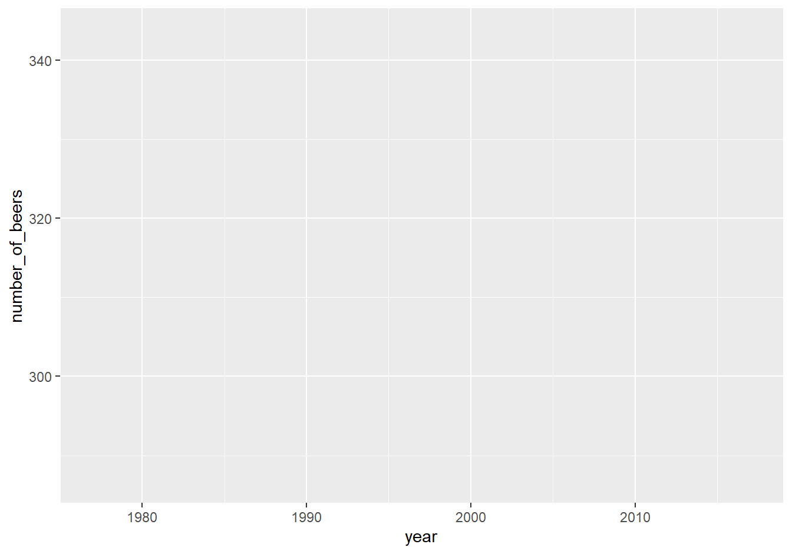

Note that on the x-axis it prints out every single year and makes it completely unreadable. That is because the "year" column is a character type, so R thinks each year is its own category. It prints every single year because it thinks we want every category shown. To fix this we can make the column numeric and `ggplot()` will be smarter about printing fewer years.


```r
penn_alcohol$year <- as.numeric(penn_alcohol$year)
```


```r
ggplot(penn_alcohol, aes(x = year,
                         y = number_of_beers))
```


When we run it we get our graph. It includes the variable names for each axis and shows the range of data through the tick marks. What is missing is the actual data. For that we need to specify what type of graph it is. We literally add it with the + followed by the type of graph we want. Make sure that the + is at the end of a line, not the start of one. Starting a line with the + will not work.

Let's start with point and line graphs.


```r
ggplot(penn_alcohol, aes(x = year, y = number_of_beers)) +
  geom_point()
```

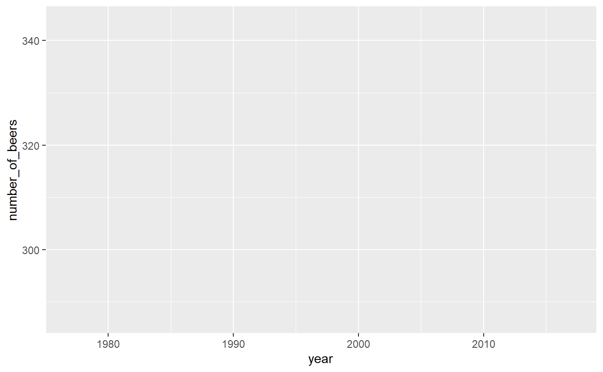


```r
ggplot(penn_alcohol, aes(x = year, y = number_of_beers)) +
  geom_line()
```

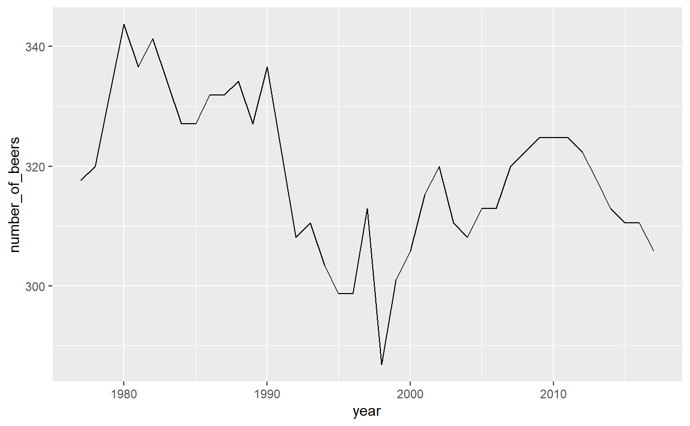

We can also combine different types of graphs.


```r
ggplot(penn_alcohol, aes(x = year, y = number_of_beers)) +
  geom_point() +
  geom_line()
```

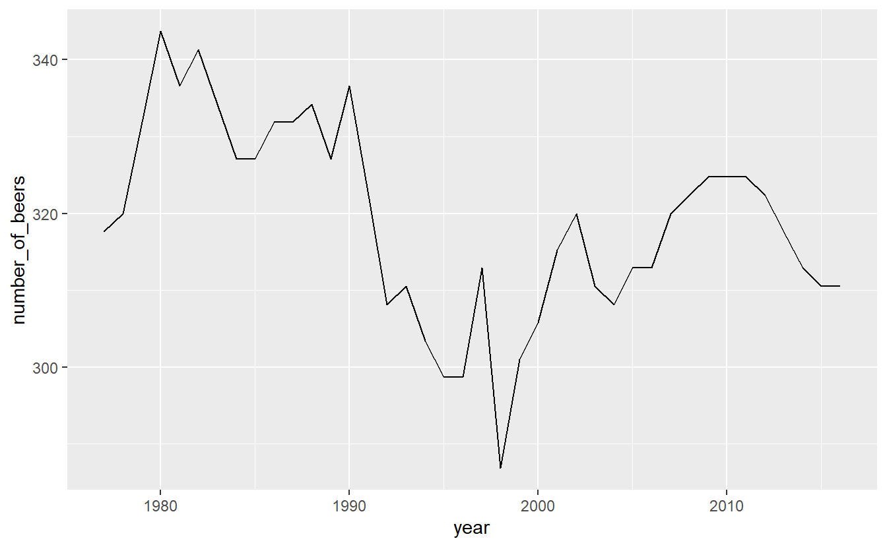

It looks like there's a huge change in beer consumption over time. But look at where they y-axis starts. It starts around 280 so really that change is only ~60 beers. That's because when graphs don't start at 0, it can make small changes appear big. We can fix this by forcing the y-axis to begin at 0. We can add `expand_limits(y = 0)` to the graph to say that the value 0 must always appear on the y-axis, even if no data is close to that value.


```r
ggplot(penn_alcohol, aes(x = year, y = number_of_beers)) +
  geom_point() +
  geom_line() +
  expand_limits(y = 0)
```

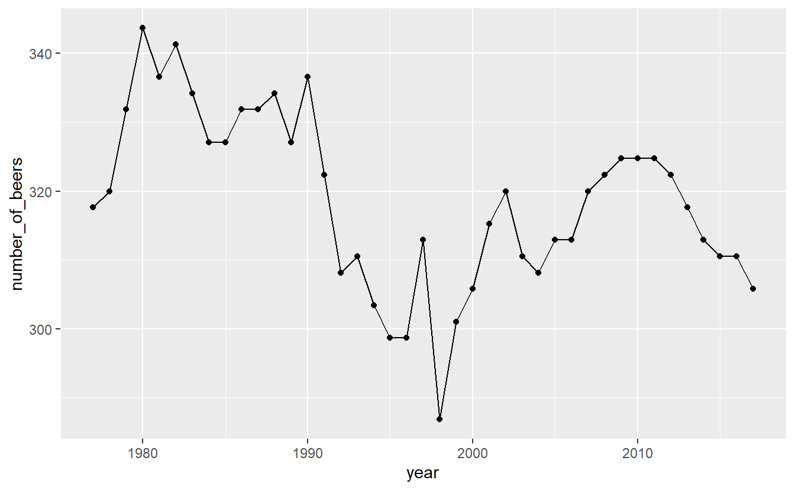

Now that graphs shows what looks like nearly no change even though that is also not true. Which graph is best? It's hard to say.

Inside the types of graphs we can change how it is displayed. As with using `plot()`, we can specify the color and size of our lines or points. 


```r
ggplot(penn_alcohol, aes(x = year, y = number_of_beers)) +
  geom_line(color = "forestgreen", size = 1.3)
```

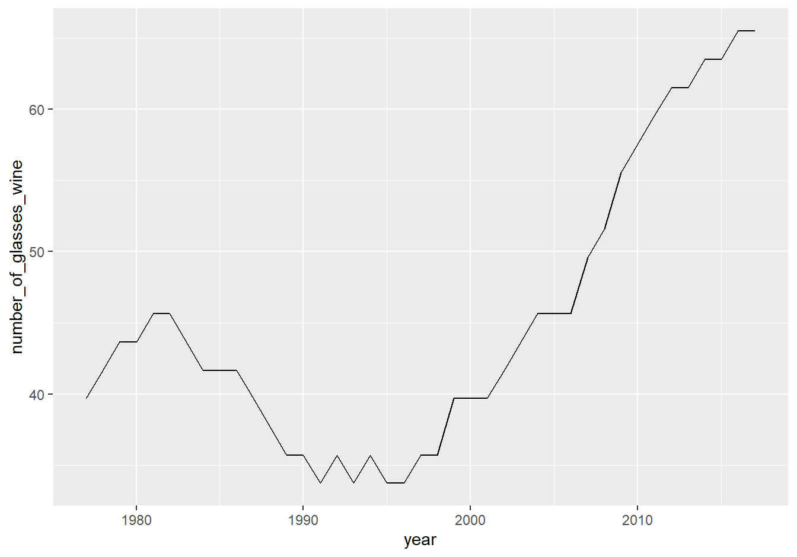

Some other useful features are changing the axis labels and the graph title. Unlike in `plot()` we do not need to include it in the () of `ggplot()` but use their own functions to add them to the graph.

  + `xlab()` - x-axis label
  + `ylab()` - y-axis label
  + `ggtitle()` - graph title
  
  

```r
ggplot(penn_alcohol, aes(x = year, y = number_of_beers)) +
  geom_line(color = "forestgreen", size = 1.3) +
  xlab("Year") +
  ylab("Number of Beers") +
  ggtitle("PA Annual Beer Consumption Per Capita (1977-2017)")
```

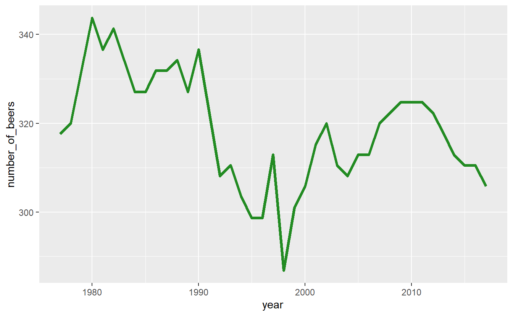

Many time-series plots show multiple variables over the same time period (e.g. murder and robbery over time). There are ways to change the data itself to make creating graphs like this easier, but let's stick with the data we currently have and just change `ggplot()`.

Start with a normal line graph, this time looking at wine.


```r
ggplot(penn_alcohol, aes(x = year, y = number_of_glasses_wine)) +
  geom_line()
```

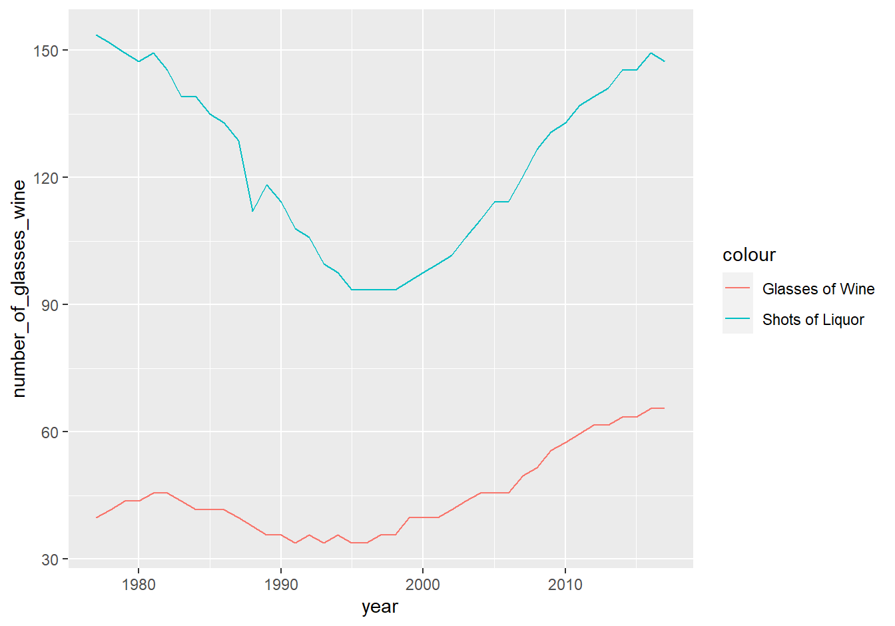

Then include a second geom_line() with its own aes() for the second variable.


```r
ggplot(penn_alcohol, aes(x = year, y = number_of_glasses_wine)) +
  geom_line() +
  geom_line(aes(x = year, y = number_of_shots_liquor))
```

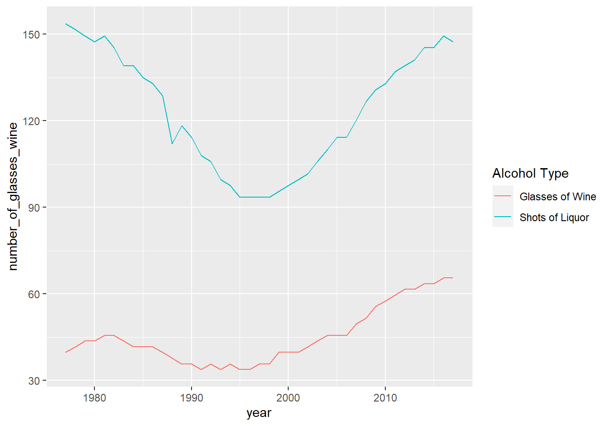

A problem with this is that both lines are the same color. We need to set a color for each line, and do so within `aes()`. Instead of providing a color name, we need to provide the name the color will have in the legend. Do so for both lines.


```r
ggplot(penn_alcohol, aes(x = year, y = number_of_glasses_wine,
                         color = "Glasses of Wine")) +
  geom_line() +
  geom_line(aes(x = year, y = number_of_shots_liquor,
                color = "Shots of of Liquor"))
```

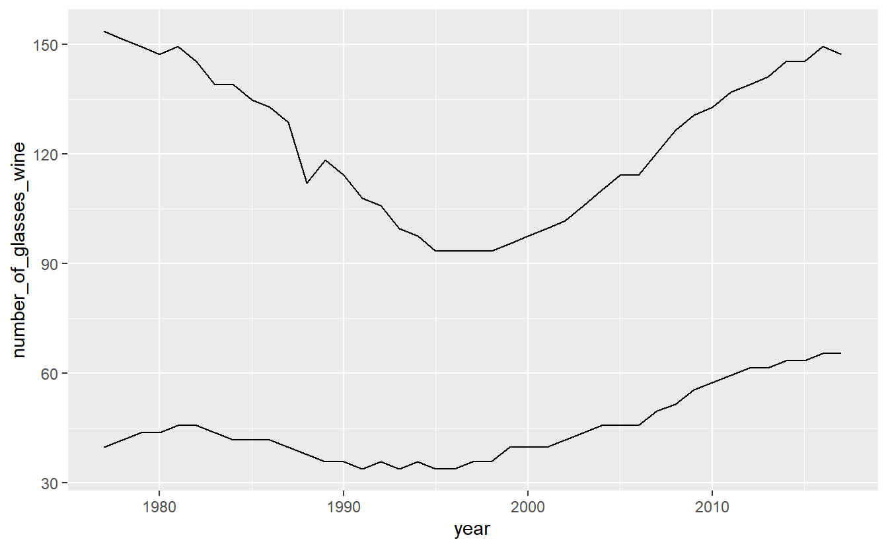

We can change the legend title by using the function `labs()` and changing the value `color` to what we want the legend title to be.


```r
ggplot(penn_alcohol, aes(x = year, y = number_of_glasses_wine,
                         color = "Glasses of Wine")) +
  geom_line() +
  geom_line(aes(x = year, y = number_of_shots_liquor,
                color = "Shots of of Liquor")) +
  labs(color = "Alcohol Type")
```

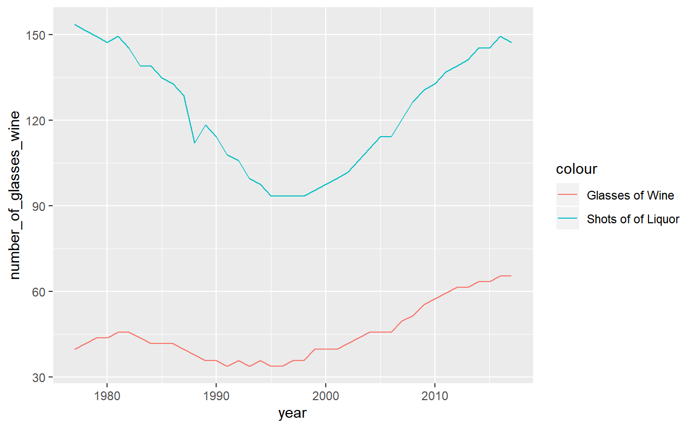

Finally, a useful option to to move the legend from the side to the bottom is setting the `theme()` function to move the `legend.position` to "bottom". This will allow the graph to be wider.


```r
ggplot(penn_alcohol, aes(x = year, y = number_of_glasses_wine,
                         color = "Glasses of Wine")) +
  geom_line() +
  geom_line(aes(x = year, y = number_of_shots_liquor,
                color = "Shots of of Liquor")) +
  labs(color = "Alcohol Type") +
  theme(legend.position = "bottom")
```

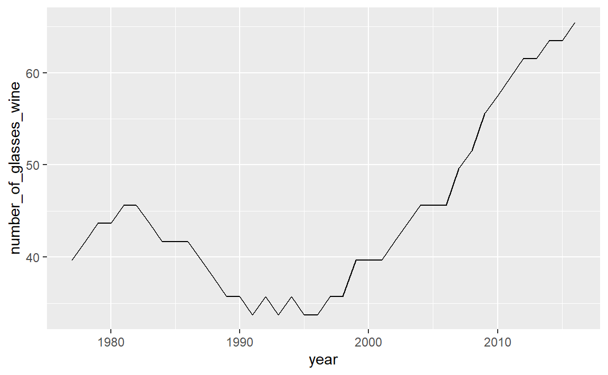

## Scatter Plots

Making a scatter plot simply requires changing the x-axis from year to another numerical variable and using geom_point().


```r
ggplot(penn_alcohol, aes(x = number_of_shots_liquor,
                         y = number_of_beers)) +
  geom_point()
```

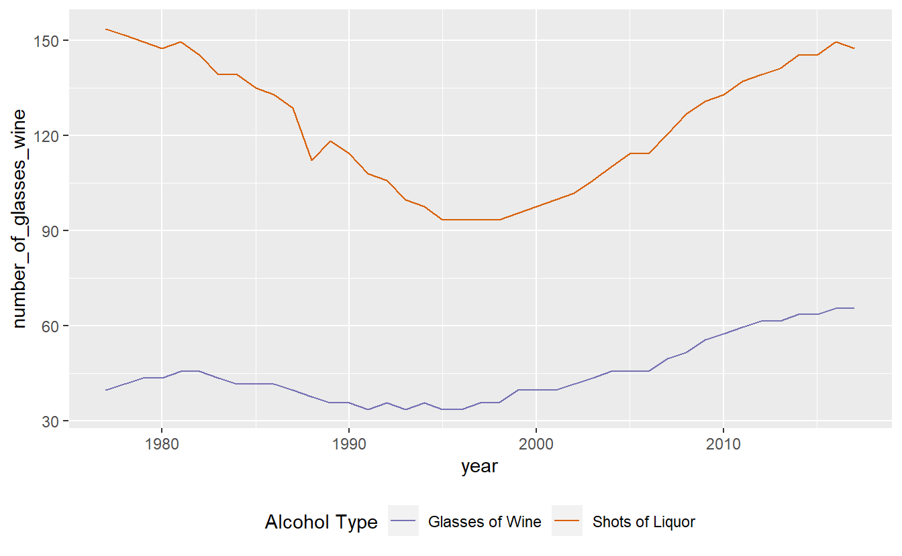

This graph shows us that when liquor consumption increases, beer consumption also tends to increase.

While scatterplots can help show the relationship between variables, we lose the information of how consumption changes over time.

## Color blindness

Please keep in mind that some people are color blind so graphs (or maps which we will learn about soon) will be hard to read for these people if we choose the incorrect colors. A helpful site for choosing colors for graphs is [colorbrewer2.org](http://colorbrewer2.org)

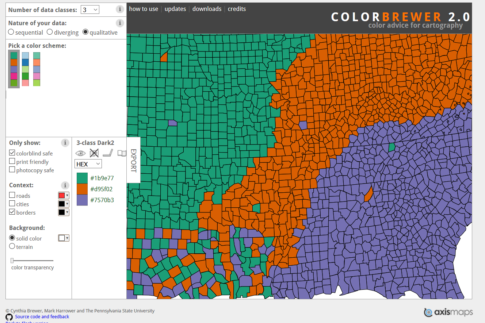

This site let's you select which type of colors you want (sequential and diverging such as shades in a hotspot map, and qualitative such as for data like what we used in this lesson). In the "Only show:" section you can set it to "colorblind safe" to restrict it to colors that allow people with color blindness to read your graph. To the right of this section it shows the HEX codes for each color (a HEX code is just a code that a computer can read and know exactly which color it is). 

Let's use an example of a color blind friendly color from the "qualitative" section of ColorBrewer. We have three options on this page (we can change how many colors we want but it defaults to showing 3): green (HEX = #1b9e77), orange (HEX = #d95f02), and purple (HEX = #7570b3). We'll use the orange and purple colors. To manually set colors in `ggplot()` we use `scale_color_manual(values = c())` and include a vector of color names or HEX codes inside the `c()`. Doing that using the orange and purple HEX codes will change our graph colors to these two colors. 


```r
ggplot(penn_alcohol, aes(x = year, y = number_of_glasses_wine,
                         color = "Glasses of Wine")) +
  geom_line() +
  geom_line(aes(x = year, y = number_of_shots_liquor,
                color = "number_of_shots_liquor")) +
  labs(color = "Alcohol Type") +
  theme(legend.position = "bottom") +
  scale_color_manual(values = c("#7570b3", "#d95f02"))
```

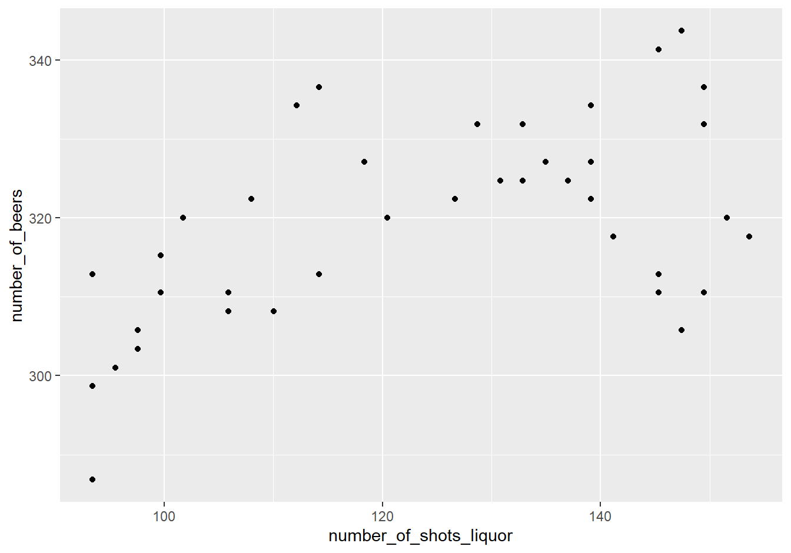
