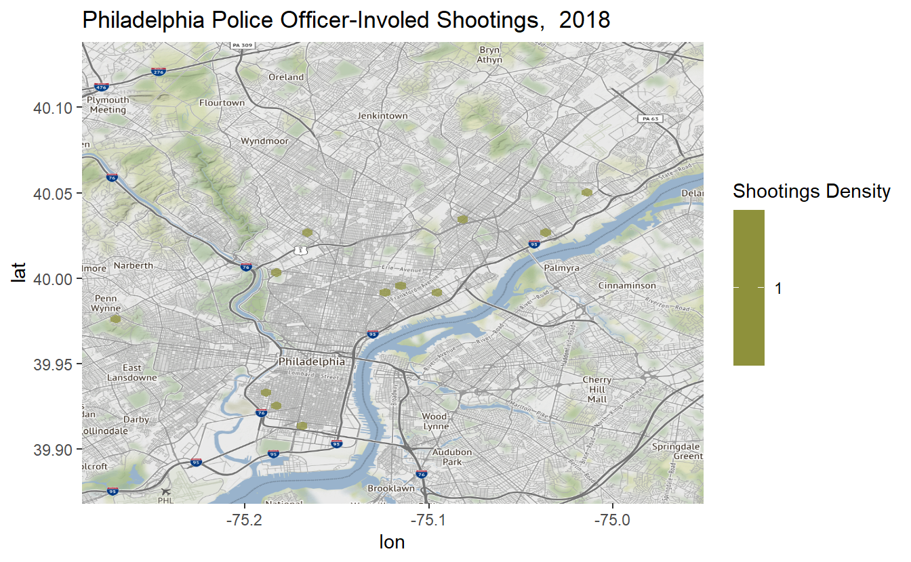
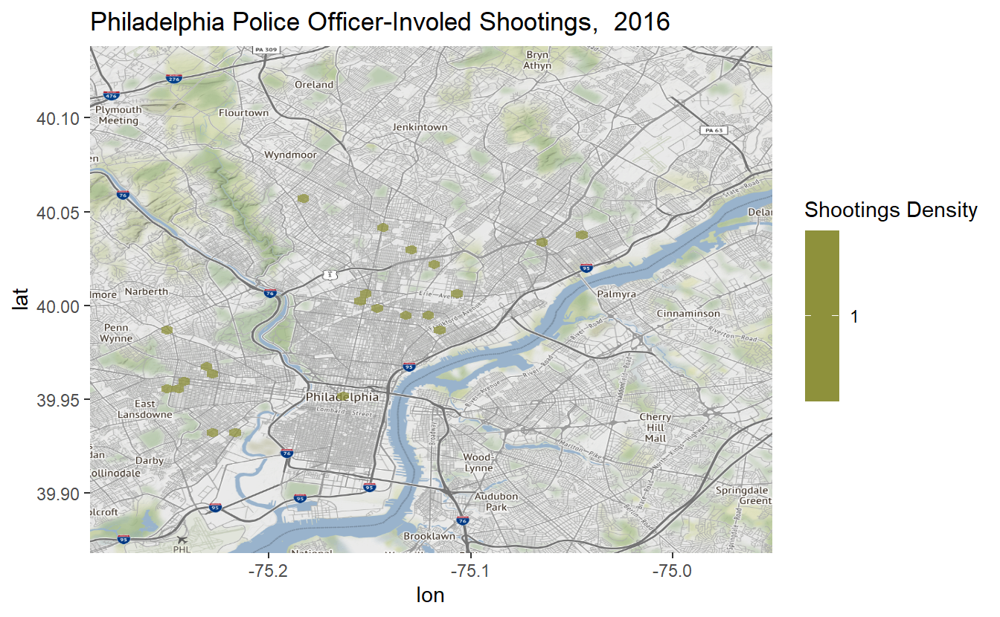
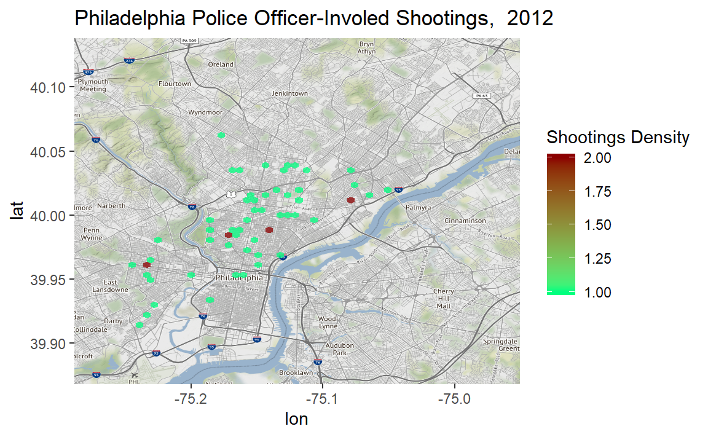
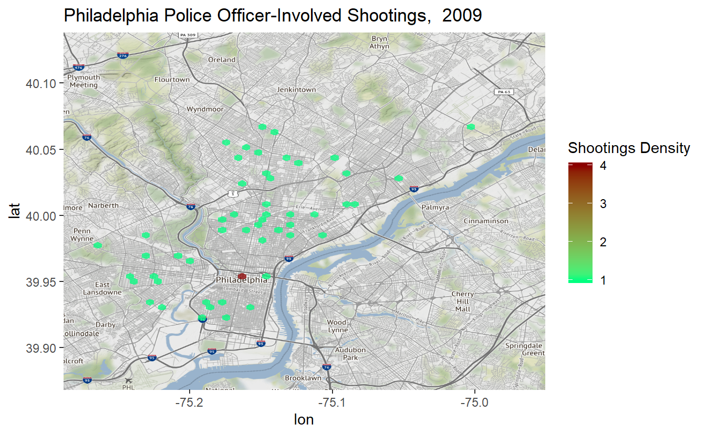
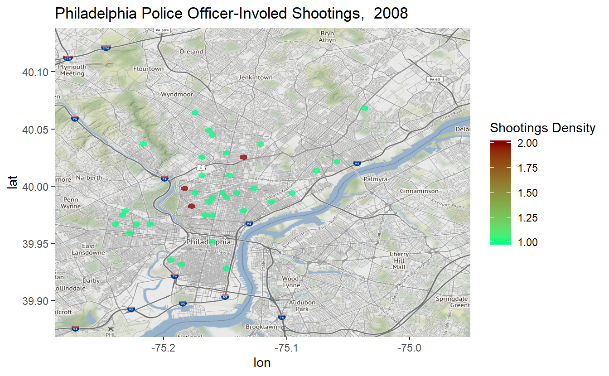

# Hotspot maps

Now that we've learned how to work with `ggplot2()`, we can make a hotspot map using many of the same concepts as the graphs we have already done. The concept of determining the geographic locations where crime is most intense - crime hotspots - is very important to criminological theory as well as to the very practical question of where police officers should be deployed.

Here, we will make hotspot maps with our officer_shootings_geocoded crime data. First we need to load the data.


```r
load("data/officer_shootings_geocoded.rda")
```


## Creating the maps

To make these maps we will use the package `ggmap`. 


```r
install.packages("ggmap")
```


```r
library(ggmap)
#> Loading required package: ggplot2
#> Google's Terms of Service: https://cloud.google.com/maps-platform/terms/.
#> Please cite ggmap if you use it! See citation("ggmap") for details.
```

We'll start by making the background to our map, showing Philadelphia. We do so using the `get_map()` function from `ggmap` which gets a map background from a number of sources. We'll set the source to "stamen" since Google no longer allows us to get a map without creating an account. The first parameter in `get_map()` is simply coordinates for Philadelphia to ensure we get a map of the right spot. 


```r
philly_map <- ggmap(get_map(c(-75.288486, 39.868285, -74.950965, 40.138251), source = "stamen"))
philly_map
```


Since we saved the map output into "philly_map" we can reuse this map background for all the maps we're making in this lesson. This saves us time as we don't have to wait to download the map every time. Let's plot the shootings from our data set.


```r
philly_map +
  geom_point(aes(x = lon, y = lat),
             data  = officer_shootings_geocoded,
             alpha = 0.5,
             color = "darkred",
             size  = 1)
#> Warning: Removed 2 rows containing missing values (geom_point).
```


This map is useful because it allows us to easily see where each officer-involved shooting in Philly happened between 2007 and early 2019. There are some limitations though. This shows all shootings in a single map, meaning any time trends are lost - we'll address this at the end of the lesson. While you can see some clusters, it is difficult to see if there are any hot spots indicating areas with especially high or low amounts of shootings. You'll notice that it has a message saying "Removed 2 rows containing missing values (geom_point)." That just means that `ggplot()` automatically deleted 2 rows that didn't contain any longitude or latitude data. Most data will have a small number of rows missing values, that is nothing to be concerned about unless the number of missing values gets large enough to affect your data.

Let's pause for a moment to think about what a map really is. Below I made a simple scatterplot of our data with one dot per shooting (minus the two without coordinates). Compare this to the map above and you'll see that they are the same except the map has a useful background while the plot has a blank background. That is all static maps are (in a later section we'll learn about interactive maps), scatterplots of coordinates overlayed on a map background. Basically, they are scatterplots with context. And this context is useful, we can interpret the map to see that there are lots of shootings in West Philly but not around University City, for example. The exact same pattern is present in the scatterplot but without the ability to tell "where" a dot is. 


```r
plot(officer_shootings_geocoded$lon, officer_shootings_geocoded$lat, col = "darkred")
```


Now we can start making hotspot maps which help to show areas with clusters of events. To do so we use 


```r
philly_map +
  coord_cartesian() +
  stat_binhex(aes(x = lon, y = lat),
              bins = 60,
              data = officer_shootings_geocoded)
#> Coordinate system already present. Adding new coordinate system, which will replace the existing one.
#> Warning: Removed 2 rows containing non-finite values (stat_binhex).
```


We can adjust the `alpha` parameter to change how transparent the bins are. 

Or try the following. Setting `alpha = 2/4` makes the bins a little more transparent. Try comparing with `alpha = 1/4` or `alpha = 3/4`.


```r
philly_map +
  coord_cartesian() +
  stat_binhex(aes(x = lon, y = lat),
              bins  = 60,
              alpha = 0.5,
              data  = officer_shootings_geocoded)
#> Coordinate system already present. Adding new coordinate system, which will replace the existing one.
#> Warning: Removed 2 rows containing non-finite values (stat_binhex).
```


The previous map was a default monochromatic color (blue). You can change the color gradient. To see what colors are available, type `colors()`.


```r
philly_map +
  coord_cartesian() +
  stat_binhex(aes(x = lon, y = lat),
              bins  = 60,
              alpha = 1,
              data = officer_shootings_geocoded) +
  scale_fill_gradient('Shootings Density',
                      low = "springgreen",
                      high = "darkred")
#> Coordinate system already present. Adding new coordinate system, which will replace the existing one.
#> Warning: Removed 2 rows containing non-finite values (stat_binhex).
```


From this map we can see that most areas which has a shooting has only 1-2 shootings in that area (a limitation to this map is it is unclear just how wide these "areas" are). North Philly and North-West Philly has more areas with more shootings, and more shootings overall. But look right in the middle of Center City by City Hall, an area has 8 shootings, the most of any hexagonal. Were there really 8 shootings outside of City Hall? No. Remember those addresses that couldn't be properly located? The coordinates given to those addresses were to City Hall, causing this weird pattern in our map. 

You can also create a map that shows the high crime areas in a way that is akin to elevation on a topographic map. The more concentrated the concentric areas, the higher the crime (or, in the case of a topographic map, the higher the terrain). Note that a plot using `stat_density2d()` requires a lot of memory. That's why it's a good idea to use a sample of cases or a small data set.


```r
philly_map +
  stat_density2d(aes(x = lon,y = lat),
                 bins = 5,
                 data = officer_shootings_geocoded,
                 geom = 'density2d',
                 col  = 'white')
#> Warning: Removed 2 rows containing non-finite values (stat_density2d).
```


Let's make a hotspot map with a gradient, red for high crime and green for low crime.


```r
philly_map +
  stat_density2d(aes(x = lon, y = lat,
                     fill = ..level..,
                     alpha = ..level..),
                 data = officer_shootings_geocoded,
                 geom = 'polygon') +
  scale_fill_gradient('Shootings Density',
                      low  = "green",
                      high = "red") +
  scale_alpha(range = c(.4, .75),
              guide = FALSE) +
  guides(fill = guide_colorbar(barwidth = 1.5, barheight = 10))
#> Warning: Removed 2 rows containing non-finite values (stat_density2d).
```


We can use `bins` to control the number of levels of colors plotted.


```r
philly_map +
  stat_density2d(aes(x = lon, y = lat,
                     fill = ..level..,
                     alpha = ..level..),
                 bins = 20,
                 data = officer_shootings_geocoded,
                 geom = 'polygon') +
  scale_fill_gradient('Shootings Density',
                      low  = "green",
                      high = "red") +
  scale_alpha(range = c(.4, .75),
              guide = FALSE) +
  guides(fill = guide_colorbar(barwidth = 1.5, barheight = 10)) 
#> Warning: Removed 2 rows containing non-finite values (stat_density2d).
```


Be careful with maps like these. This map is so broad is appears like shootings are ubiquitous across the city. We know from the map showing each shooting as a dot and that there are <500 shootings, that this is not true. Making maps like this make it easy to mislead the reader, including yourself if you are using maps to better understand your data.

Since our maps show every shooting on the same map, if there are different patterns depending on the year, we can't pick up those patterns. As a check, let's write a for loop that maps each year's data separately. First we need to make a variable with the shooting's year to be able to subset data for just that year. We can use the `year()` function from `lubridate` to do this.


```r
library(lubridate)
#> 
#> Attaching package: 'lubridate'
#> The following object is masked from 'package:base':
#> 
#>     date
officer_shootings_geocoded$year <- year(officer_shootings_geocoded$dates)
```

As a basic check, let's just see how many shootings there were each year. 


```r
table(officer_shootings_geocoded$year)
#> 
#> 2007 2008 2009 2010 2011 2012 2013 2014 2015 2016 2017 2018 2019 
#>   61   40   55   47   44   59   35   28   21   22   12   12    5
```

It looks like the general pattern is that shootings are declining. Now we can map each year. We are looping through each year in the data, and reusing the map code before except instead of the full data, we subset data to be only rows matching the year in that iteration of the loop.  


```r
for (year in unique(officer_shootings_geocoded$year)) { 
  print(
    philly_map +
      coord_cartesian() +
      stat_binhex(aes(x = lon, y = lat),
                  bins  = 60,
                  alpha = 0.75,
                  data = officer_shootings_geocoded[officer_shootings_geocoded$year == year, ]) +
      scale_fill_gradient('Shootings Density',
                          low = "springgreen",
                          high = "darkred") +
      ggtitle(paste("Philadelphia Police Officer-Involved Shootings, ", year))
  )
}
#> Coordinate system already present. Adding new coordinate system, which will replace the existing one.
#> Coordinate system already present. Adding new coordinate system, which will replace the existing one.
#> Coordinate system already present. Adding new coordinate system, which will replace the existing one.
#> Coordinate system already present. Adding new coordinate system, which will replace the existing one.
#> Coordinate system already present. Adding new coordinate system, which will replace the existing one.
#> Coordinate system already present. Adding new coordinate system, which will replace the existing one.
#> Coordinate system already present. Adding new coordinate system, which will replace the existing one.
#> Warning: Removed 1 rows containing non-finite values (stat_binhex).
#> Coordinate system already present. Adding new coordinate system, which will replace the existing one.
#> Coordinate system already present. Adding new coordinate system, which will replace the existing one.
#> Coordinate system already present. Adding new coordinate system, which will replace the existing one.
#> Coordinate system already present. Adding new coordinate system, which will replace the existing one.
#> Warning: Removed 1 rows containing non-finite values (stat_binhex).
#> Coordinate system already present. Adding new coordinate system, which will replace the existing one.
#> Coordinate system already present. Adding new coordinate system, which will replace the existing one.
```


