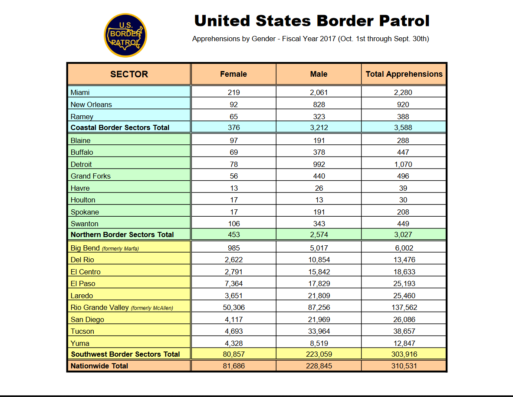

# Scraping tables from PDFs {#scrape-table}

For this chapter you'll need the following file, which is available for download [here](https://github.com/jacobkap/r4crimz/tree/master/data): usbp_stats_fy2017_sector_profile.pdf.

In the majority of cases when you want data from a PDF it will be in a table. Essentially the data will be an Excel file inside of a PDF. This format is not altogether different than what we've done before. We will be using regular expressions and the function `strsplit()` to get this data into a usable format.

Let's first take a look at the data we will be scraping. The first step in any PDF scraping should be to look at the PDF and try to think about the best way to approach this particular problem - while all PDF scraping follows a general format you cannot necessarily copy and paste your code, each situation is likely slightly different. Our data is from the U.S. Customs and Border Protection (CBP) and contains a wealth of information about apprehensions and contraband seizures in border sectors. 

We will be using the Sector Profile 2017 PDF which has information in four tables, three of which we'll scrape and then combine together. The data was downloaded from the U.S. Customs and Border Protection "Stats and Summaries" page [here](https://www.cbp.gov/newsroom/media-resources/stats). If you're interested in using more of their data, some of it has been cleaned and made available [here](https://www.openicpsr.org/openicpsr/project/109522/version/V2/view). 

The file we want to use is called "usbp_stats_fy2017_sector_profile.pdf" and has four tables in the PDF. Let's take a look at them one at a time, understanding what variables are available, and what units each row is in. Then we'll start scraping the tables.

The first table is "Sector Profile - Fiscal Year 2017 (Oct. 1st through Sept. 30th)". Before we even look down more at the table, the title is important. It is for fiscal year 2017, not calendar year 2017 which is more common in the data we usually use. This is important if we ever want to merge this data with other data sets. If possible, we would have to get data that is monthly so we can just use October 2016 through September 2017 to match up properly.


Now if we look more at the table, we can see that each row is a section of the U.S. border. There are three main sections - Coastal, Northern, and Southwest, with subsections of each also included. The bottom row is the sum of all these sections and gives us nationwide data. Many government data will be like this form with sections and subsections in the same table. Watch out when doing mathematical operations! Just summing any of these columns will give you triple the true value due to the presence of nationwide, sectional, and subsectional data. 

There are 9 columns in the data other than the border section identifier. It looks like we have total apprehensions, apprehensions for people who are not Mexican citizens, marijuana and cocaine seizures (in pounds), the number of accepted prosecutions (presumably of those apprehended), and the number of CBP agents assaulted. The last two columns have the number of people rescued by CBP and the number of people who died (it is unclear from this data alone if this is solely people in custody or deaths during crossing the border). These two columns are also special as they only have data for the Southwest border. 

Table 2 has a similar format with each row being a section or subsection. The columns now have the number of juveniles apprehended, subdivided by if they were accompanied by an adult or not, and the number of adults apprehended. The last column is total apprehensions which is also in Table 1.


Table 3 follows the same format and the new columns are number of apprehensions by gender.



Finally, Table 4 is a bit different in its format. The rows are now variables and the columns are the locations. In this table it doesn't include subsections, only border sections and nationwide total. The data it has available are partially a repeat of Table 1 but with more drug types and the addition of the number of drug seizures and some firearm seizure information. As this table is formatted differently than the others, we won't scrape it in this lesson - but you can use the skills you'll learn to do so yourself.


## Scraping the first table

We've now seen all three of the tables that we want to scrape so we can begin the process of actually scraping them. Note that each table is very similar meaning we can reuse some code to scrape as well as clean the data. That means that we will want to write some functions to make our work easier and avoid copy and pasting code three times. We will use the `pdf_text()` function from the `pdftools` package to read the PDFs into R. 


```r
library(pdftools)
#> Using poppler version 21.04.0
```

We can save the output of the `pdf_text()` function as the object *border_patrol* and we'll use it for each table.


```r
border_patrol <- pdf_text("data/usbp_stats_fy2017_sector_profile.pdf")
```

We can take a look at the `head()` of the result.


```r
head(border_patrol)
#> [1] "                                                           United States Border Patrol\n                                                            Sector Profile - Fiscal Year 2017 (Oct. 1st through Sept. 30th)\n\n                                                Agent                              Other Than Mexican            Marijuana          Cocaine         Accepted\n              SECTOR                           Staffing*\n                                                             Apprehensions\n                                                                                     Apprehensions                 (pounds)          (pounds)     Prosecutions\n                                                                                                                                                               Assaults Rescues                 Deaths\n\nMiami                                             111              2,280                     1,646                  2,253              231               292              1              N/A      N/A\nNew Orleans                                        63                920                      528                     21                 6               10               0              N/A      N/A\nRamey                                              38               388                       387                     3               2,932              89               0           N/A         N/A\nCoastal Border Sectors Total                      212              3,588                     2,561                  2,277             3,169              391              1         N/A ****    N/A ****\n\nBlaine                                            296                288                      237                      0                 0                9               0              N/A      N/A\nBuffalo                                           277                447                      293                    228                 2               37               2              N/A      N/A\nDetroit                                           408              1,070                      322                    124                 0               85               1              N/A      N/A\nGrand Forks                                       189                496                      202                      0                 0               40               2              N/A      N/A\nHavre                                             183                39                        28                     98                 0                2               0              N/A      N/A\nHoulton                                           173                30                        30                     17                 0                2               0              N/A      N/A\nSpokane                                           230                208                       67                     68                 0               24               0              N/A      N/A\nSwanton                                           292               449                       359                    531                 1               103               6             N/A      N/A\nNorthern Border Sectors Total                    2,048             3,027                     1,538                  1,066                3               302              11        N/A ****    N/A   ****\nBig Bend (formerly Marfa)                         500              6,002                     3,346                  40,852              45              2,847             11             26       1\nDel Rio                                          1,391             13,476                    6,156                  9,482               62              8,022             12             99       18\nEl Centro                                         870              18,633                    5,812                  5,554              484              1,413             34             4        2\nEl Paso                                          2,182             25,193                   15,337                  34,189             140              6,996             54             44       8\nLaredo                                           1,666             25,460                    7,891                  69,535             757              6,119             31            1,054     83\nRio Grande Valley (formerly McAllen)             3,130            137,562                  107,909                 260,020            1,192             7,979            422            1,190    104\nSan Diego                                        2,199             26,086                    7,060                  10,985            2,903             3,099             84             48       4\nTucson                                           3,691             38,657                   12,328                 397,090             331             20,963             93            750       72\nYuma                                              859              12,847                   10,139                  30,181             261              2,367             33             6        2\nSouthwest Border Sectors Total**                16,605            303,916                  175,978                 857,888            6,174            59,805            774            3,221    294\nNationwide Total***                             19,437            310,531                  180,077                 861,231            9,346            60,498            786            3,221    294\n* Agent staffing statistics depict FY17 on-board personnel data as of 9/30/2017\n** Southwest Border Sectors staffing statistics include: Big Bend, Del Rio, El Centro, El Paso, Laredo, Rio Grande Valley, San Diego, Tucson, Yuma, and the Special Operations Group.\n*** Nationwide staffing statistics include: All on-board Border Patrol agents in CBP\n**** Rescue and Death statistics are not tracked for Northern and Coastal Border Sectors.\n"
#> [2] "                                       United States Border Patrol\n                                       Juvenile (0-17 Years Old) and Adult Apprehensions - Fiscal Year 2017 (Oct. 1st through Sept. 30th)\n\n\n\n                                           Accompanied             Unaccompanied               Total            Total           Total\n               SECTOR                        Juveniles               Juveniles               Juveniles         Adults       Apprehensions\nMiami                                            19                        42                    61             2,219             2,280\nNew Orleans                                       1                        22                    23              897               920\nRamey                                             7                         1                     8              380               388\nCoastal Border Sectors Total                     27                        65                    92             3,496             3,588\nBlaine                                           29                         7                    36              252               288\nBuffalo                                           3                         3                     6              441               447\nDetroit                                           5                        11                    16             1,054             1,070\nGrand Forks                                       5                         4                     9              487               496\nHavre                                             1                         3                     4              35                 39\nHoulton                                           1                         8                     9              21                 30\nSpokane                                           3                         0                     3              205               208\nSwanton                                          18                        10                    28              421               449\nNorthern Border Sectors Total                    65                        46                   111             2,916             3,027\nBig Bend (formerly Marfa)                        506                       811                 1,317            4,685             6,002\nDel Rio                                         1,348                     1,349                2,697           10,779             13,476\nEl Centro                                        968                      1,531                2,499           16,134             18,633\nEl Paso                                         4,642                     3,926                8,568           16,625             25,193\nLaredo                                           477                      2,033                2,510           22,950             25,460\nRio Grande Valley (formerly McAllen)           27,222                    23,708                50,930          86,632            137,562\nSan Diego                                       1,639                     1,551                3,190           22,896             26,086\nTucson                                          1,088                     3,659                4,747           33,910             38,657\nYuma                                            3,241                     2,867                6,108            6,739             12,847\nSouthwest Border Sectors Total                 41,131                    41,435                82,566         221,350            303,916\nNationwide Total                               41,223                    41,546                82,769         227,762            310,531\n"                                                                                                                                                                                                                                                                                                                                                                                                                                                                                                                                                                                                                                                                                                                                                                                                                                                                                                                                                                                                                                                                                                                                                                                                                                                                                                                                                                                                                                                                                                                                                                                                                                                                                                                                                                                                                                                                                                                                                                                                                                                                                                                                                                                                                                                                                                                                                                                                
#> [3] "                                       United States Border Patrol\n                                       Apprehensions by Gender - Fiscal Year 2017 (Oct. 1st through Sept. 30th)\n\n\n\n\n              SECTOR                           Female                     Male             Total Apprehensions\n\nMiami                                            219                      2,061                     2,280\nNew Orleans                                       92                       828                       920\nRamey                                             65                       323                       388\nCoastal Border Sectors Total                     376                      3,212                     3,588\nBlaine                                            97                       191                       288\nBuffalo                                           69                       378                       447\nDetroit                                           78                       992                      1,070\nGrand Forks                                       56                       440                       496\nHavre                                             13                        26                       39\nHoulton                                           17                        13                       30\nSpokane                                           17                       191                       208\nSwanton                                          106                       343                       449\nNorthern Border Sectors Total                    453                      2,574                     3,027\nBig Bend (formerly Marfa)                        985                      5,017                     6,002\nDel Rio                                         2,622                     10,854                    13,476\nEl Centro                                       2,791                     15,842                    18,633\nEl Paso                                         7,364                     17,829                    25,193\nLaredo                                          3,651                     21,809                    25,460\nRio Grande Valley (formerly McAllen)            50,306                    87,256                   137,562\nSan Diego                                       4,117                     21,969                    26,086\nTucson                                          4,693                     33,964                    38,657\nYuma                                            4,328                     8,519                     12,847\nSouthwest Border Sectors Total                  80,857                   223,059                   303,916\nNationwide Total                                81,686                   228,845                   310,531\n"                                                                                                                                                                                                                                                                                                                                                                                                                                                                                                                                                                                                                                                                                                                                                                                                                                                                                                                                                                                                                                                                                                                                                                                                                                                                                                                                                                                                                                                                                                                                                                                                                                                                                                                                                                                                                                                                                                                                                                                                                                                                                                                                                                                                                                                                                                                                                                                                                                                                                                                                                                                                                                                                                                                                                                                                                                                                                                                                                                                                                                                                                                                                                                                                                                                                                                                                          
#> [4] "                                            United States Border Patrol\n                                            Apprehensions / Seizure Statistics - Fiscal Year 2017 (Oct. 1st through Sept. 30th)\n\n    Apprehension/Seizure Type                Coastal Border Sectors        Northern Border Sectors        Southwest Border Sectors   Nationwide Total\n\nApprehensions                                          3,588                          3,027                          303,916             310,531\nOther Than Mexican Apprehensions                       2,561                          1,538                          175,978             180,077\n\nMarijuana (pounds)                                     2,277                          1,066                          857,888             861,231\nCocaine (pounds)                                       3,169                            3                             6,174               9,346\nHeroin (ounces)                                          0                             62                            15,182              15,244\nMethamphetamine (pounds)                                23                             32                            10,273              10,328\nEcstasy (pounds)                                         0                              0                               1                   1\nOther Drugs* (pounds)                                    0                             14                              554                 568\n\nMarijuana Seizures                                      113                            255                            9,371               9,739\nCocaine Seizures                                        33                             46                              463                 542\nHeroin Seizures                                          0                             29                              219                 248\nMethamphetamine Seizures                                 2                             68                              809                 879\nEcstasy Seizures                                         1                              2                               48                 51\nOther Drugs* Seizures                                    6                             99                              735                 840\n\nConveyances                                             86                             79                             7,388               7,553\nFirearms                                                 9                             45                              369                 423\nAmmunition (rounds)                                     217                            384                           13,938              14,539\nCurrency (value)                                     $325,129                       $374,282                       $5,169,593           $5,869,004\n\n*Other Drugs include: All USBP drug seizures excluding marijuana, cocaine, heroin, methamphetamine, and ecstasy (MDMA).\nCoastal Border Sectors include: Miami, New Orleans, and Ramey, Puerto Rico.\nNorthern Border Sectors include: Blaine, Buffalo, Detroit, Grand Forks, Havre, Houlton, Spokane and Swanton.\nSouthwest Border Sectors include: Big Bend, Del Rio, El Centro, El Paso, Laredo, Rio Grande Valley, San Diego, Tucson, and Yuma.\nDrug quantities are rounded to the nearest whole number\n"
```

If you look closely in this huge amount of text output, you can see that it is a vector with each table being an element in the vector. We can see this further by checking the `length()` of "border_patrol" and just looking at the first element.


```r
length(border_patrol)
#> [1] 4
```

It is four elements long, one for each table. 


```r
border_patrol[1]
#> [1] "                                                           United States Border Patrol\n                                                            Sector Profile - Fiscal Year 2017 (Oct. 1st through Sept. 30th)\n\n                                                Agent                              Other Than Mexican            Marijuana          Cocaine         Accepted\n              SECTOR                           Staffing*\n                                                             Apprehensions\n                                                                                     Apprehensions                 (pounds)          (pounds)     Prosecutions\n                                                                                                                                                               Assaults Rescues                 Deaths\n\nMiami                                             111              2,280                     1,646                  2,253              231               292              1              N/A      N/A\nNew Orleans                                        63                920                      528                     21                 6               10               0              N/A      N/A\nRamey                                              38               388                       387                     3               2,932              89               0           N/A         N/A\nCoastal Border Sectors Total                      212              3,588                     2,561                  2,277             3,169              391              1         N/A ****    N/A ****\n\nBlaine                                            296                288                      237                      0                 0                9               0              N/A      N/A\nBuffalo                                           277                447                      293                    228                 2               37               2              N/A      N/A\nDetroit                                           408              1,070                      322                    124                 0               85               1              N/A      N/A\nGrand Forks                                       189                496                      202                      0                 0               40               2              N/A      N/A\nHavre                                             183                39                        28                     98                 0                2               0              N/A      N/A\nHoulton                                           173                30                        30                     17                 0                2               0              N/A      N/A\nSpokane                                           230                208                       67                     68                 0               24               0              N/A      N/A\nSwanton                                           292               449                       359                    531                 1               103               6             N/A      N/A\nNorthern Border Sectors Total                    2,048             3,027                     1,538                  1,066                3               302              11        N/A ****    N/A   ****\nBig Bend (formerly Marfa)                         500              6,002                     3,346                  40,852              45              2,847             11             26       1\nDel Rio                                          1,391             13,476                    6,156                  9,482               62              8,022             12             99       18\nEl Centro                                         870              18,633                    5,812                  5,554              484              1,413             34             4        2\nEl Paso                                          2,182             25,193                   15,337                  34,189             140              6,996             54             44       8\nLaredo                                           1,666             25,460                    7,891                  69,535             757              6,119             31            1,054     83\nRio Grande Valley (formerly McAllen)             3,130            137,562                  107,909                 260,020            1,192             7,979            422            1,190    104\nSan Diego                                        2,199             26,086                    7,060                  10,985            2,903             3,099             84             48       4\nTucson                                           3,691             38,657                   12,328                 397,090             331             20,963             93            750       72\nYuma                                              859              12,847                   10,139                  30,181             261              2,367             33             6        2\nSouthwest Border Sectors Total**                16,605            303,916                  175,978                 857,888            6,174            59,805            774            3,221    294\nNationwide Total***                             19,437            310,531                  180,077                 861,231            9,346            60,498            786            3,221    294\n* Agent staffing statistics depict FY17 on-board personnel data as of 9/30/2017\n** Southwest Border Sectors staffing statistics include: Big Bend, Del Rio, El Centro, El Paso, Laredo, Rio Grande Valley, San Diego, Tucson, Yuma, and the Special Operations Group.\n*** Nationwide staffing statistics include: All on-board Border Patrol agents in CBP\n**** Rescue and Death statistics are not tracked for Northern and Coastal Border Sectors.\n"
```

And this gives us all the values in the first table plus a few sentences at the end detailing some features of the table. At the end of each line (where in the PDF it should end but doesn't in our data yet) there is a `\r\n` indicating that there should be a new line. We want to use `strsplit()` to split at the `\r\n`. 

The `strsplit()` function breaks up a string into pieces based on a value inside of the string. Let's use the word "criminology" as an example. If we want to split it by the letter "n" we'd have two results, "crimi" and "ology" as these are the pieces of the word after breaking up "criminology" at letter "n". 


```r
strsplit("criminology", split = "n")
#> [[1]]
#> [1] "crimi" "ology"
```
Note that it deletes whatever value is used to break up the string. 

Let's save a new object with the value in the first element of "border_patrol", calling it *sector_profile* as that's the name of that table, and then using `strsplit()` on it. `strsplit()` returns a list so we will also want to keep just the first element of that list using double square bracket `[[]]` notation.


```r
sector_profile <- border_patrol[1]
sector_profile <- strsplit(sector_profile, "\r\n")
sector_profile <- sector_profile[[1]]
```

Now we can look at the first six rows of this data.


```r
head(sector_profile)
#> [1] "                                                           United States Border Patrol\n                                                            Sector Profile - Fiscal Year 2017 (Oct. 1st through Sept. 30th)\n\n                                                Agent                              Other Than Mexican            Marijuana          Cocaine         Accepted\n              SECTOR                           Staffing*\n                                                             Apprehensions\n                                                                                     Apprehensions                 (pounds)          (pounds)     Prosecutions\n                                                                                                                                                               Assaults Rescues                 Deaths\n\nMiami                                             111              2,280                     1,646                  2,253              231               292              1              N/A      N/A\nNew Orleans                                        63                920                      528                     21                 6               10               0              N/A      N/A\nRamey                                              38               388                       387                     3               2,932              89               0           N/A         N/A\nCoastal Border Sectors Total                      212              3,588                     2,561                  2,277             3,169              391              1         N/A ****    N/A ****\n\nBlaine                                            296                288                      237                      0                 0                9               0              N/A      N/A\nBuffalo                                           277                447                      293                    228                 2               37               2              N/A      N/A\nDetroit                                           408              1,070                      322                    124                 0               85               1              N/A      N/A\nGrand Forks                                       189                496                      202                      0                 0               40               2              N/A      N/A\nHavre                                             183                39                        28                     98                 0                2               0              N/A      N/A\nHoulton                                           173                30                        30                     17                 0                2               0              N/A      N/A\nSpokane                                           230                208                       67                     68                 0               24               0              N/A      N/A\nSwanton                                           292               449                       359                    531                 1               103               6             N/A      N/A\nNorthern Border Sectors Total                    2,048             3,027                     1,538                  1,066                3               302              11        N/A ****    N/A   ****\nBig Bend (formerly Marfa)                         500              6,002                     3,346                  40,852              45              2,847             11             26       1\nDel Rio                                          1,391             13,476                    6,156                  9,482               62              8,022             12             99       18\nEl Centro                                         870              18,633                    5,812                  5,554              484              1,413             34             4        2\nEl Paso                                          2,182             25,193                   15,337                  34,189             140              6,996             54             44       8\nLaredo                                           1,666             25,460                    7,891                  69,535             757              6,119             31            1,054     83\nRio Grande Valley (formerly McAllen)             3,130            137,562                  107,909                 260,020            1,192             7,979            422            1,190    104\nSan Diego                                        2,199             26,086                    7,060                  10,985            2,903             3,099             84             48       4\nTucson                                           3,691             38,657                   12,328                 397,090             331             20,963             93            750       72\nYuma                                              859              12,847                   10,139                  30,181             261              2,367             33             6        2\nSouthwest Border Sectors Total**                16,605            303,916                  175,978                 857,888            6,174            59,805            774            3,221    294\nNationwide Total***                             19,437            310,531                  180,077                 861,231            9,346            60,498            786            3,221    294\n* Agent staffing statistics depict FY17 on-board personnel data as of 9/30/2017\n** Southwest Border Sectors staffing statistics include: Big Bend, Del Rio, El Centro, El Paso, Laredo, Rio Grande Valley, San Diego, Tucson, Yuma, and the Special Operations Group.\n*** Nationwide staffing statistics include: All on-board Border Patrol agents in CBP\n**** Rescue and Death statistics are not tracked for Northern and Coastal Border Sectors.\n"
```

Notice that there is a lot of empty white space at the beginning of the rows. We want to get rid of that to make our next steps easier. We can use `trimws()` and put the entire "sector_profile" data in the () and it'll remove the white space at the ends of each line for us.


```r
sector_profile <- trimws(sector_profile)
```

We have more rows than we want so let's look at the entire data and try to figure out how to keep just the necessary rows.


```r
sector_profile
#> [1] "United States Border Patrol\n                                                            Sector Profile - Fiscal Year 2017 (Oct. 1st through Sept. 30th)\n\n                                                Agent                              Other Than Mexican            Marijuana          Cocaine         Accepted\n              SECTOR                           Staffing*\n                                                             Apprehensions\n                                                                                     Apprehensions                 (pounds)          (pounds)     Prosecutions\n                                                                                                                                                               Assaults Rescues                 Deaths\n\nMiami                                             111              2,280                     1,646                  2,253              231               292              1              N/A      N/A\nNew Orleans                                        63                920                      528                     21                 6               10               0              N/A      N/A\nRamey                                              38               388                       387                     3               2,932              89               0           N/A         N/A\nCoastal Border Sectors Total                      212              3,588                     2,561                  2,277             3,169              391              1         N/A ****    N/A ****\n\nBlaine                                            296                288                      237                      0                 0                9               0              N/A      N/A\nBuffalo                                           277                447                      293                    228                 2               37               2              N/A      N/A\nDetroit                                           408              1,070                      322                    124                 0               85               1              N/A      N/A\nGrand Forks                                       189                496                      202                      0                 0               40               2              N/A      N/A\nHavre                                             183                39                        28                     98                 0                2               0              N/A      N/A\nHoulton                                           173                30                        30                     17                 0                2               0              N/A      N/A\nSpokane                                           230                208                       67                     68                 0               24               0              N/A      N/A\nSwanton                                           292               449                       359                    531                 1               103               6             N/A      N/A\nNorthern Border Sectors Total                    2,048             3,027                     1,538                  1,066                3               302              11        N/A ****    N/A   ****\nBig Bend (formerly Marfa)                         500              6,002                     3,346                  40,852              45              2,847             11             26       1\nDel Rio                                          1,391             13,476                    6,156                  9,482               62              8,022             12             99       18\nEl Centro                                         870              18,633                    5,812                  5,554              484              1,413             34             4        2\nEl Paso                                          2,182             25,193                   15,337                  34,189             140              6,996             54             44       8\nLaredo                                           1,666             25,460                    7,891                  69,535             757              6,119             31            1,054     83\nRio Grande Valley (formerly McAllen)             3,130            137,562                  107,909                 260,020            1,192             7,979            422            1,190    104\nSan Diego                                        2,199             26,086                    7,060                  10,985            2,903             3,099             84             48       4\nTucson                                           3,691             38,657                   12,328                 397,090             331             20,963             93            750       72\nYuma                                              859              12,847                   10,139                  30,181             261              2,367             33             6        2\nSouthwest Border Sectors Total**                16,605            303,916                  175,978                 857,888            6,174            59,805            774            3,221    294\nNationwide Total***                             19,437            310,531                  180,077                 861,231            9,346            60,498            786            3,221    294\n* Agent staffing statistics depict FY17 on-board personnel data as of 9/30/2017\n** Southwest Border Sectors staffing statistics include: Big Bend, Del Rio, El Centro, El Paso, Laredo, Rio Grande Valley, San Diego, Tucson, Yuma, and the Special Operations Group.\n*** Nationwide staffing statistics include: All on-board Border Patrol agents in CBP\n**** Rescue and Death statistics are not tracked for Northern and Coastal Border Sectors."
```

Based on the PDF, we want every row from Miami to Nationwide Total. But here we have several rows with the title of the table and the column names, and at the end we have the sentences with some details that we don't need. 

To keep only the rows that we want, we can combine `grep()` and subsetting to find the rows from Miami to Nationwide Total and keep only those rows. We will use `grep()` to find which row has the text "Miami" and which has the text "Nationwide Total" and keep all rows between them (including those matched rows as well). Since each only appears once in the table we don't need to worry about handling duplicate results. 


```r
grep("Miami", sector_profile)
#> [1] 1
```


```r
grep("Nationwide Total", sector_profile)
#> [1] 1
```

We'll use square bracket notation to keep all rows between those two values (including each value). Since the data is a vector, not a data.frame, we don't need a comma. 


```r
sector_profile <- sector_profile[grep("Miami", sector_profile):grep("Nationwide Total", sector_profile)]
```

Note that we're getting rid of the rows which had the column names. It's easier to make the names ourselves than to deal with that mess. 


```r
head(sector_profile)
#> [1] "United States Border Patrol\n                                                            Sector Profile - Fiscal Year 2017 (Oct. 1st through Sept. 30th)\n\n                                                Agent                              Other Than Mexican            Marijuana          Cocaine         Accepted\n              SECTOR                           Staffing*\n                                                             Apprehensions\n                                                                                     Apprehensions                 (pounds)          (pounds)     Prosecutions\n                                                                                                                                                               Assaults Rescues                 Deaths\n\nMiami                                             111              2,280                     1,646                  2,253              231               292              1              N/A      N/A\nNew Orleans                                        63                920                      528                     21                 6               10               0              N/A      N/A\nRamey                                              38               388                       387                     3               2,932              89               0           N/A         N/A\nCoastal Border Sectors Total                      212              3,588                     2,561                  2,277             3,169              391              1         N/A ****    N/A ****\n\nBlaine                                            296                288                      237                      0                 0                9               0              N/A      N/A\nBuffalo                                           277                447                      293                    228                 2               37               2              N/A      N/A\nDetroit                                           408              1,070                      322                    124                 0               85               1              N/A      N/A\nGrand Forks                                       189                496                      202                      0                 0               40               2              N/A      N/A\nHavre                                             183                39                        28                     98                 0                2               0              N/A      N/A\nHoulton                                           173                30                        30                     17                 0                2               0              N/A      N/A\nSpokane                                           230                208                       67                     68                 0               24               0              N/A      N/A\nSwanton                                           292               449                       359                    531                 1               103               6             N/A      N/A\nNorthern Border Sectors Total                    2,048             3,027                     1,538                  1,066                3               302              11        N/A ****    N/A   ****\nBig Bend (formerly Marfa)                         500              6,002                     3,346                  40,852              45              2,847             11             26       1\nDel Rio                                          1,391             13,476                    6,156                  9,482               62              8,022             12             99       18\nEl Centro                                         870              18,633                    5,812                  5,554              484              1,413             34             4        2\nEl Paso                                          2,182             25,193                   15,337                  34,189             140              6,996             54             44       8\nLaredo                                           1,666             25,460                    7,891                  69,535             757              6,119             31            1,054     83\nRio Grande Valley (formerly McAllen)             3,130            137,562                  107,909                 260,020            1,192             7,979            422            1,190    104\nSan Diego                                        2,199             26,086                    7,060                  10,985            2,903             3,099             84             48       4\nTucson                                           3,691             38,657                   12,328                 397,090             331             20,963             93            750       72\nYuma                                              859              12,847                   10,139                  30,181             261              2,367             33             6        2\nSouthwest Border Sectors Total**                16,605            303,916                  175,978                 857,888            6,174            59,805            774            3,221    294\nNationwide Total***                             19,437            310,531                  180,077                 861,231            9,346            60,498            786            3,221    294\n* Agent staffing statistics depict FY17 on-board personnel data as of 9/30/2017\n** Southwest Border Sectors staffing statistics include: Big Bend, Del Rio, El Centro, El Paso, Laredo, Rio Grande Valley, San Diego, Tucson, Yuma, and the Special Operations Group.\n*** Nationwide staffing statistics include: All on-board Border Patrol agents in CBP\n**** Rescue and Death statistics are not tracked for Northern and Coastal Border Sectors."
```

The data now has only the rows we want but still doesn't have any columns, it's currently just a vector of strings. We want to make it into a data.frame to be able to work on it like we usually do. When looking at this data it is clear that where the division between columns is a bunch of white space. Take the first row for example, it says "Miami" then after lots of white spaces "111" than again with "2,280" and so on for the rest of the row. We'll use this pattern of columns differentiated by white space to make *sector_profile* into a data.frame. 

We will use the function `str_split_fixed()` from the `stringr` package. This function is very similar to `strsplit()` except you can tell it how many columns to expect. 


```r
install.packages("stringr")
```


```r
library(stringr)
```

The syntax of `str_split_fixed()` is similar to `strsplit()` except the new parameter of the number of splits to expect. Looking at the PDF shows us that there are 10 columns so that's the number we'll use. Our split will be " {2,}". That is, a space that occurs two or more times. Since there are sectors with spaces in their name, we can't have only one space, we need at least two. If you look carefully at the rows with sectors "Coast Border Sectors Total" and "Northern Border Sectors Total", the final two columns actually do not have two spaces between them because of the amount of * they have. Normally we'd want to fix this using `gsub()`, but those values will turn to NA anyway so we won't bother in this case. 


```r
sector_profile <- str_split_fixed(sector_profile, " {2,}", 10)
```

If we check the `head()` we can see that we have the proper columns now but this still isn't a data.frame and has no column names. 


```r
head(sector_profile)
#>      [,1]                           
#> [1,] "United States Border Patrol\n"
#>      [,2]                                                                 
#> [1,] "Sector Profile - Fiscal Year 2017 (Oct. 1st through Sept. 30th)\n\n"
#>      [,3]    [,4]                 [,5]        [,6]      [,7]        
#> [1,] "Agent" "Other Than Mexican" "Marijuana" "Cocaine" "Accepted\n"
#>      [,8]     [,9]         
#> [1,] "SECTOR" "Staffing*\n"
#>      [,10]                                                                                                                                                                                                                                                                                                                                                                                                                                                                                                                                                                                                                                                                                                                                                                                                                                                                                                                                                                                                                                                                                                                                                                                                                                                                                                                                                                                                                                                                                                                                                                                                                                                                                                                                                                                                                                                                                                                                                                                                                                                                                                                                                                                                                                                                                                                                                                                                                                                                                                                                                                                                                                                                                                                                                                                                                                                                                                                                                                                                                                                                                                                                                                                                                                                                                                                                                                                                                                                                                                                                                                                                                                                                                                                                                                                                                                                                                                                                                                                                                                                                                                                                                                                                                                                                                                                                                                                                                                                                                                                                                                                                                                                                                                                                                                                                                                                                                                                                                                                                                                                                                                                                                                                                                                                                                                                                                                                                                                                                                                                                                                                                                                                                                                                                                                                                               
#> [1,] "Apprehensions\n                                                                                     Apprehensions                 (pounds)          (pounds)     Prosecutions\n                                                                                                                                                               Assaults Rescues                 Deaths\n\nMiami                                             111              2,280                     1,646                  2,253              231               292              1              N/A      N/A\nNew Orleans                                        63                920                      528                     21                 6               10               0              N/A      N/A\nRamey                                              38               388                       387                     3               2,932              89               0           N/A         N/A\nCoastal Border Sectors Total                      212              3,588                     2,561                  2,277             3,169              391              1         N/A ****    N/A ****\n\nBlaine                                            296                288                      237                      0                 0                9               0              N/A      N/A\nBuffalo                                           277                447                      293                    228                 2               37               2              N/A      N/A\nDetroit                                           408              1,070                      322                    124                 0               85               1              N/A      N/A\nGrand Forks                                       189                496                      202                      0                 0               40               2              N/A      N/A\nHavre                                             183                39                        28                     98                 0                2               0              N/A      N/A\nHoulton                                           173                30                        30                     17                 0                2               0              N/A      N/A\nSpokane                                           230                208                       67                     68                 0               24               0              N/A      N/A\nSwanton                                           292               449                       359                    531                 1               103               6             N/A      N/A\nNorthern Border Sectors Total                    2,048             3,027                     1,538                  1,066                3               302              11        N/A ****    N/A   ****\nBig Bend (formerly Marfa)                         500              6,002                     3,346                  40,852              45              2,847             11             26       1\nDel Rio                                          1,391             13,476                    6,156                  9,482               62              8,022             12             99       18\nEl Centro                                         870              18,633                    5,812                  5,554              484              1,413             34             4        2\nEl Paso                                          2,182             25,193                   15,337                  34,189             140              6,996             54             44       8\nLaredo                                           1,666             25,460                    7,891                  69,535             757              6,119             31            1,054     83\nRio Grande Valley (formerly McAllen)             3,130            137,562                  107,909                 260,020            1,192             7,979            422            1,190    104\nSan Diego                                        2,199             26,086                    7,060                  10,985            2,903             3,099             84             48       4\nTucson                                           3,691             38,657                   12,328                 397,090             331             20,963             93            750       72\nYuma                                              859              12,847                   10,139                  30,181             261              2,367             33             6        2\nSouthwest Border Sectors Total**                16,605            303,916                  175,978                 857,888            6,174            59,805            774            3,221    294\nNationwide Total***                             19,437            310,531                  180,077                 861,231            9,346            60,498            786            3,221    294\n* Agent staffing statistics depict FY17 on-board personnel data as of 9/30/2017\n** Southwest Border Sectors staffing statistics include: Big Bend, Del Rio, El Centro, El Paso, Laredo, Rio Grande Valley, San Diego, Tucson, Yuma, and the Special Operations Group.\n*** Nationwide staffing statistics include: All on-board Border Patrol agents in CBP\n**** Rescue and Death statistics are not tracked for Northern and Coastal Border Sectors."
```

We can make it a data.frame just by putting it in `data.frame()`. To avoid making the columns into factors, we'll set the parameter `stringsAsFactors` to FALSE. And we can assign the columns names using a vector of strings we can make. We'll use the same column names as in the PDF but in lowercase and replacing spaces and parentheses with underscores.


```r
sector_profile <- data.frame(sector_profile, stringsAsFactors = FALSE)
names(sector_profile) <- c("sector",
                           "agent_staffing",
                           "apprehensions",
                           "other_than_mexican_apprehensions", 
                           "marijuana_pounds",
                           "cocaine_pounds",
                           "accepted_prosecutions",
                           "assaults",
                           "rescues",
                           "deaths")
```

We have now taken a table from a PDF and successfully scraped it to a data.frame in R. Now we can work on it as we would any other data set that we've used previously. 


```r
head(sector_profile)
#>                          sector
#> 1 United States Border Patrol\n
#>                                                        agent_staffing
#> 1 Sector Profile - Fiscal Year 2017 (Oct. 1st through Sept. 30th)\n\n
#>   apprehensions other_than_mexican_apprehensions marijuana_pounds
#> 1         Agent               Other Than Mexican        Marijuana
#>   cocaine_pounds accepted_prosecutions assaults     rescues
#> 1        Cocaine            Accepted\n   SECTOR Staffing*\n
#>                                                                                                                                                                                                                                                                                                                                                                                                                                                                                                                                                                                                                                                                                                                                                                                                                                                                                                                                                                                                                                                                                                                                                                                                                                                                                                                                                                                                                                                                                                                                                                                                                                                                                                                                                                                                                                                                                                                                                                                                                                                                                                                                                                                                                                                                                                                                                                                                                                                                                                                                                                                                                                                                                                                                                                                                                                                                                                                                                                                                                                                                                                                                                                                                                                                                                                                                                                                                                                                                                                                                                                                                                                                                                                                                                                                                                                                                                                                                                                                                                                                                                                                                                                                                                                                                                                                                                                                                                                                                                                                                                                                                                                                                                                                                                                                                                                                                                                                                                                                                                                                                                                                                                                                                                                                                                                                                                                                                                                                                                                                                                                                                                                                                                                                                                                                                               deaths
#> 1 Apprehensions\n                                                                                     Apprehensions                 (pounds)          (pounds)     Prosecutions\n                                                                                                                                                               Assaults Rescues                 Deaths\n\nMiami                                             111              2,280                     1,646                  2,253              231               292              1              N/A      N/A\nNew Orleans                                        63                920                      528                     21                 6               10               0              N/A      N/A\nRamey                                              38               388                       387                     3               2,932              89               0           N/A         N/A\nCoastal Border Sectors Total                      212              3,588                     2,561                  2,277             3,169              391              1         N/A ****    N/A ****\n\nBlaine                                            296                288                      237                      0                 0                9               0              N/A      N/A\nBuffalo                                           277                447                      293                    228                 2               37               2              N/A      N/A\nDetroit                                           408              1,070                      322                    124                 0               85               1              N/A      N/A\nGrand Forks                                       189                496                      202                      0                 0               40               2              N/A      N/A\nHavre                                             183                39                        28                     98                 0                2               0              N/A      N/A\nHoulton                                           173                30                        30                     17                 0                2               0              N/A      N/A\nSpokane                                           230                208                       67                     68                 0               24               0              N/A      N/A\nSwanton                                           292               449                       359                    531                 1               103               6             N/A      N/A\nNorthern Border Sectors Total                    2,048             3,027                     1,538                  1,066                3               302              11        N/A ****    N/A   ****\nBig Bend (formerly Marfa)                         500              6,002                     3,346                  40,852              45              2,847             11             26       1\nDel Rio                                          1,391             13,476                    6,156                  9,482               62              8,022             12             99       18\nEl Centro                                         870              18,633                    5,812                  5,554              484              1,413             34             4        2\nEl Paso                                          2,182             25,193                   15,337                  34,189             140              6,996             54             44       8\nLaredo                                           1,666             25,460                    7,891                  69,535             757              6,119             31            1,054     83\nRio Grande Valley (formerly McAllen)             3,130            137,562                  107,909                 260,020            1,192             7,979            422            1,190    104\nSan Diego                                        2,199             26,086                    7,060                  10,985            2,903             3,099             84             48       4\nTucson                                           3,691             38,657                   12,328                 397,090             331             20,963             93            750       72\nYuma                                              859              12,847                   10,139                  30,181             261              2,367             33             6        2\nSouthwest Border Sectors Total**                16,605            303,916                  175,978                 857,888            6,174            59,805            774            3,221    294\nNationwide Total***                             19,437            310,531                  180,077                 861,231            9,346            60,498            786            3,221    294\n* Agent staffing statistics depict FY17 on-board personnel data as of 9/30/2017\n** Southwest Border Sectors staffing statistics include: Big Bend, Del Rio, El Centro, El Paso, Laredo, Rio Grande Valley, San Diego, Tucson, Yuma, and the Special Operations Group.\n*** Nationwide staffing statistics include: All on-board Border Patrol agents in CBP\n**** Rescue and Death statistics are not tracked for Northern and Coastal Border Sectors.
```

To really be able to use this data we'll want to clean the columns to turn the values to numeric type but we can leave that until later. For now let's write a function that replicates much of this work for the next tables. 

## Making a function

As we've done before, we want to take the code we wrote for the specific case of the first table in this PDF and turn it into a function for the general case of other tables in the PDF. Let's copy the code we used above then convert it to a function.


```r
sector_profile <- border_patrol[1]
sector_profile <- trimws(sector_profile)
sector_profile <- strsplit(sector_profile, "\r\n")
sector_profile <- sector_profile[[1]]
sector_profile <- sector_profile[grep("Miami", sector_profile):grep("Nationwide Total", sector_profile)]
sector_profile <- str_split_fixed(sector_profile, " {2,}", 10)
sector_profile <- data.frame(sector_profile, stringsAsFactors = FALSE)
names(sector_profile) <- c("sector",
                           "agent_staffing",
                           "total_apprehensions",
                           "other_than_mexican_apprehensions", 
                           "marijuana_pounds",
                           "cocaine_pounds",
                           "accepted_prosecutions",
                           "assaults",
                           "rescues",
                           "deaths")
```

Since each table is so similar our function will only need a few changes in the above code to work for all three tables. The object *border_patrol* has all four of the tables in the data, so we need to say which of these tables we want - we can call the parameter `table_number`. Then each table has a different number of columns so we need to change the `str_split_fixed()` function to take a variable with the number of columns we input, a value we'll call `number_columns`. We rename each column to their proper name so we need to input a vector - which we'll call `column_names` - with the names for each column. Finally, we want to have a parameter where we enter in the data which holds all of the tables, our object *border_patrol*, we can call this `list_of_tables` as it is fairly descriptive. We do this as it is bad form to have a function that relies on an object that isn't explicitly put in the function. It we change our *border_patrol* object and the function doesn't have that as an input, it will work differently than we expect. Since we called the object we scraped *sector_profile* for the first table, let's change that to *data* as not all tables are called Sector Profile.


```r
scrape_pdf <- function(list_of_tables, table_number, number_columns, column_names) {
  data <- list_of_tables[table_number]
  data <- trimws(data)
  data <- strsplit(data, "\r\n")
  data <- data[[1]]
  data <- data[grep("Miami", data):grep("Nationwide Total", data)]
  data <- str_split_fixed(data, " {2,}", number_columns)
  data <- data.frame(data, stringsAsFactors = FALSE)
  names(data) <- column_names
  
  return(data)
}
```

Now let's run this function for each of the three tables we want to scrape, changing the function's parameters to work for each table. To see what parameter values you need to input, look at the PDF itself or the screenshots in this lesson. 


```r
table_1 <- scrape_pdf(list_of_tables = border_patrol,
                      table_number = 1, 
                      number_columns = 10, 
                      column_names = c("sector",
                                       "agent_staffing",
                                       "total_apprehensions",
                                       "other_than_mexican_apprehensions", 
                                       "marijuana_pounds",
                                       "cocaine_pounds",
                                       "accepted_prosecutions",
                                       "assaults",
                                       "rescues",
                                       "deaths"))
table_2 <- scrape_pdf(list_of_tables = border_patrol,
                      table_number = 2, 
                      number_columns = 6, 
                      column_names = c("sector",
                                       "accompanied_juveniles",
                                       "unaccompanied_juveniles",
                                       "total_juveniles", 
                                       "total_adults",
                                       "total_apprehensions"))
table_3 <- scrape_pdf(list_of_tables = border_patrol,
                      table_number = 3, 
                      number_columns = 4, 
                      column_names = c("sector",
                                       "female",
                                       "male",
                                       "total_apprehensions"))
```

We can use the function `left_join()` from the `dplyr` package to combine the three tables into a single object. In the first table there are some asterix after the final two row names in the Sector column. For our match to work properly we need to delete them which we can do using `gsub()`. If you look carefully at the Sector column in *table_1* you'll see that each value starts with a space (this is something that is hard to see just looking at the data and is found primarily when encountering an error that forces you to search as I did here). Since the other tables do not have their values start with a space, it won't match properly in `left_join()`. We'll fix this by running `trimws()` on the column from *table_1*.


```r
table_1$sector <- gsub("\\*", "", table_1$sector)
table_1$sector <- trimws(table_1$sector)
```

Now we can run `left_join()`.


```r
library(dplyr)
#> 
#> Attaching package: 'dplyr'
#> The following objects are masked from 'package:stats':
#> 
#>     filter, lag
#> The following objects are masked from 'package:base':
#> 
#>     intersect, setdiff, setequal, union
final_data <- left_join(table_1, table_2)
#> Joining, by = c("sector", "total_apprehensions")
final_data <- left_join(final_data, table_3)
#> Joining, by = c("sector", "total_apprehensions")
```

Let's take a look at the `head()` of this combined data.


```r
head(final_data)
#>                        sector
#> 1 United States Border Patrol
#>                                                        agent_staffing
#> 1 Sector Profile - Fiscal Year 2017 (Oct. 1st through Sept. 30th)\n\n
#>   total_apprehensions other_than_mexican_apprehensions
#> 1               Agent               Other Than Mexican
#>   marijuana_pounds cocaine_pounds accepted_prosecutions assaults
#> 1        Marijuana        Cocaine            Accepted\n   SECTOR
#>       rescues
#> 1 Staffing*\n
#>                                                                                                                                                                                                                                                                                                                                                                                                                                                                                                                                                                                                                                                                                                                                                                                                                                                                                                                                                                                                                                                                                                                                                                                                                                                                                                                                                                                                                                                                                                                                                                                                                                                                                                                                                                                                                                                                                                                                                                                                                                                                                                                                                                                                                                                                                                                                                                                                                                                                                                                                                                                                                                                                                                                                                                                                                                                                                                                                                                                                                                                                                                                                                                                                                                                                                                                                                                                                                                                                                                                                                                                                                                                                                                                                                                                                                                                                                                                                                                                                                                                                                                                                                                                                                                                                                                                                                                                                                                                                                                                                                                                                                                                                                                                                                                                                                                                                                                                                                                                                                                                                                                                                                                                                                                                                                                                                                                                                                                                                                                                                                                                                                                                                                                                                                                                                               deaths
#> 1 Apprehensions\n                                                                                     Apprehensions                 (pounds)          (pounds)     Prosecutions\n                                                                                                                                                               Assaults Rescues                 Deaths\n\nMiami                                             111              2,280                     1,646                  2,253              231               292              1              N/A      N/A\nNew Orleans                                        63                920                      528                     21                 6               10               0              N/A      N/A\nRamey                                              38               388                       387                     3               2,932              89               0           N/A         N/A\nCoastal Border Sectors Total                      212              3,588                     2,561                  2,277             3,169              391              1         N/A ****    N/A ****\n\nBlaine                                            296                288                      237                      0                 0                9               0              N/A      N/A\nBuffalo                                           277                447                      293                    228                 2               37               2              N/A      N/A\nDetroit                                           408              1,070                      322                    124                 0               85               1              N/A      N/A\nGrand Forks                                       189                496                      202                      0                 0               40               2              N/A      N/A\nHavre                                             183                39                        28                     98                 0                2               0              N/A      N/A\nHoulton                                           173                30                        30                     17                 0                2               0              N/A      N/A\nSpokane                                           230                208                       67                     68                 0               24               0              N/A      N/A\nSwanton                                           292               449                       359                    531                 1               103               6             N/A      N/A\nNorthern Border Sectors Total                    2,048             3,027                     1,538                  1,066                3               302              11        N/A ****    N/A   ****\nBig Bend (formerly Marfa)                         500              6,002                     3,346                  40,852              45              2,847             11             26       1\nDel Rio                                          1,391             13,476                    6,156                  9,482               62              8,022             12             99       18\nEl Centro                                         870              18,633                    5,812                  5,554              484              1,413             34             4        2\nEl Paso                                          2,182             25,193                   15,337                  34,189             140              6,996             54             44       8\nLaredo                                           1,666             25,460                    7,891                  69,535             757              6,119             31            1,054     83\nRio Grande Valley (formerly McAllen)             3,130            137,562                  107,909                 260,020            1,192             7,979            422            1,190    104\nSan Diego                                        2,199             26,086                    7,060                  10,985            2,903             3,099             84             48       4\nTucson                                           3,691             38,657                   12,328                 397,090             331             20,963             93            750       72\nYuma                                              859              12,847                   10,139                  30,181             261              2,367             33             6        2\nSouthwest Border Sectors Total**                16,605            303,916                  175,978                 857,888            6,174            59,805            774            3,221    294\nNationwide Total***                             19,437            310,531                  180,077                 861,231            9,346            60,498            786            3,221    294\n* Agent staffing statistics depict FY17 on-board personnel data as of 9/30/2017\n** Southwest Border Sectors staffing statistics include: Big Bend, Del Rio, El Centro, El Paso, Laredo, Rio Grande Valley, San Diego, Tucson, Yuma, and the Special Operations Group.\n*** Nationwide staffing statistics include: All on-board Border Patrol agents in CBP\n**** Rescue and Death statistics are not tracked for Northern and Coastal Border Sectors.
#>   accompanied_juveniles unaccompanied_juveniles total_juveniles
#> 1                  <NA>                    <NA>            <NA>
#>   total_adults female male
#> 1         <NA>   <NA> <NA>
```

In one data set we now have information from three separate tables in a PDF. There's still some work to do - primarily convert the numeric columns to be actually numeric using `gsub()` to remove commas then using `as.numeric()`  (or the `parse_numeric()` function from `readr`) on each column (probably through a for loop). but we have still made important progress getting useful data from a PDF table.  

## Practice problems

For answers, please see Section \@ref(problem-answers-chapter-23). Please keep in mind that the goal is to have your answers be the same as mine, even if the code isn't. With R you can answer a question in multiple ways, so different code can lead to the same answer.
