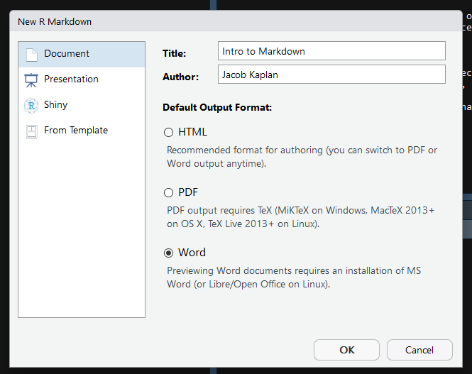
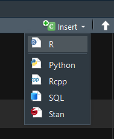
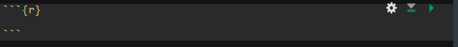
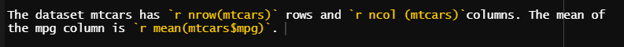
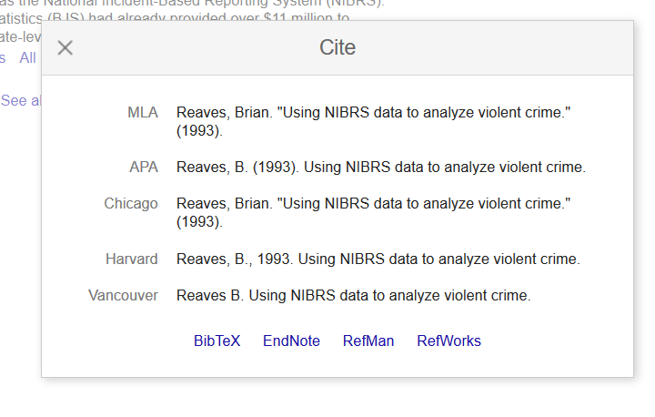
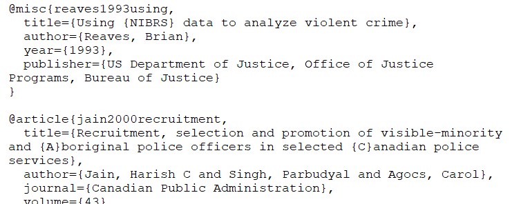

# R Markdown

When conducting research your end product is usually a Word Document or a PDF which reports on the research you've done, often including several graphs or tables. In many cases people do the data work in R, producing the graphs or numbers for the table, and then write up the results in Word or LaTeX. While this is a good system, there are significant drawbacks, mainly that if you change the graph or table you need to change it in R **and** change it in the report. If you only do this rarely it isn't much of a problem. However, doing so many times can increase both the amount of work and the likelihood of an error occurring from forgetting to change something or changing it incorrectly. We can avoid this issue by using R Markdown, R's way of writing a document and incorporating R code within. 

This chapter will only briefly introduce R Markdown, for a comprehensive guide please see [this excellent book](https://bookdown.org/yihui/rmarkdown/). For a cheatsheet on R Markdown see [here](https://www.rstudio.com/wp-content/uploads/2015/02/rmarkdown-cheatsheet.pdf).

What R Markdown does is let you type exactly as you would in Microsoft Word and insert the code to make the table or graph in the places you want it. If you change the code, the document will have the up-to-date result already, reducing your workload. There are some additional formatting you have to do when using R Markdown but it is minimal and is well-worth the return on the effort. This book, for example, was made entirely using R Markdown. 

To open up a R Markdown file click File from the top menu, then New File, and then R Markdown...


From here it'll open up a window where you select the title, author, and type of output. You can always change all three of these selections right in the R Markdown file after making your selection here. Selecting PDF may require you to download additional software to get it to output - some OS may already have the software installed. For a nice guide to using PDF with R Markdown, see  [here](https://medium.com/@sorenlind/create-pdf-.reports-using-r-r-markdown-latex-and-knitr-on-windows-10-952b0c48bfa9). 



When you click OK, it will open a new R Markdown file that is already populated with example text and code. You can delete this entirely or modify it as needed.


When you output that file as a PDF it will look like the image below.


R converted the file into a PDF, executing the code and using the formatting specified. In an R Script a `#` means that the line is a comment. In an R Markdown file, the `#` signifies that the line is a section header. There are 6 possible headers, made by combining the `#` together - a `#` is the largest header while `######` is the smallest header. As with comments, they must be at the beginning of a line. 

The word "Knit" was surrounded by two asterix `*` in the R Markdown file and became bold in the PDF because that is how R Markdown sets bolding - to make something italics using a single asterix like *this*. If you're interested in more advanced formatting please see the book or cheatsheet linked earlier.

Other than the section headers, most of what you do in R Markdown is exactly the same as in Word. You can write text as you would normally and it will look exactly as you write it.

## Code

The reason R Markdown is so useful is because you can include code output in the file. In R Markdown we write code in what is called a "code chunk". These are simply areas in the document which R knows it should evaluate as R code. You can see three of them in the example - at lines 8-9 setting a default for the code, lines 18-20 to run the `summary()` function on the *cars* data (a data set built into R), and lines 26-28 (and cut off in the screenshot) to make a plot of the data set *pressure* (another data set built into R). 

To make a chunk click Insert near the top right, then R.



It will then make an empty code chunk where your cursor is. 



Notice the three \` at the top and bottom of the chunk. Don't touch these! They tell R that anything in it is a code chunk (i.e. that R should run the code). Inside the squiggly brackets `{}` are instructions about how the code is outputted. Here you can specify, among other things if the code will be outputted or just the output itself, captions for tables or graphs, and formatting for the output. Include all of these options after the `r` in the squiggly brackets. Multiple options must be separated by a comma (just like options in normal R functions).  

If you do not have the R Markdown file in the same folder as your data, you'll need to set the working directory in a chunk before reading the data (you do so exactly like you would in an R Script). However, once a working directory is set, or the data is read in, it applies for all following chunks. You will also need to run any packages (using `library()`) to use them in a chunk. It is good form to set your working directory, load any data, and load any packages you need in the first chunk to make it easier to keep track of what you're using. 

### Hiding code in the output

When you're making a report for a general audience you generally only want to keep the output (e.g. a graph or table), not the code you used. At early stages in writing the report or when you're collaborating with someone who wants to see you code, it is useful to include the code in the R Markdown output.

If you look at the second code chunk in the screenshot (lines 18-20) it includes the function `summary(cars)` as the code and the options `{r cars}` (the "cars" simply names the code chunk "cars" for if you want to reference the chunk - or it's output if a table or graph - later, but does not change the code chunk's behavior). In the output it shows both the code it used and the output of the code. This is because by default a code chunk shows both. To set it to only show the output, we need to set the parameter `echo` to FALSE inside of the `{}`. 

In the third code chunk (lines 26-28), that parameter is set to false as it is `{r pressure, echo=FALSE}`. In the output it only shows the graph, not the code that was used. 

## Inline Code

You can also include R code directly in the text of your document and it will return the output of that code. To use it, you simple need to setup an inline code chunk using the tick mark followed by the lowercase letter R, the code you want to use, and then end it using another tick mark. This is called using inline code. When you have a table or visualization to output, this isn't the proper method, it is best for small pieces of text to add to your document. This is most useful for when you want to include some descriptive info, such as the number of respondents to a survey or the mean of some variable, in the text of your document. Inline code will only present the output of the code, and doesn't show the code itself. Below is an example of inline code - see the image below that for what it looks like with the code. 


The dataset mtcars has 32 rows and 11 columns. The mean of the mpg column is 20.090625. When rounded, the mean is 20.



## Tables

There are a number of packages that make nice tables in R Markdown. We will use the `knitr` package for this example. 

The easiest way to make a table in Markdown is to make a data.frame with all the data (and column names) you want and then show that data.frame (there are also packages that can make tables from regression output though that won't be covered in this lesson). For this example we will subset the *mtcars* data (which is included in R) to just the first 5 rows and columns. The `kable` function from the `knitr` package will then make a nice looking table. With `kable` you can add the caption directly in the `kable()` function. The option `echo` in our code chunk is not set to FALSE here so you can see the code.


```r
library(knitr)
#> Warning: package 'knitr' was built under R version 4.0.2
mtcars_small <- mtcars[1:5, 1:5]
kable(mtcars_small, caption = "This is an example table caption")
```


Table: (\#tab:unnamed-chunk-1)This is an example table caption

|                  |  mpg| cyl| disp|  hp| drat|
|:-----------------|----:|---:|----:|---:|----:|
|Mazda RX4         | 21.0|   6|  160| 110| 3.90|
|Mazda RX4 Wag     | 21.0|   6|  160| 110| 3.90|
|Datsun 710        | 22.8|   4|  108|  93| 3.85|
|Hornet 4 Drive    | 21.4|   6|  258| 110| 3.08|
|Hornet Sportabout | 18.7|   8|  360| 175| 3.15|

For another package to make very nice looking tables, see [this guide](https://cran.r-project.org/web/packages/kableExtra/vignettes/awesome_table_in_html.html) to the `kableExtra` package.

## Footnotes

In your writing, you'll often have sentences that you want to include but are auxiliary to your main point (or, frequently, to include links to specific resources such as a website where you got data from). In these cases you'll want to include that info as a footnote, which is a section at the bottom of the page for this kind of information. To create a footnote in RMarkdown, you use the carrot ^ followed immediately by square brackets []. Put the text inside of the [] and it'll print that at the bottom of the page. A footnote will look like this: `^[This sentence will be printed as a footnote]`. In cases where you have a very long footnote it may extend to the next page, and will be again at the bottom of the page. Look down at the bottom of this page to see the footnote (in a PDF or Word Doc, the footnote will be on the page you create it on, however since websites are just one long page without breaks, this footnote is at the very bottom of this entire page.^[This is an example of a footnote.] When you use a footnote, you'll usually put it immediately after the punctuation of the sentence it should be after. Note that footnotes are numbered so you can identify them. There's a blue superscript 1 where we made the footnote so people reading know the context - i.e. which part of the text they relate to. If we make another footnote, it'll be numbered sequentially, such that the next one one is 2, the next is 3, etc. 

If you're familiar with LaTeX you can use LaTeX code such as `\footnote{}` where the text goes inside the {}. But note that citations (which we'll learn in Section \@ref(citation)) won't work properly in the footnote if made this way. You can use LaTeX code - and use LaTeX packages - in RMarkdown if you'd like and it'll operate (in most cases) like normal LaTeX.

## Citation

In academic research you will need to cite the papers that you are referencing. RMarkdown has a built-in way to cite papers, though it's a bit of a process to get everything setup. You'll need the citation data in BibTeX format and we'll walk through the steps from finding an article that you want to cite to citing it in your RMarkdown file. First, a brief overview of what kinds of citations you can use. There are two types of citations you can use, in-text and parenthetical. You'll use in-text citations when you want to have the author names be in the text, and parenthetical citations when you want everything to be in parentheses. 

Note, there may be other ways to get the citations in the right format; I'm just showing you one way to do so. For this example, we'll use the article "Using NIBRS data to analyze violent crime" by Brian Reaves that was published in 1993. We'll walk through the process from finding the article on Google Scholar to citing it in your paper. First, from Google Scholar we'll search for the article title. 


This returns all articles that meet your search criteria. Since we're searching for a specific article title, we only get one result. The result shows some basic info about the article - title, date, name, abstract. Below the abstract are some important things. First, and circled in blue in the above photo, is a link that looks like quotation marks. This is what we'll click on to get to the BibTeX citation. While not necessary for citation, the next two links may come in handy during your research. 'Cited by 31' means that 31 published (in some format that Google can locate, not necessarily peer-reviewed articles) articles have cited this article. If you click the link it'll open up a Google Scholar page with all of these articles. This is a good way to find relevant literature. Clicking 'Related articles' does the same thing but with articles that Google Scholar deems similar, not necessarily articles linking to the one you're looking up.

But back to the quotes link circled in blue. Click this and it'll make a popup, shown below, of ways to cite this article is various formats. We'll have RMarkdown automatically generate the citation in the format we want so we don't need to worry about this. Instead, click the BibTeX link at the bottom left.   



When you click it, it'll open up a new page with that article's citation in BibTeX form, as shown below. This basically is just a way to tell a computer how to cite it properly. Each part of the citation - author, year, title, etc. - is its own piece. Take a close look at the section immediately after the first squiggly bracket, "reaves1993using". This is how you'll identify the article in RMarkdown so R knows which article to cite. It's essentially the citation's name. It's created automatically by combining the author name (first author if there are more than one author, publication year, and part of the title). You can change it to whatever you want it to be called. 


Note at the end of the publisher section are the characters "~...". This looks like a mistake made by Google Scholar so we'll need to delete that so it isn't included in a paper we use this citation in. When using Google Scholar, you'll occasionally find issues like this which you'll need to fix manually - a bigger issue is apostrophes or other punctuation may copy over from Google Scholar weird (meaning that it copies as a character that your computer, and thus RMarkdown, doesn't understand) and need to be rewritten so RMarkdown will run. You can rewrite it by just deleting the punctuation and typing it using your keyboard. This isn't always an issue so don't worry about it unless you get an error with the citations when outputting your document.

Below is the citation included in my .bib file, and the start of another citation also included in the file. A .bib file is basically a text file that programs can read to get citation info. You'll have all of your citations (in the BibTeX format) in this one file. To make a .bib file you can open up a text document, such as through the Notepad app in Windows, and paste the BibTeX that you've copied from Google Scholar. Save this file as a .bib extension (by renaming it filename.bib) and you'll have a usable .bib file.

Note that I have the word NIBRS surrounded by squiggly brackets {}. That is because by default RMarkdown (and other citation generators such as Overleaf) will only capitalize the first letter of the title or the first letter following a colon. Since NIBRS is an abbreviation and should be capitalized, I put it in the {} to force it to remain capitalized. This is often a problem with abbreviations or country names (such as United States) in the paper title I've also deleted the weird characters at the end of the publisher section. Since all citations you use for a project (I have a single .bib file that I use for projects since much of my work is on the same topic and the citations overlap across papers) are in one .bib file, you can see the start of another article cited below the Reaves citation. 


  
To use citations from your .bib file, add `bibliograph: references_file_name.bib` to the head of your RMarkdown file. If your .bib file isn't in the RMarkdown file's working directory, as my example below is not, you'll need to include the path in the file name.


Now that we have the citation in BibTeX format, put it in our .bib file, and told RMarkdown where to look for that file, we are ready to finally cite that article. To use a citation we simply put the @ sign in front of the citation name (in our case "reaves1993using") so we would write `@reaves1993using`. This will give us an in-text citation, with the author name in the text and the year in parentheses. Adding a - right in front of the @ will cause the citation to show just the year, not the author's name. You'll usually want to use this if you're already named the author earlier in the sentence. Generally we will want parenthetical citations, with both the authors and the year in parentheses. To do this, we put the citation inside of square brackets like this `[@reaves1993using]`. If we're citing multiple articles, we separate each citation using a semicolon `[@reaves1993using; @jain2000recruitment]`.

Here's what the results look like when citing that Reaves article, see the photo below for what this looks like just as code. 

[@reaves1993using]

@reaves1993using

-@reaves1993using

[-@reaves1993using]

[@reaves1993using; @jain2000recruitment]

If you use a citation that isn't in your .bib file, RMarkdown will present three question marks in place of the citation. 

[@wrongCitation]


When you use citations, R will automatically put the reference at the very end of the document. Two LaTeX commands may be useful here. `\clearpage` makes a new page so your reference section isn't on the same page as the conclusion. `\singlespace` makes the reference section single spaced if you document is set to be double spaced. Put these commands at the very end of your document so they only apply to the reference page. You don't need to do anything other than write them (for easier reading, make them on separate lines) at the end of the RMarkdown file. If you want to make the references go in another part of the paper (e.g. after tables and figures), just put this code at the place in the paper where you want to reference section to go: `<div id="refs"></div>`.
 
## Spell check 

RMarkdown does have a built-in spell checker (the ABC above a check mark symbol to the left of the Knit button) but it isn't that great. I recommend that you export to Word (or open up the PDF in Word if you prefer using PDFs) and using Word's superior spell checker.
 
## Making the output file

To create the Word or PDF output click `Knit` and it will create the output in the format set in the very top. To change this format click the white down-arrow directly to the right of `Knit` and it will drop-down a menu with output options. Click the option you want and it will output it in that format and change that to the new default. Sometimes it takes a while for it to output, so be patient.


