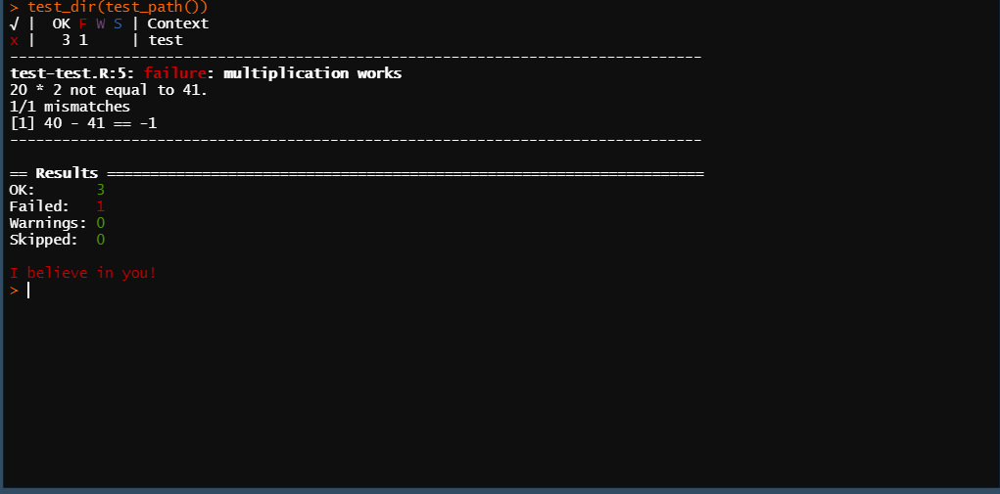
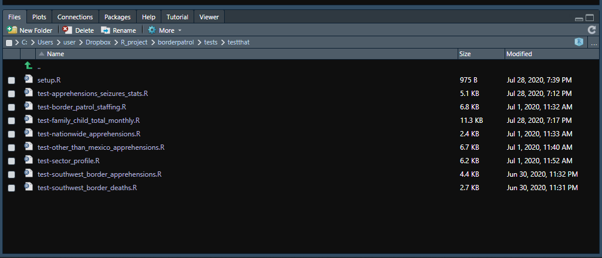
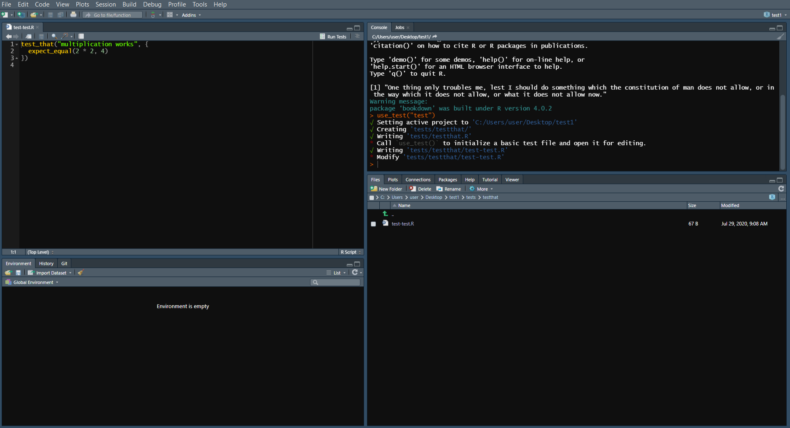
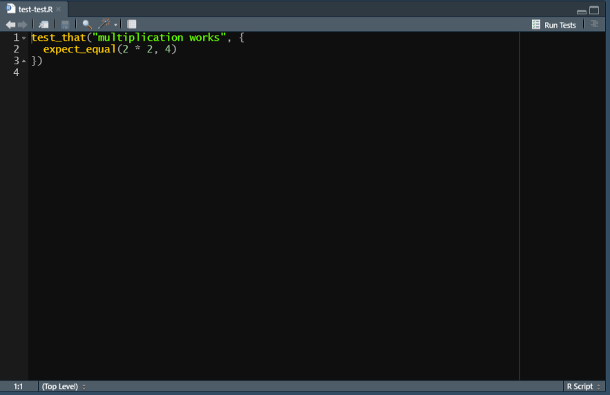
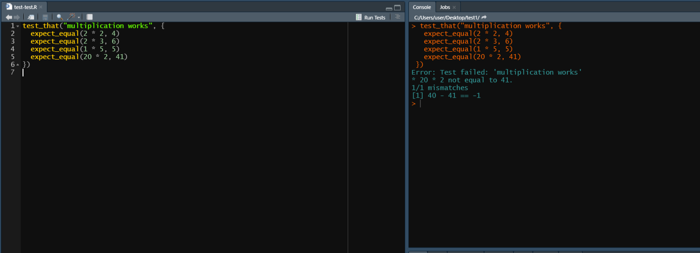
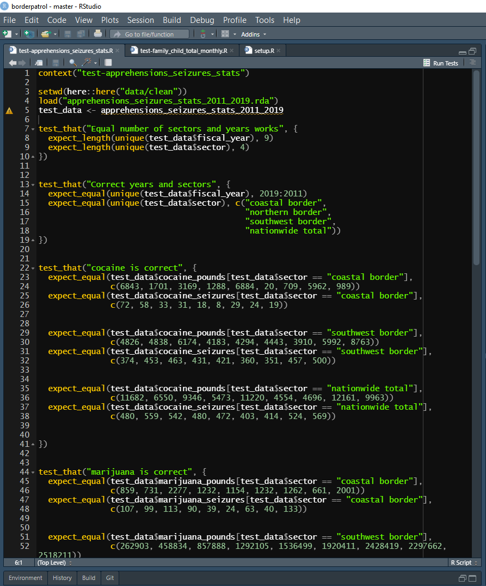

# Testing your code {#tests}

This chapter covers how to write code that tests other code. It's especially useful when you write complex functions but is also useful for work such as PDF scraping or webscraping where you know the right answer (by looking at the PDF or web page yourself) and want to be sure your scraping code did the scrape correctly. However, in most cases when programming for research you won't formally test your code - though you should be checking if everything makes sense and rereading your code to look out for errors (such as typos or using the wrong data). If you've never programmed before, I recommend that you skip this chapter entirely (or read it but don't feel pressure to understand everything) and return to it after you've finished the rest of the book.

## Why test your code?

As you write code, you will inevitably make mistakes. There are two main types of mistakes with coding - those that prevent code from working (i.e. give you an error message and don't run the code) and those that run the code but give you the wrong result. Of these, the first is probably more frustrating as R tends to give fairly unhelpful error messages and you'll feel you hit a roadblock since R just isn't working right. However, the second issue - code is wrong but doesn't tell you it's wrong! - is far more dangerous. This is especially true for research projects.

Let's use examining whether a policy affected murder as an example. In the example data set below, we have two years of data for both murder and theft, and we'll say that the policy changed at the start of the second year. If we want to see if murder changed from 2000 to 2001, we could (overly simply) see if the number of murders in 2001 was different from the number in 2000. And since the data also has theft, we'd want to subset to murder first. 


```r
example_data <- data.frame(year = c(2000, 2000, 2001, 2001),
                           crime_type = c("murder", "theft", "murder", "theft"),
                           crime_count = c(100, 100, 200, 50))
example_data
#   year crime_type crime_count
# 1 2000     murder         100
# 2 2000      theft         100
# 3 2001     murder         200
# 4 2001      theft          50
```

To see if murder changed, we can subset to the rows where the crime is murder, and then print out the year and crime_count columns to see if there is a change. So our code will be `example_data[example_data$crime_type == "murder", c("year", "crime_count")]`. Below I've accidentally only put one `=` instead of two, this will give us an error and not give any other results. Helpfully, the error message tells us that there's an error with the `=` sign, though not what that exact error is. 


```r
example_data[example_data$crime_type = "murder", c("year", "crime_count")]
# Error: <text>:1:38: unexpected '='
# 1: example_data[example_data$crime_type =
#                                          ^
```

Now I've made a different mistake. Here, instead of `==`, I've written `!=` which is the opposite of what we want - it'll return all rows that do **not** equal "murder". Now it looks like the policy cut murder in half when in actuality the policy doubled murders! Since we don't print out the type of crime in the output, we wouldn't catch this from the output alone.


```r
example_data[example_data$crime_type != "murder", c("year", "crime_count")]
#   year crime_count
# 2 2000         100
# 4 2001          50
```

You may think this is a silly example that is unrealistic. And it is to a degree, it's just one line of code that we're using to evaluate an entire policy. Now think about how you would actually evaluate a policy using data that you're familiar with. Now the code is going to be much more complex. Your code may be hundreds of lines long, deal with multiple data sets that must be joined together, and involve a number of relative subjective (though must be defensible) decisions as to how to deal with your data (e.g. what crimes constitute violent crime, what time unit to analyze), and some of the code may be written by other people who you are collaborating with. The increased complexity with a real analysis increases the likelihood that errors will occur - and even small issues such as an incorrect subset can have large impacts on your results. 

So, how do we properly test our code? There are two main methods that I'll refer to as informally testing and formally testing. The formal method will be using something called "unit tests" that we'll discuss in the next part of this chapter.

Informal methods are what you've likely been doing already. Essentially, just looking at your data and trying to see if it "looks right". This includes stuff like printing summary statistics (using `summary()`) of important variables and making simple graphs to look at the data. If something is wrong, exploring the data is a fairly good way to discover it. For example, if you are looking at arson data from the FBI, you may find (as this is actually in the data) some cities with millions of car arsons in a month. This is clearly wrong so you know there's an issue - in this case, an issue with not subsetting out obvious outliers. Knowledge about the topic and the data are also important in this approach. If you are familiar with a given topic and your results are similar to that of past studies, that's a good sign that you did things right.^[However, make sure that you don't look less closely just because the results are the way you expect. Past results may be wrong, or you can have a new finding, so make sure to avoid complacency just because you like the results]

You can also take this kind of approach when testing functions - which ideally are the way you write code. For example, if you have a function that takes a number and returns that number + 2, you can test it by checking a few cases. If you input 2, you expect 4. If you input -2, you expect 0. Do this a few times and you can be more confident that the function works properly. Now imagine a function that's more complex - one that calls a different function and uses the result of that function. If you change the underlying function, you'll need to check both that function and the function that calls it.

As you have more intertwined pieces in your code, this gets more and more complex. It also takes a lot more time as you'll have a lot of code that only checks a function and will have to run it line by line to see if there's an issue. At this point, relying on informal methods becomes unfeasible and you'll want to use unit tests, a formal way to test your code. Note, however, that this is far better suited for checking functions than for checking data, though it is possible to some degree. We'll discuss formally testing data in Section \@ref(tests-for-research-projects). 

## Unit tests

A unit test is simply a conditional statement where you have some input, usually a function with some parameters set, and state what you expect the result to be. You are saying "I expect that if I do X, I will get Y". And if you get a result other than what you expected, R will tell you. In R, you can make a number of unit tests and have R run them all at once and inform you of which ones failed. Each unit test is just a function in R that is specifically for checking whether other functions - or other code or data - are correct. They operate just like a normal function. To use unit tests, we'll use the R package `testthat` which has a number of functions that make unit testing easier, and we'll use some keyboard shortcuts in RStudio that also improve the ease of testing. 

Please note that these shortcuts will only work if you're working in an R Package, a normal R Project won't work. An R Package is a special type of R Project, which you can make by following the steps in Section \@ref(r-projects) and choosing "R Package" instead of "New Project" in the Project Type panel. An R Package is essentially an R Project with the goal of creating a package in R, though there's no requirement that we actually make a package. We can treat it as a normal R Project but use the added testing tools.

If you don't have `testthat` installed, do so using `install.packages("testthat")`. For more information on the package, please see the package's [website](https://testthat.r-lib.org/index.html).


```r
install.packages("testthat")
```


```r
library(testthat)
# Warning: package 'testthat' was built under R version 4.2.2
```

In `testthat`, every function follows the same `expect_` format where a type of conditional statement follows the _. For example, `expect_equal()` checks if two values are equal, `expect_named()` checks if the name of a data set is correct, and `expect_silent()` makes sure that the code that's run doesn't return any warnings, messages, or errors. To use this technique for our above example of the function that adds 2 to an inputted number - which we'll call `add_2()` - we can use some `expect_equal()` functions. If we input 2, we expect 4. So we'd write `expect_that(add_2(2), 4)`.     


```r
add_2 <- function(number) { return(number + 2) }
expect_equal(add_2(2), 4)
```

Above is the code that makes the `add_2()` function and one unit test checking it. It doesn't output anything. That is good. When a test passes, there is no information; when it fails, the function will output a message that it failed. Below is another test, this one intentionally wrong to show what happens when a test fails.


```r
expect_equal(add_2(2), 5)
# Error: add_2(2) not equal to 5.
# 1/1 mismatches
# [1] 4 - 5 == -1
```

It gives an error, telling us that the result of the `add_2(2)` function does not equal 5. Helpfully, it also shows us how much of a difference there is between what we expected and what we got. Note that it says "1/1 mismatches". That says that all of the expected values - we only expect one value here - are incorrect. If we expect more than one result, such as if we expect a function to return a vector, it will check each value and say exactly which ones (in the order we have the resulting vector) are incorrect. This is helpful when diagnosing exactly which part failed. 

There are a few different ways to run the unit tests. First, you can run them like a normal R script by running each line directly. This is fairly inefficient and loses some of the benefits built into RStudio for testing. Though in this case you do **not** need to be using an R Package, you can just use a normal R Project or just use normal R and the code will work fine.

The next way is to use the `test_dir()` function from the `testthat` package where you enter the folder directory in the parentheses and it runs every test file in that folder. It's easier to simply use the `test_path()` function which inserts the correct folder, assuming that you didn't move folders around after `use_test()` (which we'll discuss below) created them. So you'd write `test_dir(test_path())` and it would run all of your tests. This also prints out a nice summary of the results for all of your tests combined, showing the number of tests that passed, that failed (i.e. didn't pass), that returned warnings, and that were skipped (you can force R to skip some tests which is useful when you change one part of the code and know those tests will fail but still want to test other parts).

You will also need to run all the functions or load all of the data that the tests check, otherwise you'll get an error since R doesn't implicitly know that the functions/data exist. You can run this the normal way by highlighting and running the function (or the code to load data) in your R script or use the shortcut Control+Shift+L (Command+Shift+L on a Mac, the L stands for "Load") which will run every R file in your project (and every line of each file).  

The final way is to use the keyboard shortcut Control+Shift+T (Command+Shift+T on a Mac, the T stands for "Test") which will load all of the files in your folder and then run all of the tests. It's a quicker way of doing the above method. However, this shortcut only works when using an R Package, not a normal R Project. 



### Modular test scripts

Before getting into exactly how to write a unit test correctly, we'll talk about organizing each testing file. As with your normal R script, you can have separate testing scripts (a testing script is a normal R script which people use specifically for testing code but doesn't actually function any different) for each major part of the code that you're testing.^[For more info on having separate R scripts for each major section of your code, please refer to Section \@ref(modular-r-scripts)] As with the R scripts for your code, this is simply a way to organize your work, and doesn't affect the testing. Below is an image showing the files I use to test the US Border Patrol scrapers. I have one file per PDF that I scraped. 



Note where the folder depicted above is located. It's in a folder called "testthat" in the "tests" folder in the main project folder that I called "borderpatrol." We'll use a helpful function from the `usethis` package to organize our test files and generate them automatically. If you haven't installed this package already, do so using `install.packages("usethis")` and then load it with `library(usethis)`. ^[The `usethis` package is an extremely helpful package that automates a lot of work that you would do primarily for R package development so if you go down that route I recommend exploring the package more through its website https://usethis.r-lib.org/index.html).]

You can use the function `use_test()` from the `usethis` package to create a test file inside your R Project. This will automatically create the necessary file and folders (if not created already) so you don't have to do any more work. Run this function by putting the name of the test file you want to create (in quotes) in the parentheses. It will open the test file in the Source panel (shown in the top left). In the example shown below, I wrote `use_test("test")` to make a new file called "test". In the Source panel, the file is called "test-test.R," which is just because `usethis` will automatically add "test-" to the name of any test file name you make. `use_test()` will also generate an example of a test, which you can modify (or delete entirely) to suit your own needs. 



The first file in the testthat folder is called setup.R, which is a file that will automatically run first when you run a test script through R or using RStudio's keyboard shortcut. This file is where you run some code that is used during the tests. In my setup.R file I made several vectors, which I use during the tests to subset the data. You won't always need to have a setup.R file, but it's useful when you want to run the same code beforehand for multiple different test scripts. 


### How to write unit tests

We'll start by looking at the default test example made when using `use_test()` to understand the organization of a test file before getting into an example of actual tests. In the image below, there are really two pieces. First, we have the actual test on line 2 - `expect_equal(2 * 2, 4)`. This is saying, I expect 2 * 2 to equal 4, and R will check if that is true. All of your tests will be in this format, just for a specific result from a specific input. Now let's look at the code surrounding that line - `test_that("multiplication works", {})` where the `expect_equal()` line goes inside the {}. 



The `test_that` code is basically a form of organization within a test file to group similar tests together. In this case it is grouping all of the tests that check if "multiplication works," though we only have one test written. Below I've added three new tests to this "multiplication works" testing group. To run this code, I can either run each `expect_equal()` individually (remember to run `library(testthat)` beforehand or it won't run) or run the entire `test_that()` group at once. You can do this by either highlighting it all and running it or selecting either the top or bottom line (which has the squiggly brackets) and running that line - the entire thing will run. 

The benefit of this is that when you run all the tests you write (and you'll often have many test groups and more individual tests than shown here), if a test in a group fails, it will tell you exactly which group failed (based on the name of the group which you specify - here, "multiplication works"). Note that the final test in this example is incorrect, and in the Console panel on the right it says that "Test failed: 'multiplication works' to tell you where the test failed. The test groups aren't necessary, but they make it easier to organize your tests.



As an example of actual tests, we'll go over the tests that I wrote when I first scraped the US Border Patrol data that we will scrape in Chapter \@ref(scrape-table). This test file is organized almost identically to the example one shown above. At the start I have some code that loads the data that I will test - this isn't in the setup file since the code is for this specific test script (though it could be in the setup.R file and the results would be the same). While most tests check the result of functions, here I am checking the data that is outputted by the function, and not rerunning the function for each test. I do this because the function that scrapes the PDF is relatively slow to run and I have many tests, but putting the function that gets the data in the test directly will give the exact same results. Then there are several `test_that()` groups with some `expect_equal()` tests inside each. 

Since these tests are checking if the code is scraping the PDFs correctly, I determine the expected result by looking at the PDFs and writing down what the values should be (be careful, this must be done by hand but that can mean you mistype - so double-check your work!). We'll use the test on lines 21-22 as an example. Here I am asking if the values in the "cocaine_pounds" column, for rows where the sector is "coastal border" are equal to the values `c(6843, 1701, 3169, 1288, 6884, 20, 709, 5962, 989)`. If they are, then the scraping was correct (at least for this part of the PDF) and the code worked. In this case I checked every value that meets the two conditions, but that's just because there were relatively few values. If I had many values that meet those conditions (i.e. many rows of data in that column), I would just check a small number of them. 



### What to test

Now that we've gone over how to make unit tests, let's talk about what to test. When testing functions, you generally want to test every possible parameter in the function, and a variety of inputs. In particular, try to think of ways that the function could be used incorrectly and write a test to catch that. For example, our `add_2()` function will fail if a string (e.g. "2") was inputted instead of a number, so you'll want to add a test for that. You'll also want to make sure that inputting something other than simply a single number, such as a vector of numbers, works as expected. Basically, you want to be thorough and cover all of your bases. 

Writing unit tests is one of the most time-efficient things you can do since it helps you avoid making costly (in time and in getting wrong results) mistakes. But don't spend too much time writing tests. If you've tested that `add_2(2)` equals 4, no need to test that `add_2(3)` equals five since you're essentially testing the exact same thing. And consider your audience (even if that is only you). If you know that `add_2()` will only be used by people who know better than to input a string, there's no need to test for that. In general, I think it's always better to have more tests than fewer, but consider whether writing that test is a good use of your time. This is something that you'll learn with experience so it's better to have too many tests when you're first using R than too few.

#### Tests for research projects

When you use R for a research project, you'll usually take data that someone else collected, or scrape it yourself, do some work to clean this data (e.g. subset or aggregate the data, standardize values) and then run a regression on it. In these cases there are relatively few opportunities to use unit tests to check your code. Indeed, the best checks are often content knowledge about the data and examining the results of your analysis to see if it makes sense and fits prior literature. 

While testing is most commonly used for functions, you can use it to test data. Writing tests for research data is best if your code is scraping the data (webscrape or PDF scrape) and you want to verify that it is correct, or if you expect the data to change and want to ensure that it is still correct (while exact values will change, you can check broad categories such as whether certain groups are included). For example, if you know that you only want to look at a certain state, you can write a test that expects the only state in the data to be the one you're analyzing. This way, if you add more data, such as a new release of that data set, the test will catch if there's any other state that you may have forgotten to remove after adding the new data. If you're sure that you will only use a particular data set that never changes, you're better off just writing code in your main R script (or a specific script for checking the data) to do these checks rather than dedicated tests. 

#### Tests for data collection

Our example in this chapter was tests for a data collection process - in our case, PDF scraping - so we've already seen how to test code for gathering data. We'll still talk briefly here about what kind of tests - and how many tests - you will want for this type of code. In normal tests, you don't want to test the exact same thing multiple times (for example, if you test that 2 + 2 = 4, you don't need to test that 2 + 3 = 5). This is different when it comes to testing code that collects data from a source, such as through PDF scraping or webscraping. 

When testing data collection code, you want to be far more thorough, retesting something in multiple ways. This is because small differences in the data you are scraping may affect the code at different parts of the scrape. For example, imagine a PDF with ten pages and a single table on each page. On the first page there five columns but on the next nine pages there are six columns. If you test only data from the first page you'll miss all of the pages where there are six columns instead of five - and where your code to scrape it is probably wrong.

I've often experienced PDF or webscraping where some parts of the data are just "weird" and cause the code to scrape it incorrectly - but often not tell me that there's an issue. So to catch this you'll need far more tests than normal. I prefer to choose a few random pages (more if the PDF/website is longer) and test random rows and columns since that'll give a good coverage of the results. In addition, I look at the PDF or website and try to see if there's anything atypical about a certain part; if there is, I test that specifically. It's easy to over-test (and that's better than under-testing) this kind of work, but there are rapidly diminishing returns. So test comprehensively but not at the cost of having too little time to work on code - again, this is something that requires experience and doesn't have a hard rule on what constitutes too much (or too little) testing. 

## Test-driven development (TDD)

We'll finish this chapter by talking about test-driven development (TDD), a philosophy in programming where you write the tests first and then write the code that meets these tests after. This is really an extension to the discussion in Chapter \@ref(mise-en-place) of planning out your project before you start. In Chapter \@ref(mise-en-place) we talked about writing out every step of the project and hand sketching all the figures or tables that you intended to have. With TDD, you write tests for all of the functions you intend to write (and any variations of parameters or inputs for these functions) or data you intend to gather/clean. 

Test-driven development is a useful tool to make you really think about the functions that you need to write, and how they interact with each other. This is an excellent way to identify potential issues (I've often realized while writing tests that the approach I was going to do wouldn't work) before you start on the code. However, for this same reason, it is a fairly advanced topic since you need to know exactly (or, mostly) what you need to do, and the likely problems that each approach will face. For that reason, I recommend holding off on using TDD until you're fairly experienced with R or programming in general.
