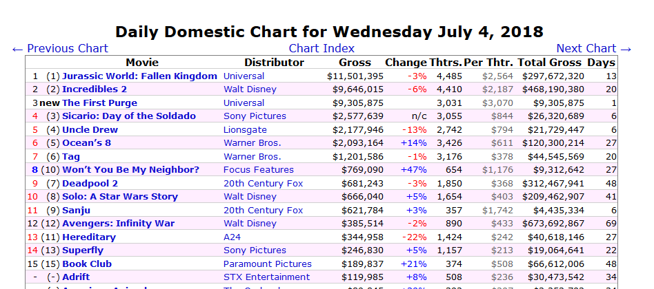
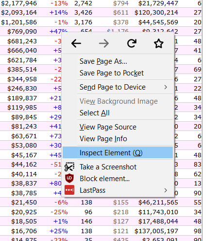

# Webscraping with `rvest`

You may come across data online that are relevant to your interests or research (for example, past students have scraped data from sex offender registries and sporting information from Wikipedia). Not all online data is in a tidy, downloadable format such as a .csv or .rda file. Yet, patterns in the page provide a valuable way to "scrape" data from that webpage. Here, we're going to work through an example of webscraping. We're going to get data on ticket sales of every movie, for every day in a single year. 

For our purposes we will be using the R package [`rvest`](https://github.com/tidyverse/rvest). This package makes it relatively easy to scrape data from websites, especially when that data is already in a table on the page as our data will be.

If you haven't done so before, make sure to install `rvest`.


```r
install.packages("rvest")
```

And every time you start R, if you want to use `rvest` you must tell R so by using `library()`.


```r
library(rvest)
#> Loading required package: xml2
```

We will be scraping movie ticket data from the website [The-Numbers](http://www.the-numbers.com). This site has daily information on how much money each movie in theaters made that day. The data includes the name of the movie, the number of theaters it played in, how much it made that day, how much it made since it started playing, and how many days it has been in theaters. Conveniently, this is all found in a single table on that page.

Here is a screenshot of data from July 4th, 2018 and here is a link to [that page]([http://www.the-numbers.com/box-office-chart/daily/2018/07/04](http://www.the-numbers.com/box-office-chart/daily/2018/07/04)




## Scraping one page

In later lessons we'll learn how to scrape an entire year of data from this site. For now, we'll focus on just getting data from July 4th, 2018.

The first step to scraping a page is to read in that page's information to R using the function `read_html()` from the `rvest` package. The input for the () is the URL of the page we want to scrape. In a later lesson, we will manipulate this URL to be able to scrape data from many pages. 


```r
read_html("http://www.the-numbers.com/box-office-chart/daily/2018/07/04")
#> {xml_document}
#> <html>
#> [1] <head>\n<!-- Global site tag (gtag.js) - Google Analytics --><script ...
#> [2] <body>\n\r\n<script>\r\n  window.fbAsyncInit = function() {\r\n    F ...
```

When running the above code, it returns an XML Document. The `rvest` package is well suited for interpreting this and turning it into something we already know how to work with. To be able to work on this data, we need to save the output of `read_html()` into an object which we'll call "movie_data" since that is our end goal. 


```r
movie_data <- read_html("http://www.the-numbers.com/box-office-chart/daily/2018/07/04")
```

We now need to select only a small part of page which has the relevant information - in this case the data in the table.

Right click somewhere in the table and then click "Inspect Element".



This will open up a tab on the screen and allows you to see the building blocks on that page. When you move your cursor over parts of this tab, the parts of the page it relates to will be highlighted in blue. Want want all of the data from the table so move your cursor to where it starts with "<table". Doing so will highlight the entire table in blue. 


Right click the "table" area and click Copy then CSS Selector. That will copy what we need. Essentially this says which part of the page is the table and allows us grab only that part from the XML Document we made earlier. 


We will use the function `html_nodes()` to grab the part of the page (based on the CSS selectors) that we want. The input for this function is first the object made from `read_html()` (which we called "movie_data") and then we can paste the text we copied from thr website (putting it in quotes). 

Note that when doing this in Google Chrome, you follow the same steps except click "Copy selector" rather than "CSS Selector". The value copied also differs between Chrome and Firefox though the result is the same in our code. 


```r
movie_data <- html_nodes(movie_data, "#page_filling_chart > center:nth-child(2) > table")
```

Since we are getting data from a table, we need to tell rvest that the format of the scraped data is a table. We do with using `html_table()` and our input in the () is the the object made in the function `html_nodes()`.


```r
movie_data <- html_table(movie_data)
```

By default, `rvest` returns a list. We prefer to work with data.frames so we're going to use double square bracket notation [[]] to just take the first object in the list, which is the data from the table we scraped. In a future lesson we will discuss more explicitly what lists are and understand what we are doing here.


```r
movie_data <- movie_data[[1]]
```

Take a look at the webpage and compare it to the data set you've now created. All the values should now match.


```r
head(movie_data)
                                 Movie   Distributor       Gross Change
1 1 (1) Jurassic World: Fallen Kingdom     Universal $11,501,395    -3%
2 2 (2)                  Incredibles 2   Walt Disney  $9,646,015    -6%
3 3 new                The First Purge     Universal  $9,305,875       
4 4 (3)    Sicario: Day of the Soldado Sony Pictures  $2,577,639    n/c
5 5 (4)                     Uncle Drew     Lionsgate  $2,177,946   -13%
6 6 (5)                      Ocean’s 8  Warner Bros.  $2,093,164   +14%
  Thtrs. Per Thtr.  Total Gross Days
1  4,485    $2,564 $297,672,320   13
2  4,410    $2,187 $468,190,380   20
3  3,031    $3,070   $9,305,875    1
4  3,055      $844  $26,320,689    6
5  2,742      $794  $21,729,447    6
6  3,426      $611 $120,300,214   27
```


```r
tail(movie_data)
                       Movie          Distributor  Gross Change Thtrs.
43 - (-)               Beast Roadside Attractions $1,332   -18%     14
44 - (-)     On Chesil Beach      Bleecker Street $1,305    -2%     10
45 - (-) Let The Sunshine In     Sundance Selects $1,098  +104%      4
46 - (-)    Super Troopers 2     20th Century Fox   $718   -44%     21
47 - (-)        Summer of 67     Self Distributed   $450  +254%      1
48 - (-)      Chappaquiddick Entertainment Studi…   $445   -44%      6
   Per Thtr. Total Gross Days
43       $95    $798,923   55
44      $131    $733,899   48
45      $275    $855,165   69
46       $34 $30,608,780   76
47      $450      $6,196    6
48       $74 $17,387,545   90
```

We have now successfully scraped a website! The "movie_data" object is a data.frame object that we are familiar with from looking at the Chicago and UCR data so we can subset and manipulate it like we've done before. 

## Cleaning the webscraped data

Let's look at some summary statistics and try to find which movie made the most money that day. Let's check what the max value is in the "Gross" column which says how much the movie made on that day. 


```r
max(movie_data$Gross)
#> [1] "$9,646,015"
```

So the most money a movie made is about \$9.6 million. Is that right? We can check either the website or the data in `View()` to see if there are any more successful movies (convienently, the table is already sorted by how much the movie made). No! The most successful movie made \$11.5 million, not \$9.5 million. So why did `max()` say the top value is 9.6 million? Let's take another look at the values in the "Gross" column.


```r
head(movie_data$Gross)
#> [1] "$11,501,395" "$9,646,015"  "$9,305,875"  "$2,577,639"  "$2,177,946" 
#> [6] "$2,093,164"
```

The values are not actually numeric type. If a value is numeric in R it would only have numbers, not dollar signs or commas like we see here. It also would not be in quotes, R's way of saying "this value is a character type". So what we have to do is turn these values into numeric type. 

The way to convert a character type into a numeric type is the function `as.numeric()`. Let's take a look at the very first value in that column, "$11,501,395".


```r
as.numeric("$11,501,395")
#> Warning: NAs introduced by coercion
#> [1] NA
```

Running `as.numeric()` on that value returns NA because it doesn't know how to handle the dollar sign and comma. If we remove those, it will work as expected.


```r
as.numeric("11501395")
#> [1] 11501395
```

We can use `gsub()` which we learned earlier in \@ref(regular-expressions) to delete the dollar sign and commas from our values. After that we can use `as.numeric()` to fix that column. (alternatively we could use the function `parse_number()` from the `readr` package, but this is a good example of using regular expressions)

Remember that the syntax of `gsub()` is 

gsub("find", "replace", string_to_fix)

First we will remove the comma. We want to use `gsub()` to find all commas and replace it with nothing (deleting it). To indicate nothing we just use quotes without anything in it.


```r
gsub(",", "", "$11,501,395")
#> [1] "$11501395"
```

Now to do the dollar sign. Remember that in `gsub()` and `grep()` the \$ is a special character indicating that whatever precedes it is the last character. To tell R we want the \$ literally, we use two backslashes before it - this is how to deal with all special characters, not just dollar signs.


```r
gsub("\\$", "", "$11,501,395")
#> [1] "11,501,395"
```

Each of these `gsub()`s work alone. We need to combine them to remove both the dollar sign and comma. We have two choices for this. The first choice is to use the `|` operator which tells `gsub()` to replace the value on the left **or** right side of the `|` symbol (or both if both are present). 


```r
gsub(",|\\$", "", "$11,501,395")
#> [1] "11501395"
```

The second choce is to do them separately and save the results into an object that we use in the second `gsub()`. Let's first save our value ""$11,501,395" into an object we call "x" and then run both `gsub()` we wrote earlier, using "x" (without quotes since it is an object) as our value and saving the results back into "x". For those not very comfortable with regular expressions, this is the better way of doing it as you can deal with simpler `gsub()` expressions than above. 


```r
x <- "$11,501,395"
x <- gsub(",", "", x)
x <- gsub("\\$", "", x)
x
#> [1] "11501395"
```

Finally we can use `as.numeric()` on the result to turn it into a numeric type.


```r
as.numeric(x)
#> [1] 11501395
```

Now we have code that works on a single value, let's do it for the entire "Gross" column and turn it numeric. 

```r
movie_data$Gross <- gsub(",|\\$", "", movie_data$Gross)
movie_data$Gross <- as.numeric(movie_data$Gross)
```

We can look at the first 6 rows in that column and check the max value to see if our code worked.


```r
head(movie_data$Gross)
#> [1] 11501395  9646015  9305875  2577639  2177946  2093164
```


```r
max(movie_data$Gross)
#> [1] 11501395
```

## Fixing names

If we run `names()` on our data we will see that there is a column with a space in the name "Total Gross". This is an issue because it is difficult to select a function with a space in the name. 


```r
names(movie_data)
#>  [1] ""            ""            "Movie"       "Distributor" "Gross"      
#>  [6] "Change"      "Thtrs."      "Per Thtr."   "Total Gross" "Days"
```

Trying to do so using the dollar sign notation causes an error.


```r
head(movie_data$Total Gross)
#> Error: <text>:1:23: unexpected symbol
#> 1: head(movie_data$Total Gross
#>                           ^
```

To select it we need to put the name in between tick marks `` so R knows to include the value after the space as part of the colum name. 


```r
head(movie_data$`Total Gross`)
#> [1] "$297,672,320" "$468,190,380" "$9,305,875"   "$26,320,689" 
#> [5] "$21,729,447"  "$120,300,214"
```

An alternative is to change the column name using both `names()` and `gsub()` together to remove the space. Running `names()` returns the name of every column. If we assign something to the `names()` it will actually change the column names to whatever we assign it. What we want to do is use `gsub()` to replace all spaces in column names with something else - either with nothing or a value R understands as part of a name such as an underscore. 


```r
gsub(" ", "", names(movie_data))
#>  [1] ""            ""            "Movie"       "Distributor" "Gross"      
#>  [6] "Change"      "Thtrs."      "PerThtr."    "TotalGross"  "Days"
```

If we assign the results of that `gsub()` to the `names()`, it will change the names to the values resulting from `gsub()`.


```r
names(movie_data) <- gsub(" ", "", names(movie_data))
```

We can check to make sure it worked by again running `names()`.


```r
names(movie_data)
#>  [1] ""            ""            "Movie"       "Distributor" "Gross"      
#>  [6] "Change"      "Thtrs."      "PerThtr."    "TotalGross"  "Days"
```

We have now scraped a single page of movie data. In the next lessons we will learn how to scrape multiple pages. 

### Exercises

1. Turn the columns "Thtrs." and "TotalGross" into numeric type.
2. What was the average number of theaters that a movie played in?
  + How many more theaters did the top movie (by number of theaters) play in than average?
  + How many fewer theaters did the bottom movie (by number of theaters) play in than average?
3. How big is the difference in theates as the mean number of theaters played in and the median? Which should we use?
