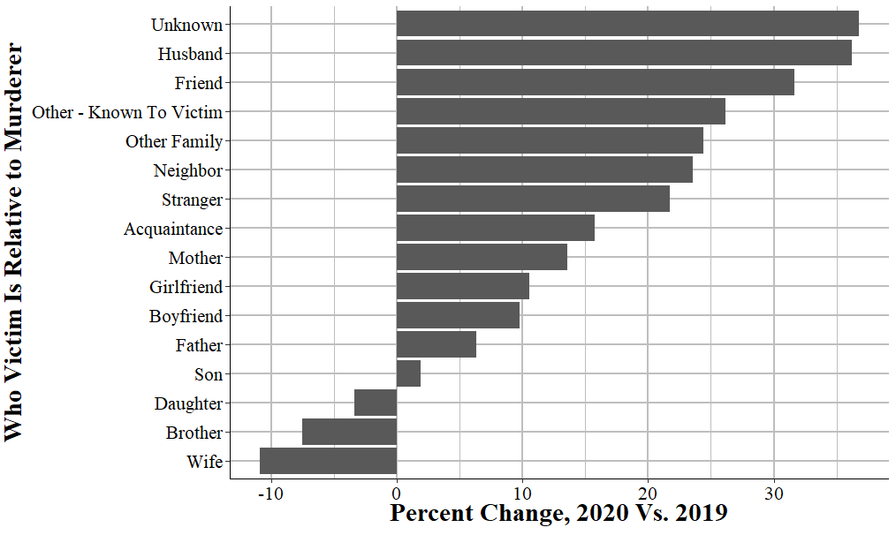

\mainmatter

# (PART) Introduction {-}

# A soup to nuts project example

Before we get into exactly how to use R, we'll go over a brief example of a kind of data project that you'd do in the real world. For this chapter we'll look at FBI homicide data that you can download [here.](https://github.com/jacobkap/r4crimz/tree/master/data) The file is called "shr_1976_2020.rds".

## Big picture data example

Below is a large chunk of R code along with some comments about what the code does. The purpose of this example is to show that with relatively little code (excluding blank lines and comments, there are only 35 lines of R code here) you can go from opening a data set to making a graph that answers your research question. I don't expect you to understand any of this code as it is fairly complex and involves many different concepts in programming. So if the code is scary - and for many early programmers seeing a bunch of code that you don't understand is scary and overwhelming - feel free to ignore the code itself. 

We'll cover each of these skills in turn throughout the book so that by the end of the book you should be able to come back and understand the code (and modify it to meet your own needs). The important thing is that you can see exactly what R can do (and this is only a tiny example of R's flexibility) and think about the process to get there (which we'll talk about below). 

At the time of this writing, the FBI had just released 2020 crime data, which showed about a 30% increase in murders relative to 2019. This had led to an explosion of (in my opinion highly premature) explanations of why exactly murder went up so much in 2020. A common explanation is that it is largely driven by gun violence among gang members who are killing each other in a cyclical pattern of murders followed by retaliatory murders. For our coding example, we'll examine that claim by seeing if gang violence did indeed increase, and whether it increased more than other types of murders. 

The end result is the graph below. It is, in my opinion, a fairly strong answer to our question. It shows the percent change in murders by the victim-offender relationship from 2019 to 2020. This is using FBI murder data, which technically does have a variable that says if the murder is gang related, but it's a very flawed variable (i.e. vast undercount of gang-related murders) so I prefer to use stranger and acquaintance murders as a rough proxy. And we now have an easy to read graph that shows that while indeed stranger and acquaintance murders did go up a lot, nearly all relationship groups experienced far more murders in 2020 than in 2019. This suggests that there was a broad increase in murder in 2020, and it was not driven merely by an increase in one or a few groups. 

```{r, echo = FALSE}

```

These graphs (though modified to a table instead of a graph) were included in a article I contributed to on the site [FiveThirtyEight](https://fivethirtyeight.com/features/murders-spiked-in-2020-how-will-that-change-the-politics-of-crime/) in discussing the murder increase in 2020. So this is an actual work product that is used in a major media publication - and is something that you'll be able to do by the end of this book. For nearly all research you do you'll follow the same process as in this example: load data into R, clean it somehow, and create a graph or a table or do a regression on it. While this can range from very simple to very complex depending on your exact situation (and how clean the data is that you start with), all research projects are essentially the same.

Please look at the following large chunk of code. We'll next go through each of the different pieces of this code to start understanding how they work. Throughout the course of this book we'll cover these steps in more detail - as most research programming work follows the same process - so here we'll talk more abstractly about what each does. The goal is for you to understand the basic steps necessary for using R to do research, and to understand how R can do it - but not having to understand what each line of code does just yet. 

```{r}
library(dplyr)      # Used to aggregate data
library(ggplot2)    # Used to make the graph
library(crimeutils) # Used to capitalize words in a column
library(tidyr)      # Used to reshape the data

# Load in the data
shr <- readRDS("data/shr_1976_2020.rds") 

# See which agencies reported in 2019 and 2020
# An "ori" is a unique identifier code for agencies in FBI data
agencies_2019 <- shr$ori[shr$year == 2019]
agencies_2020 <- shr$ori[shr$year == 2020]
# Get which agencies reported in both years so we have an
# apples-to-apples comparison
agencies_in_both <- agencies_2019[agencies_2019 %in% agencies_2020]

# Keep just data from 2019 and 2020 and where the agencies
# is one of the agencies chosen above. Also keep only murder and 
# nonnegligent manslaughter (so excluding  negligent manslaughter). 
shr_2019_2020 <- shr[shr$year %in% 2019:2020,]
shr_2019_2020 <- shr_2019_2020[shr_2019_2020$ori  %in% 
                                 agencies_in_both,]
shr_2019_2020 <- shr_2019_2020[shr_2019_2020$homicide_type %in% 
                                  "murder and nonnegligent manslaughter",]

# Get the number of murders by victim-offender relationship in 2019 and 2020
# Then find the percent change in murders by this group from 2019 to 2020
# Sort data by smallest to largest percent change
shr_difference <- 
  shr_2019_2020 %>%
  group_by(year) %>%
  count(victim_1_relation_to_offender_1) %>%
  spread(year, n) %>%
  mutate(difference = `2020` - `2019`,
         percent_change = difference / `2019` * 100,
         victim_1_relation_to_offender_1 = 
           capitalize_words(victim_1_relation_to_offender_1)) %>%
  filter(`2019` >= 50) %>%
  arrange(percent_change)

# This is only for the graph. By default graphs order alphabetically
# but this makes sure it orders it based on the ordering we made above
# (smallest to largest percent change)
shr_difference$victim_1_relation_to_offender_1 <- 
  factor(shr_difference$victim_1_relation_to_offender_1,
         levels = shr_difference$victim_1_relation_to_offender_1)

# Makes a barplot showing the percent change from 2019 to 2020 in number
# of murders by victim group. Labels the x-axis and the y-axis, shifts 
# the graph so that relationship labels are on the y-axis for easy reading. 
# And finally uses the "crim" theme that changes the colors in the graph to
# make it a little easier to see.
ggplot(shr_difference, aes(x = victim_1_relation_to_offender_1, 
                           y = percent_change)) +
  geom_bar(stat = "identity") +
  ylab("% Change, 2020 Vs. 2019") +
  xlab("Who Victim Is Relative to Murderer") + 
  coord_flip() +
  theme_crim() 
```

## Little picture data example

We'll now look at each piece of the larger chunk of code above, and I'll explain what it does. There are five different steps that I take to create the graph from the data we use:

1. Load the packages we use
2. Load the data
3. Clean the data
4. Aggregate the data
5. Make the graph

### Loading packages

In R we'll often use code written by other people that have tools that we want to use in our code. To use this code we need to tell R that we want to use that particular package - and packages are just a collection of other people's code. A collection of code for a specific purpose (e.g. making a graph, doing a very particular cleaning task) is called a function. Each package is a collection of functions. For this example, we're using packages that help us clean and aggregate data or to graph it, so we load it here. The general convention is to start your R file with each of the packages you want to use at the top of the file. 

```{r}
library(dplyr)    
library(ggplot2)    
library(crimeutils) 
library(tidyr)      
```

### Loading data

Next we need to load in our data. The data we're using is a type of R data file called an .Rds file so we load it using the function `readRDS()`, which is one of the functions built into R so we don't actually need to use any package for it. For this example, we're using data from the FBI's Supplementary Homicide Report which are an annual data set that has relatively detailed information on most (but not all, as not all agencies report data) murders in the United States. This includes the relationship between the victim and the offender (technically the suspected offender) in the murder, which is what we'll look at. When we read in the data to R we need to give it a name so R knows what it is called. We'll call this data "shr" since that is the normal abbreviation for the Supplementary Homicide Report data. Normally in R we use lower cased letters when naming something, which is why we're calling it "shr" rather than "SHR."

Each row of data is actually a murder incident, and there can be up to 11 victims per murder incident. So we'll be undercounting murders as in this example we're only looking at the first victim in an incident. But, as it's an example, this is fine as I don't want it to be too complicated and including more than just the first victim would greatly complicate our code. 

```{r}
shr <- readRDS("data/shr_1976_2020.rds") 
```

### Cleaning 

One of the annoying quirks of dealing with FBI data is that different agencies report each year. So comparing different years has an issue because you'll be doing an apples-to-oranges competition as an agency may report one year but not another. So for this data the first thing we need to do is to make sure we're only looking at agencies that reported data in both years. The first few lines check which agencies reported in 2019 and which agencies reported in 2020. We do this by looking at which ORIs (in the "ori" column) are present in each year (as agencies that did not report won't be in the data). An ORI is the FBI term for a unique ID for that agency. Then we make a vector, which has only the ORIs that are present in both years.

We then subset the data to only data from 2019 and 2020 and where the agency reported in both years. Subsetting essentially means that we only keep the rows of data that meet those conditions. Another quirk of this data is that it includes homicides that are not murder - namely, negligent manslaughter. So the final subsetting condition we use is that it only includes murder and nonnegligent manslaughter.

```{r}
agencies_2019 <- shr$ori[shr$year == 2019]
agencies_2020 <- shr$ori[shr$year == 2020]
agencies_in_both <- agencies_2019[agencies_2019 %in% agencies_2020]


shr_2019_2020 <- shr[shr$year %in% 2019:2020,]
shr_2019_2020 <- shr_2019_2020[shr_2019_2020$ori  %in% agencies_in_both,]
shr_2019_2020 <- shr_2019_2020[shr_2019_2020$homicide_type %in% 
                                 "murder and nonnegligent manslaughter",]
```

### Aggregating 

Now we have only the rows of data that we want. Each row of data is a single murder incident, so we want to aggregate that data to the year-level and see how many murders there were for each victim-offender relationship group. The following chunk of code does that and then finds the percent difference. Since we can have large percent changes due to low base rates, we then remove any rows where there were fewer than 50 murders of that victim-offender relationship type in 2019. Finally, we arrange the data from smallest to largest difference. We'll print out the data just to show you what it looks like. 

```{r}
shr_difference <- 
  shr_2019_2020 %>%
  group_by(year) %>%
  count(victim_1_relation_to_offender_1) %>%
  spread(year, n) %>%
  mutate(difference = `2020` - `2019`,
         percent_change = difference / `2019` * 100,
         victim_1_relation_to_offender_1 = 
           capitalize_words(victim_1_relation_to_offender_1)) %>%
  filter(`2019` >= 50) %>%
  arrange(percent_change)
shr_difference
```

### Graphing

Once we have our data cleaned and organized in the way we want, we are ready to graph it. By default when R graphs data it will organize it alphabetically. In our case we want it ordered by smallest to largest change in the number of murders between 2019 and 2020 by relationship type. So we first tell R to order it by the relationship type variable, which we've already sorted in the last section of code. Then we use the `ggplot()` function (which is covered extensively in Chapters \@ref(graphing-intro) and \@ref(ois-graphs)) to make our graph. In our code we include the data set we're using, which is the shr_difference data and the columns we want to graph. Then we tell it we want to create a bar chart and what we want the x-axis and y-axis labels to be. Finally, we have two lines that just affect how the graph looks. All of this is covered in the two graphing chapters, but is only several lines of code to go from cleaned data to a beautiful - and informative - graphic. 

```{r}
shr_difference$victim_1_relation_to_offender_1 <- 
  factor(shr_difference$victim_1_relation_to_offender_1,
         levels = shr_difference$victim_1_relation_to_offender_1)

ggplot(shr_difference, aes(x = victim_1_relation_to_offender_1, 
                           y = percent_change)) +
  geom_bar(stat = "identity") +
  ylab("% Change, 2020 Vs. 2019") +
  xlab("Who Victim Is Relative to Murderer") + 
  coord_flip() +
  theme_crim() 
```

## Reusing and modifying code

One of the main benefits of programming is that once you write code to do one thing, it's usually very easy to adapt it to do a similar thing. Below I've copied some of the code we used above and changed only one thing: instead of looking at the column "victim_1_relation_to_offender_1" we're now looking at the column "offender_1_weapon". That's all I did, everything else is identical. Now after about 30 seconds of copying and changing the column name, we have a graph that shows weapon usage changes from 2019 to 2020 instead of victim-offender relationship. 

This is one of the key benefits of programming over something more click intensive like using Excel or SPSS.^[I'm aware that technically you can write SPSS code. However, every single person I know who has ever used SPSS does so by clicking buttons and is afraid of writing code.] There's certainly more upfront work than just clicking buttons, but once we have working code we can very quickly reuse it or modify it slightly. 

```{r}
shr_difference <- 
  shr_2019_2020 %>%
  group_by(year) %>%
  count(offender_1_weapon) %>%
  spread(year, n) %>%
  mutate(difference = `2020` - `2019`,
         percent_change = difference / `2019` * 100,
         offender_1_weapon = capitalize_words(offender_1_weapon)) %>%
  filter(`2019` >= 50) %>%
  arrange(percent_change)

shr_difference$offender_1_weapon <- 
  factor(shr_difference$offender_1_weapon,
         levels = shr_difference$offender_1_weapon)
ggplot(shr_difference, aes(x = offender_1_weapon, 
                           y = percent_change)) +
  geom_bar(stat = "identity") +
  ylab("% Change, 2020 Vs. 2019") +
  xlab("Offender Weapon") + 
  coord_flip() +
  theme_crim() 
```
