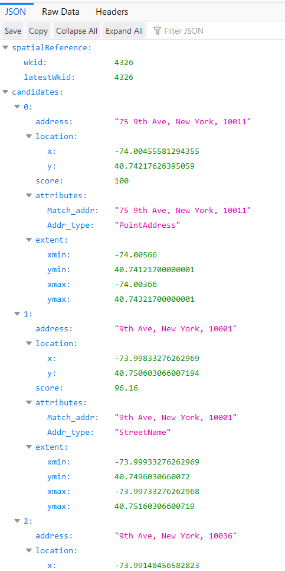

# Geocoding 

Several recent studies have looked at the effect of marijuana dispensaries on crime around the dispensary. For these analyses they find the coordinates of each crime in the city and see if it occurred in a certain distance from the dispensary. Many crime data sets provide the coordinates of where each occurred, however sometimes the coordinates are missing - and other data such as marijuana dispensary locations give only the address - meaning that we need a way to find the coordinates of these locations.

## Geocoding a single address

In this chapter we will cover using the free geocoder from ArcGIS, a software that people frequently use when dealing primarily with mapping projects. Google Maps used to be easily usable in R but since 2018 requires an account to use its geocoder so we will not be using it.

The URL for geocoding using ArcGIS is the following:

`https://geocode.arcgis.com/arcgis/rest/services/World/GeocodeServer/findAddressCandidates?f=json&singleLine=ADDRESS&outFields=Match_addr,Addr_type`

where instead of "ADDRESS" we put in the address whose coordinates we want. As an example, let's look at Food Network's Corporate office where they film many of their shows. The address is 75 9th Ave, New York, NY 10011.

`https://geocode.arcgis.com/arcgis/rest/services/World/GeocodeServer/findAddressCandidates?f=json&singleLine=75%209th%20Ave,%20New%20York,%20NY%2010011&outFields=Match_addr,Addr_type`

Including spaces in the address causes errors so all spaces need to be replaced with `%20`. Let's see what data we get back from this URL. Enter the URL above in your browser and you'll see these results.



It gives us a page with several important values. For our purposes we want the "lat" and "lon" sections which are the latitude and longitude parts of a location's coordinates. 

This data is stored on the page in a JSON format which is a convenient (for computers to read) way data is stored online. We can concert it to a data.frame that we're more familiar with using the package `jsonlite`.

```{r eval = FALSE}
install.packages("jsonlite")
```

We will use the `fromJSON()` function and enter in the URL right in the (). 

```{r}
library(jsonlite)
fromJSON("https://geocode.arcgis.com/arcgis/rest/services/World/GeocodeServer/findAddressCandidates?f=json&singleLine=75%209th%20Ave,%20New%20York,%20NY%2010011&outFields=Match_addr,Addr_type")
```

It returns a list of objects. This is a named list meaning that we can grab the part of the list we want using dollar sign notation as if it were a column in a data.frame. In this case we want the part of the object called *candidates*. To avoid having a very long line of code, let's call the list `fromJSON()` returns *address_coordinate* and grab the *candidates* object from that list. 

```{r}
address_coordinates <- fromJSON("https://geocode.arcgis.com/arcgis/rest/services/World/GeocodeServer/findAddressCandidates?f=json&singleLine=75%209th%20Ave,%20New%20York,%20NY%2010011&outFields=Match_addr,Addr_type")
address_coordinates$candidates
```

*candidates* is a data.frame which includes 12 (slightly) different coordinates for our address. The first one is the one we want and if you look at the "score" column you can see it has the highest score of those 12. The ArcGIS geocoder provides a number of potential coordinates for an inputted address and ranks them in order of how confident it is that this is the address you want. Since we just want the top address - the "most confident" one - so we will just keep the first row.

Since we are grabbing the first row of a data.frame, our square bracket notation must be `[row, column]`. For row we put 1 since we want the first row. Since we want every column, we can leave it blank but make sure to keep the comma.

```{r}
address_coordinates <- fromJSON("https://geocode.arcgis.com/arcgis/rest/services/World/GeocodeServer/findAddressCandidates?f=json&singleLine=75%209th%20Ave,%20New%20York,%20NY%2010011&outFields=Match_addr,Addr_type")
address_coordinates <- address_coordinates$candidates
address_coordinates <- address_coordinates[1, ]
address_coordinates
```

This data.frame has something we've never seen before. It has columns that are themselves data.frames. For example, the column "location" is a data.frame with the x- and y-coordinates that we want. We can select this exactly as we do with any column but instead of returning a vector of values it returns a data.frame.

```{r}
address_coordinates$location
```

Since our end goal is to get the coordinates of an address, the data.frame in the "location" column is exactly what we want. It took a few steps but now we have code that returns the coordinates of an address. 

## Making a function

We want to geocode every single address from the officer-involved shooting data. As with most things where we do the same thing many times except for one minor change - here, the address being geocoded - we will make a function to help us. 

Let's start by copying the code used to geocode a single address. 

```{r}
address_coordinates <- fromJSON("https://geocode.arcgis.com/arcgis/rest/services/World/GeocodeServer/findAddressCandidates?f=json&singleLine=75%209th%20Ave,%20New%20York,%20NY%2010011&outFields=Match_addr,Addr_type")
address_coordinates <- address_coordinates$candidates
address_coordinates <- address_coordinates[1, ]
address_coordinates$location
```

Now we can make the skeleton of a function without including any code. What do we want to input to the function and what do we want it to return? We want it so we input an address and it returns the coordinates of that address. 

We can call the function *geocode_address*, the input *address* and the returning value *address_coordinates* just to stay consistent with the code we already wrote.

```{r}
geocode_address <- function(address) {
   
   return(address_coordinates)
}
```

Now we can add the code.

```{r}
geocode_address <- function(address) {
   address_coordinates <- fromJSON("https://geocode.arcgis.com/arcgis/rest/services/World/GeocodeServer/findAddressCandidates?f=json&singleLine=75%209th%20Ave,%20New%20York,%20NY%2010011&outFields=Match_addr,Addr_type")
   address_coordinates <- address_coordinates$candidates
   address_coordinates <- address_coordinates[1, ]
   address_coordinates$location
   return(address_coordinates)
}
```

Finally we need to replace the value in `fromJSON()` which is for a specific address with something that works for any address we input.

Since the URL is in the form

`https://geocode.arcgis.com/arcgis/rest/services/World/GeocodeServer/findAddressCandidates?f=json&singleLine=ADDRESS&outFields=Match_addr,Addr_type`

we can use the `paste()` function to combine the address inputted with the URL format. There is one step necessary before that, however. Since spaces cause issues in the data, we need to replace every space in the address with `%20`. We can do that using `gsub()` which is perfect for replacing characters. Let's try a simple example using `gsub()` before including it in our function. We just want to find every `" "` and replace it with `"%20"`. 

We will use the address for the Food Network's Corporate office as our example.

```{r}
gsub(" ", "%20", "75 9th Ave, New York, NY 10011")
```

It works so we can use the code to fix the address before putting it in the URL. To avoid having very long lines of code, we can break down the code into smaller pieces. We want to use `paste()` to combine the parts of the URL with the address and have that as the input in `fromJSON()`. Let's do that in two steps. First, we do the `paste()`, saving it in an object we can call *url*, and then use *url* as our input in `fromJSON()`. Since we do not want spaces in the URL, we need to set the `sep` parameter in `paste()` to "".

```{r}
geocode_address <- function(address) {
   address <- gsub(" ", "%20", address)
   url <- paste("https://geocode.arcgis.com/arcgis/rest/services/World/GeocodeServer/findAddressCandidates?f=json&singleLine=",
                address,
                "&outFields=Match_addr,Addr_type",
                sep = "")
   address_coordinates <- fromJSON(url)
   
   address_coordinates <- address_coordinates$candidates
   address_coordinates <- address_coordinates[1, ]
   address_coordinates <- address_coordinates$location
   
   return(address_coordinates)
}
```

We can try it using the same address we did earlier, "75 9th Ave, New York, NY 10011".

```{r}
geocode_address("75 9th Ave, New York, NY 10011")
```

It returns the same data.frame as earlier so our function works!

## Geocoding San Francisco marijuana dispensary locations

We now have a function capable of returning the coordinates of every location in our marijuana dispensary data. We can write a for loop to go through every row of data and get the coordinates for that row's location. 

Let's read in the marijuana dispensary data which is called "san_francisco_active_marijuana_retailers.csv" and call the object *marijuana*.

```{r}
setwd(here::here("data"))
library(readr)
marijuana <- read_csv("san_francisco_active_marijuana_retailers.csv")
marijuana <- as.data.frame(marijuana)
```

Let's look at the top 6 rows. 

```{r}
head(marijuana)
```

So the column with the address is called *Premise Address*. Since it's easier to deal with columns that don't have spacing in the name, we will be using `gsub()` to remove spacing from the column names. Each address also ends with "County:" followed by that address's county, which in this case is always San Francisco. That isn't normal in an address so it may affect our geocode. We need to `gsub()` that column to remove that part of the address.

```{r}
names(marijuana) <- gsub(" ", "_", names(marijuana))
```

Since the address issue is always " County: SAN FRANCISCO" we can just `gsub()` out that entire string.
 
```{r}
marijuana$Premise_Address <- gsub(" County: SAN FRANCISCO", "", marijuana$Premise_Address)
```

Now let's make sure we did it right.

```{r}
names(marijuana)
head(marijuana$Premise_Address)
```


We can now write a for loop to go through every row in our data and geocode that address. The function `geocode_address()` we made returns a data.frame with one column for the longitude and one for the latitude. To make it so we only work with the data.frame *marijuana* we can save the output of `geocode_address()` to a temporary file and add each of the columns it produces to a column in *marijuana*.

We need to make columns for the coordinates in *marijuana* now to be filled in during the for loop. We can call them *lon* and *lat* for the longitude and latitude values we get from the coordinates. When making a new column which you will fill through a for loop, it is a good idea to start by assigning the column NA. That way any row that you don't fill in during the loop (such as if there is no match for the address), will still be NA. NAs are easy to detect in your data for future subsetting or to ignore in a mathematical operation. 

```{r}
marijuana$lon <- NA
marijuana$lat <- NA
```

Let's start with an example using the first row. Inputting the address from the first row gives a data.frame with the coordinates. Let's now save that output to an object we'll call *temp*.

```{r}
temp <- geocode_address(marijuana$Premise_Address[1])
temp
```

We can use square bracket `[]` notation to assign the value from the *x* column of *temp* to our *lon* column in *marijuana* and do the same for the *y* and *lat* columns. Since we got the address from the first row, we need to put the coordinates in the first row so they are with the right address.

```{r}
marijuana$lon[1] <- temp$x
marijuana$lat[1] <- temp$y
```

And we can check the first 6 rows to make sure the first row is the only one with values in these new columns.

```{r}
head(marijuana)
```

Since we are geocoding a few dozen of addresses, this may take some time. 

```{r cache = TRUE}
for (i in 1:nrow(marijuana)) {
   temp <- geocode_address(marijuana$Premise_Address[i])
   marijuana$lon[i] <- temp$x
   marijuana$lat[i] <- temp$y
}
```

Now it appears that we have longitude and latitude for every dispensary. We should check that they all look sensible.

```{r}
summary(marijuana$lat)
```

```{r}
summary(marijuana$lon)
```

Another check is to make a simple scatterplot of the data. Since all the data is from San Francisco, they should be relatively close to each other. If there are dots far from the rest, that is probably a geocoding issue.

```{r}
plot(marijuana$lon, marijuana$lat)
```

Most points are within a very narrow range so it appears that our geocoding worked properly. 

To finish this lesson we want to save the *marijuana* data.frame. We'll use the `write_csv()` function from the `readr` package to save it as a .csv file. Since this data is now geocoded and it is specifically for San Francisco, we'll save it as "san_francisco_marijuana_geocoded.csv".

```{r}
setwd(here::here("data"))
write_csv(marijuana, path = "san_francisco_marijuana_geocoded.csv")
```
