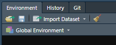

# Git

## What is Git and why do I need it?

As you write R code you will - I hope! - save your R script from time to time (preferably using RStudio's auto-save feature) to avoid losing any code you've written if you close R or shut down your computer. This is important as it'll save everything you've done locally but if your computer crashes, you'll want your work to be backed up elsewhere. While you should have something like Dropbox or Google Drive that keeps backups of your work, here we'll talk about Git which is a version control software that gives you much more control (but requires more work) of the saved work than from something like Dropbox.^[This came in handy for me as somehow one of my dissertation papers written in RMarkdown became empty a couple of months before my defense and I couldn't undo that change. My Dropbox backup was older than my Git backup so having Git was a real time saver] Before getting into exactly how to use Git, we'll talk first on what it is and how it'll help your work. Git is also a very powerful and complex tool so this guide is going to be touching just a small - but useful to most researchers and R programmers - part of it.

With backup software such as Dropbox, it'll save your work very frequently - so frequently in fact that I turn off Dropbox when I write R since it keeps interrupting me by saving at the moment I'm typing, which stops the typing. Below is the Dropbox page for some R code that I've been working on to scrape COVID data. Notice the timestamps - 4/5 of them are within one minute, showing how often Dropbox is saving changes. This is useful if I need the most recent update - or to share the most recent version with a collaborator. Here's the big issue - and the one that Git solves - I have four versions within a minute of each other, what's the difference between them? Dropbox is saving automatically and doesn't indicate how they're different (clicking on the file shows the complete file, not differences relative to some previous version) which means if I mess up some code a while ago, I can't easily see which version is the one that works. With Git you can essentially wait until you've made enough changes to decide that these changes merit a new "version" of your work (One way to think about this is )

If you're ever used the track changes feature on a Word Document(or Google Doc or Overleaf, etc.), the concept is similar. When you have this setting in a Word or Google Doc every time you (or anyone else) makes changes in that document, those changes, who made them, and when they occurred, is tracked. This makes it easy to see exactly what part of the file was changed and to undo that change if necessary. Below is an example of this feature on one of my drafts on Overleaf (basically a way to collaborate using LaTeX which is similar to RMarkdown). You can see each change that my co-author Aaron Chalfin made in the draft in the purpose changes the main part of the photo. The parts that were rewritten or added are highlighted in purple while the parts that were deleted have a purple . What is shown in purple isn't all of the history of changes for this paper. If you look at the part on the right, highlighted in green, it shows what files were edited, by whom, and at what time. If you don't like a change - or in R's case more commonly, broke some code by accident - you can go back in the history of changes and return to an older version.

The way that R - and many other programming languages (and technically you can use this for any file or folder) does this "version control" is through Git. 

The times you see are ones that Overleaf automatically set each change to. 

You make changes to your code or RMarkdown file and the computer will track these changes.

## Git basics

There are four main processes you need to know for a basic understanding of Git: checkout, add and commit, push, and pull. We’ll use the example of getting a book from the library to walk through using Git. The steps for this are simple, we go to the library, pick a book we want, check it out from the librarian, read it, and eventually return it. Using Git adds one wrinkle to this, we will want to write in the book and see what other people write too. Of course, when the book is checked out, no one else could write in our version, and no one can see what we write. So anything we write has to be done before we return the book to the library, then we check-out the book again to see what other people have written. When we want another book, we simply redo these steps. 

Library Steps | Git steps     | Git code 
------------- | ------------- | ------------- 
Go to library | | 
Find book and check-out book | Clone (usually will just be done once per project). RStudio helps with this. The code you see in the next cell is a little more complicated than normal since we’re using RStudio Server. | Git clone *path to repo, can be GitHub link*  
Read or write in book | This is done in R, not in Git  | No Git code, this is going to be whatever code we write in R. Also includes any outputs such as making a graph that is saved, RMarkdown outputs like a PDF, or even new R files. 
Return book | Add & commit   Push | Git add .  Git commit –m “message indicating what we wrote”   Git push 
Check-out book again (to see what other people have written in it)  | Pull | Git pull

Another way to think about commit vs push is that of writing an email. When you write an email, you’re essentially editing a blank document by adding the words of the email. When you save (but don’t send) the email, you are making a commit (essentially “committing” or promising to make a change). When you send the email you are making a push (taking something that you have written and changed and sending it to the main repository). While emails let you correspond directly between two or more people, how Git works is like sending the email to a central server (or a Post Office) and anyone who wants to read it has to go there. And when someone reads it and responds their email also goes to this central server. You have to go there to get their response (called a “pull” in Git terms) which is essentially an addition to your initial email. 

## Using Git

While you can use Git like writing R code (though the syntax is not that similar to R), RStudio has built-in buttons that work instead of writing code yourself. We'll go through these buttons and not discuss any Git code beyond the small amount needed to link your project to GitHub, a website that is like DropBox for Git. 

### Github

we'll be using GitHub to host our Git commits. To use GitHub, please make an account on their website [https://Github.com/](https://Github.com/). There are several [types of accounts](https://Github.com/pricing) at various monthly costs but you only need the Free version. This gives you an unlimited number of public and private repositories (sometimes shorthanded to 'repos') - these are basically R Projects (you can use any language when it comes to using Git and GitHub, not just R). 

A public repository is one that anyone can look at on GitHub, download the code/files and make any changes they want (though if they want to make changes to your repository they need to make a change request, it is not automatic). This is good for projects where you want others to collaborate on or to showcase your work. A private repository is the same thing but only people you approve can view, download, and work on your repository. This is good for when you don't want the code to be public (e.g. code for an employer or dealing with sensitive data such as people's personal information). I tend to keep my research work private until the paper is published and my data work public since I want people to notice it and find bugs.^[You may disagree with my decision to keep research code private until publication - and for good reason. Doing this has the benefit of preventing people from scooping my (and my collaborator's) work, but also makes it more likely to lead to bugs as there are fewer people looking at the code.]

Once you've made an account on GitHub, you'll need to create a repository there to connect to your R Project. You can do this through the GitHub home page as shown below. This page is my own homepage and shows several on my current repositories on the left (note the ones with a golden lock to the left, these are the private repositories which are only accessible to people I permit), a list of updates on other people's repositories that I chose to get updates from, and some suggested repositories that GitHub thinks I'd be interested in on the right. To create a new repository, click the green New button on the left side above the list of current repositories. 

After you click the green New button, you'll go to a page when you set a name for your repository (this can be different than the name of your R Project though I prefer to use the same name so I know exactly what project the repository is for), provide a short description, and choose if the repository should be public or private. You can also optionally add a README file which is a longer form of description for what the code is and its purpose (basically a short manual for the project - often explaining how, not why, it works), and add a .gitignore file or set a license (which tells people who look at the project what they're allowed to do with it. For more on code licenses please see this excellent [site](https://choosealicense.com/).) The .gitignore file is essentially a list of files or folders than you do **not** want  These last three choices are all optional and if you don't do it now, you can do it anytime through R. Once you've made your choices, click the green Create Repository button

This will open up a new page with a bunch of code that you'll enter in R that connects your R Project Git commits to this repository on GitHub. We'll get to this in a bit - for now, let's focus on those three buttons in the top left. These are for accessing or following other people's public repositories (you can technically click on them in your own repository but there isn't much benefit to that apart from the first button). 

The first button sets your notification settings for the repository. To change the notification setting, click "Unwatch" and then select how much you want to be notified for. By default it is set to notify you of all conversations that occur. The main conversation will be when someone posts a message in the Issues tab where they tell you about an issue (or sometimes a request for a new feature or just ask a question) about the code in this repo. With your own repositories, you'll want to be notified of all conversations so you don't miss anything. You can use this option on other people's repositories and it will alert you of changes or conversations in that repo. This is useful when you want to know about updates (i.e. new features) on repositories that you're interested in (for example, I follow the [testthat repo](https://Github.com/r-lib/testthat) so I know of any new versions of that package that may have useful features).

Stars are simply a way to favorite a repository and you can see a list of all repositories that you have starred by clicking the profile button on the top right and going to "Your stars".

The final option is "Fork" which creates a new repository on your account that is a copy of the repository that you forked. You will want to fork other people's repositories - there isn't much benefit of forking your own as that's essentially just making a duplicate of your own work - and modify them to suit your needs. This is useful for two reasons. First, if you want collaborate with someone - even if just to submit a fix to a bug you found (or a typo in this book!) - you can fork their repository, make the changes on your own RStudio project, commit the changes, and request that the original account accept your changes into the repository that you forked (called a "pull request"). 

This sounds very complicated to make what could be a simple change (and it is) so why bother? As you get more familiar with R and how R handles Git, this process won't take *too* much extra time so it's not that much of an additional burden. But the main advantage is that Git establishes much more structure than would exist otherwise, and helps protect the original creator's time. Consider that you found a bug in some of my code and sent me an email detailing that issue. This is probably the best-case scenario for you - it is quick to send emails. For me, that adds time to try to figure out what and where the bug is (describing it better would just take more time for you to write and me to read) and then to fix the bug. Even if you included the fix in the email, it would take me time to test it. 

When using Git and GitHub, this process is far easier for the person receiving the changes (and while is extra work because you must follow Git procedures, it can be somewhat easier as you won't need to explain as much). If you submit a bug changes to me through GitHub, I will immediately know what is changes as Git highlights all changes between my version and your fixed version, and I can set it to automatically run tests (see Chapter \@ref(tests) for more on this) to make sure everything works. There is no longer any questions of what was changed, where the code was changed, how it is changed (barring confusing code being used), or whether it passes all the unit tests. Everything is largely automated so accepting changes is a breeze. As you program and collaborate more, you'll increasingly be on the side of receiving changes to your code, so the balance between extra work as a submitted and easier time as a receiver of changes gets better. 

In Section \@ref(r-projects) we walked through making an R Project and selected the "Create a Git repository" box without explaining what that does. Clicking this box sets the R Project up to use Git so you don't need to do any other steps from the R side (but you'll need some steps to connect with GitHub). In the below section we discuss a simple way to connect your R Project to Git if you didn't check this box. If you plan on always checking the box - and have no unchecked R Projects that you want to use with Git, feel free to skip the following section. 

## Setting up Git on an already made R Project

If you didn't tell RStudio to setup Git in your R Project, it's quite simple to do so through RStudio.

First, go to Tool -> Project Options. Then click the Git/SVN button that is second to the bottom to open up the Git options. This will open up a page that says "Version control system" which will be set to "(None)". Click this and set it to "Git".

It will then ask if you want to set up Git for the current R Project. Say Yes. 

You need to restart RStudio for Git to work now, so click Yes.

Now if you look at the Environment panel you can see a new tab called "Git". We'll do all of the Git work in RStudio through this tab. You are now ready to use Git for this project. 

## Using Git through RStudio

The below photo shows my Git tab while working on this chapter and from an update to the Subsetting chapter. It has a list of all of the files that I changed since my last commit (if you haven't committed at all yet, this is just all of the files in your project folder) and is color coded based on what I did to them. The blue M means that I have modified an already existing - i.e. one that has already been committed through Git - file, and and the yellow ? means that these are new files. If there was a red D next to any of the files, that would mean that I deleted a file that had previously been committed. There are a lot of buttons here (Diff, Commit, Pull, etc.) but you can ignore them and just click the Commit button when ready to make a commit. Doing so will open up a new window that has all the functionality of these various buttons in an easier (in my opinion) format.

This window is where you can review the changes and write up a brief note about what you did. The window is a bit overwhelming so we'll take it in pieces. First let's start by examining how the list of files in the top left is related to the big box on the bottom with text highlighted in red and green. The list of files is identical to that in the Git tab - it's just a list of files that have changed (including new files and deleted files) since the last commit. When you click one, it'll show you the changes made to this file relative to the most recent version on Git (note that while this will show changes on R files and some other types of files, not all are available to be viewed - though that won't affect Git working at all - so it may just show a blank part of the window instead). The section that was remove is highlighted in red and the replacement is highlighting in green. Unfortunately, it shows changes on entire lines so if you only change a small part of a line, you will have to read closely to see the difference. You can look through this to exactly what you changed - both in which files were changed and what was changed in each file.

Now let's walk through the process of actually committing and pushing your changes to GitHub. In real terms, this is basically uploading a new version of the files to GitHub, with brief documentation of what changed. At this point all we need to do is tell RStudio which files we want to commit, write a brief message explaining the changes, and submit it. 

First, we select which files to commit by clicking the checkbox to the very left on the top left panel. In the image below, they are all unchecked as I haven't selected any yet. You can click each file's box or click the Stage button near the top once you have a file (or files) highlighted to stage it. Once it's staged the checkbox will now have a check in it. Staging a file just means that you want to commit this file. If you want to commit all of the files, you can do Control+A (or Command+A) to select all of the files and then click Stage. 

Now you're ready to document the **overall** changes that you're committing, not the changes for each individual file. You do so in the "Commit message" box on the right. Again, here it is blank but you would write a short description (there is no hard rule that it must be short, but the general convention is each commit is relatively small and thus the description of the message can be short. You generally want no less than a short sentence and no more than a paragraph. Though of course this depends on your unique circumstances. As you first start out, I think over-describing your work is best as you get a feel to what to do.). Now click the Commit button.

It will make a popup window showing all the changes that it made. The "create mode ..." stuff is saying that these files (the images) are new files that Git hasn't seen before. You can close this popup.

You have now completed your first commit commit using Git through RStudio. The files aren't on GitHub just yet though. Now right above the list of files is text that says "Your branch is ahead of 'origin/master' by 1 commit." This means that your version of the project is ahead of (since you made changes to the project that you just committed) the version on GitHub. To send it to GitHub you just need to push the Push button on the top right. In our email example, this is like clicking send after writing your draft and saving (committing) it. When you click Push it'll open up a popup which you can close once it's done.

## When to commit

There is no hard rule for when to make a commit, but the general convention is to make one whenever you've finished a unique "part" of the work. For example, if you have some data that you need to clean, graph, and run a regression on, you'd likely commit after each part is done. One of the benefits of using Git is that you will have a record of each version of the code that you commit - so you want to balance between having too many records that are very similar to each other (similar to saving a new version of a paper draft every time you add a sentence) and too few so you lose a lot of work if you need to go back (similar to saving a new version of the paper only every 10 pages of writing). 
 

## Other resources

For an excellent overview of using Git and GitHub with R, please see [this chapter](https://r-pkgs.org/Git.html) of Hadley Wickham and Jenny Bryan's book [R Packages](https://r-pkgs.org/). For a short and very accessible book on this topic, please see Jenny Bryan and Jim Hester's excellent [Happy Git and GitHub for the useR](https://happyGitwithr.com/).