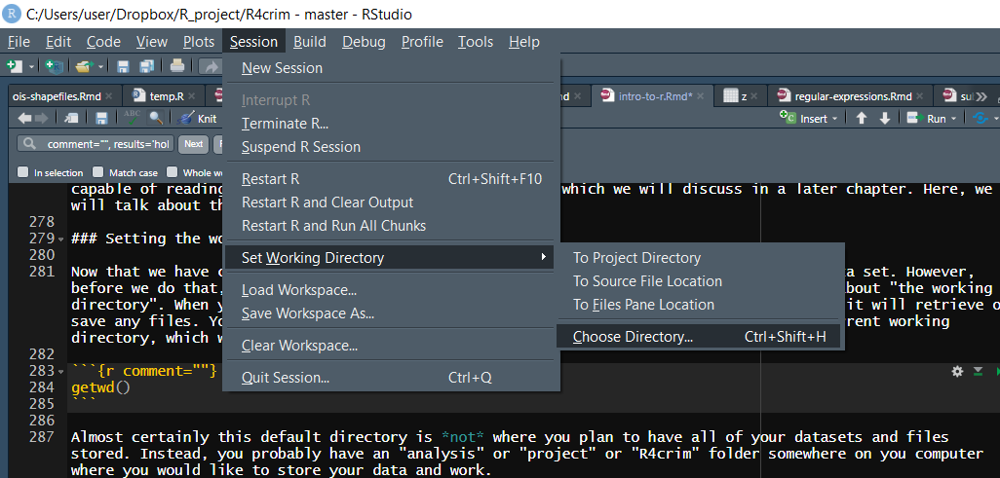

# Introduction to R

This is the first set of notes for an introduction to R programming for criminology and criminal justice. These notes assume that you have the latest version of [R](https://cloud.r-project.org/) and [R Studio Desktop (The free version)](https://www.rstudio.com/products/rstudio/download/) installed. We are also assuming that you know how to start a new script file (File -> New File -> R Script) and submit code to the R console. From that basic knowledge about using R, we are going to start with `2 + 2` and by the end of this set of notes you will load in a small Chicago crime data set and look at some summary statistics of the data's variables. Our aim is to build a firm foundation on which we will build throughout this set of notes.

R sometimes provides useful help as to how to do something, such as choosing the right function or figuring what the syntax of a line of code should be. Let's say we're stumped as to what the `mean()` function does. Just type `?mean` at the R console and hit enter/return to read documentation on `mean()`. Most help pages have examples at the bottom that can give you a better idea about how the function works. R has many thousands of functions and an often seemingly inconsistent syntax. As you do more complex work with R (such as using new packages, which are collections of user-written functions), the Help tab can be useful. 

## Basic Math

R, on a very unsophisticated level, is like a calculator. 

```{r}
2 + 2
```

```{r}
(1 + 2 + 3 - 4) / (5 * 7)
```

```{r}
2^3
```

```{r}
round(2.718281828, 3)
```

At a more sophisticated level it can do every step in a research project from reading in the raw data, cleaning it, analyzing it, and letting you write up the results in a PDF or Word Document. We'll learn about many of these steps throughout this course. 

## Combining values together into a collection (or vector)

We will use the `c()` function a lot. `c()` *c*ombines elements, like numbers and text to form a vector or a collection of values. If we wanted to combine the numbers 1 to 5 we could do

```{r comment=""}
c(1, 2, 3, 4, 5)
```

It also works on what are called strings (sometimes called characters or character type). You can think of a string as any value inside of quotation marks. This includes numbers as long as they are inside quotes such as "2". 

```{r}
c("cat", "dog", "gorilla", "buffalo", "lion", "snake")
```

The "thing" that the `c()` function creates is called a vector. A vector is simply a collection of same-type values. So writing `c(1, 2, 3, 4, 5)` creates a vector with the values 1-5. Note that vectors take values that are the same type, so all values included must be the same type such as a number or a string. If they aren't the same type R will automatically convert it. 

```{r}
c("cat", "dog", 2)
```

Above we made a vector with the values "cat", "dog" and 2 (without quotes) and it added quotes to the 2. Since everything must be the same type R automatically converted the 2 to a string of "2". We'll talk more explicitly about the different types of objects R has later, but for now it is important to know that `c()` creates a vector as we'll be using vectors frequently in this course. 

With the `c()` function, it's important to separate all of the items with commas. 

Conveniently, if you want to add 1 to each item in this collection, there's no need to add 1 like `c(1 + 1, 2 + 1, 3 + 1, 4 + 1, 5 + 1)`... that's a lot of typing. Instead R offers the shortcut

```{r comment=""}
c(1, 2, 3, 4, 5) + 1
```

In fact, you can apply any mathematical operation to each value in the same way.

```{r}
c(1, 2, 3, 4, 5)*2
```

As a common example in criminology, in comparing crime between two cities you generally don't want to compare counts due to population differences. A city with a million people often has more crime than a city with 50,000 people just due to the size difference. So you'd want to compare rates of crime per population (usually per 100,000 people). To do this you just divide the count by the city's population and multiple the result by 100,000. 

Let's say both of these cities had 100 murders, 200 burglaries, and 300 robberies. To find the rate you do 

```{r}
(100 / 1000000) * 100000
```

```{r}
(200 / 1000000) * 100000
```

```{r}
(300 / 1000000) * 100000
```

and you get the rate of crime per 100,000 population for the larger city. But doing that already is a lot of copying of the same code as the only variable we're changing each time is the number of crimes. Imagine doing that for dozens of crime categories or for thousands of agencies. The benefit of using `c()` is we can apply the mathematical operation to all of the values at once.

```{r}
(c(100, 200, 300) / 1000000) * 100000
```
and do the same thing for our smaller city

```{r}
(c(100, 200, 300) / 50000) * 100000
```

This concept - doing the same thing to multiple values - is important in R and will come in handy later. Imagine that we had an Excel file where a column shows the number of crimes in a given city (each row is a new city). Using the method above we can find the average number of crimes (or any other mathematical operation) easily by treating that column as the values in the `c()` above.

The `c()` function isn't the only way to make a collection of values in R. For example, placing a `:` between two numbers can return a collection of numbers in sequence. The functions `rep()` and `seq()` produce repeated values or sequences.

```{r}
1:10
```

```{r}
5:-5
```

`rep()` takes first the value to be repeated, and then the number of times to repeat it.

```{r}
rep(1, 10)
```

It can accept a vector of values to be repeated.

```{r}
rep(c(1, 2), each = 5)
```

```{r}
seq(1, 5)
```

R will also do arithmetic with two vectors, doing the calculation pairwise. The following will compute 1 + 11 and 2 + 12 up to 10 + 20.

```{r comment=""}
1:10 + 11:20
```

Yet, other functions operate on the whole collection of values in a vector. For each of these functions you will need to put the vector inside the parentheses of the main function. See the following examples:

  + `sum()` Sum
  + `mean()` Mean of the vector
  + `median()` Median of the vector
  + `length()` How many values there are in the vector

```{r}
sum(c(1, 10, 3, 6, 2, 5, 8, 4, 7, 9)) 
```

```{r}
mean(c(1, 10, 3, 6, 2, 5, 8, 4, 7, 9))
```

```{r}
median(c(1, 10, 3, 6, 2, 5, 8, 4, 7, 9)) 
```

```{r}
length(c(1, 10, 3, 6, 2, 5, 8, 4, 7, 9))
```

There are also some functions in R that help us find the biggest and smallest values. For example:

  + `max()` What is the biggest value in vector?
  + `which.max()` In which "spot" (or "index") would we find it? This will be useful for the lesson on subsetting which is a way to grab only specific rows or columns (such as the row with the largest value)
  + `min()` What is the smallest value in vector?
  + `which.min()` In which "spot" would we find it?

```{r}
max(c(1, 10, 3, 6, 2, 5, 8, 4, 7, 9)) 
```

```{r}
which.max(c(1, 10, 3, 6, 2, 5, 8, 4, 7, 9))
```

```{r}
min(c(1, 10, 3, 6, 2, 5, 8, 4, 7, 9))
```

```{r}
which.min(c(1, 10, 3, 6, 2, 5, 8, 4, 7, 9))
```

Many functions in R are helpful to see and understand your data. For example, we can rearrange a collection of values in ascending or descending order. Note the `order()` function.  How is it similar to the `which.max()` or `which.min()` function?  Note the `sort()` function.

  + `sort()` Sorts from smallest to largest
  + `order()` Tells you what order each value should be moved to for it to be sorted from smallest to largest

```{r comment="", results='asis'}
sort(c(1, 10, 3, 6, 2, 5, 8, 4, 7, 9))
```

```{r comment="", results='asis'}
order(c(1, 10, 3, 6, 2, 5, 8, 4, 7, 9))
```

Below is the same `sort()` function as before but with the parameter `decreasing`. A parameter is just an option used in an R function to change the way the function is used or what output it gives. Almost all functions have these parameters and they are useful if you don't want to use the default setting in the function. This parameter, `decreasing` changes the sort from smallest to largest to be from largest to smallest. By default this parameter is set to FALSE and here we say it is equal to TRUE (you'll learn more about TRUE and FALSE values soon and they must always be written in all capital letters).

```{r comment="", results='asis'}
sort(c(1, 10, 3, 6, 2, 5, 8, 4, 7, 9), decreasing = TRUE)
```

To learn about the parameters available for each function, check the help menu for that function using the Help tab or by typing `?function` in the console and replacing "function" with the name of the function you're interested in. The section of the help page labeled Arguments tells you each of the parameters and what they do. The top of this help page (under Description) also explains what the function does. 

```{r eval = FALSE}
?sort
```

The above examples have involved mostly numerical values in a vector. Here are some examples involving non-numerical "string" or "character" values. Let's create an object called `my_states` (a name I made up) that will contain a number of state abbreviations.

```{r}
my_states <- c("WA","DC","CA","PA","MD","VA","OH")
```

Take a look at the arrow `<-` (pronounced 'gets'). This is how you tell R to take the result of what is on the right and store it in the object named on the left. We're going to talk more about this arrow soon. Now let's run some new functions on this collection of state a.

```{r}
paste(my_states, ", USA")
```

```{r}
paste(my_states, ", USA", sep = "")
```

```{r}
paste(my_states, collapse = ",")
```

The `paste()` function pastes character strings together. By default, `paste()` puts a space between the strings being pasted together. It looks strange with that space after WV in "WV , USA". We can set the separator to be nothing (the empty string) by setting `sep = ""`. Remember that you need a comma before starting a new parameter. 

Being able to sort or manipulate strings/character values (i.e. not numbers) is important in research. When dealing with real crime data you'll find that there are often spelling issues where categories are slightly different (e.g. 'assault' 'asault' 'asslt') that you need to make consistent for an analysis. You will also likely want to grab only rows where the data is a certain crime, such as all assaults, which is something we'll learn later. 

We used `sort()` to sort numbers from smallest to largest. It can also be used on a vector of strings to alphabetize it. This is useful when rearranging data.frames (think an Excel file) to alphabetize by a variable to make it easier to read. 

```{r}
sort(my_states)
```

Setting the parameter `decreasing` to TRUE sorts it by reverse alphabetical order.

```{r}
sort(my_states, decreasing = TRUE)
```

Note that running the above code doesn't actually change the "my_states" vector. It we check, the order is as it was initially, not sorted.

```{r}
my_states
```

That is because just running code on something doesn't save it. In most cases it just prints the changed values but our original object remains unchanged. That is because we need to change the output of these functions to a new object, something called "assigning" values to an object.

## Assignment of values to variables (Making "things")

The left-facing arrow symbol is an extremely important tool in R. Try the following:

```{r}
a <- 1
```

Now type:

```{r}
a
```

R has assigned "a" the value of "1". We choose "a" because it is an easy name to type but when you're working on projects you want to call the objects something that is easy to remember and (most importantly!) tells you immediately what the data is. If you are using data on Philadelphia crime, a good name would be philadelphia_crime. Make it easy on yourself what the data is!

R programmers typically pronounce the `<-` as "gets". So we would read `a <- 1` as "a gets one". This is read from left to right as thing on left (the name of the object) "gets" the value of the thing on the right of the `<-`. The proper terminology is that the "thing" on the left is an "object". So the object "a" gets the value 1. We could also say "one was assigned to a". 

The terminology is "object gets value" or "value assigned to object", both work. 

You can use the `=` instead of `<-`. Again, the thing on the left gets the value of the thing on the right even when using `=`.

```{r}
a <- 2
```

a now has the value of the number 2.

```{r}
a
```

It is the convention in R to use `<-` instead of `=` and in some cases the `=` will not work or it'll cause an error. For those reasons we will use `<-` for this class. 

## Reading data into R

In nearly every case in research you'll have data produced by some outside group (FBI, local police agencies) and you want to take that data and put it inside R to work on it. We call that reading data into R. R is capable of reading a number of different formats of data which we will discuss in a later chapter. Here, we will talk about the standard R data file only. 

### Setting the working directory

Now that we have covered a lot of fundamental R features, it is time to load in a real data set. However, before we do that, R needs to know where to find the data file. So we first need to talk about "the working directory". When you start R, it has a default folder or directory on your computer where it will retrieve or save any files. You can run `getwd()` to get the current working directory. Here's our current working directory, which will not be the same as yours.

```{r comment=""}
getwd()    
```

Almost certainly this default directory is *not* where you plan to have all of your data sets and files stored. Instead, you probably have an "analysis" or "project" or "R4crim" folder somewhere on your computer where you would like to store your data and work (you should also store the R files you write for that data to keep the data and code for that data together).

Use `setwd()` to tell R what folder you want it to use as the working directory. If you do not set the working directory, R will not know where to find the data you wish to import and will be unable to read the data. Make it a habit to have `setwd()` as the first line of every script you write. If you know the working directory you want to use, then you can just put it inside the `setwd()` function.

```
setwd("C:/Users/user/Dropbox/R_project/R4crim/data")    
```
Note that for all platforms, Windows, Macs, and Linux, the working directory only uses forward slashes. So Windows users be careful. Most Windows applications use backslashes, but in an effort to make R scripts work across all platforms, R requires forward slashes.

If you do not know how to write your working directory, here comes R Studio to the rescue. In R Studio click Session -> Set Working Directory -> Choose Directory. Then click through to navigate to the working directory that you want to use. When you find it click "Select Folder". Then look over at the console. R Studio will construct the right `setwd()` syntax for you. Copy and paste that into your script for use later. No need to have to click through the Session menu again now that you have your `setwd()` set up.



Now you can use R functions to load in any data sets that are in your working folder. If you have done your `setwd()` correctly, you shouldn't get any errors because R will know exactly where to look for the data files. If the working directory that you've given in the `setwd()` isn't right, R will think the file doesn't even exist. For example, if you give the path for, say, your R4econ folder, R won't be able to load data because the file isn't stored in what R thinks is your working directory. With that out of the way, let's load a data set.

### Loading data

The `load()` function lets us load data already in the R format. These files will end in the extension ".rda" or sometimes ".Rda" or ".RData". Since we are telling R to load a specific file we need to have that file name in quotes and include the file extension ".rda". With R data, the object inside the data already has a name so we don't need to assign (using the `<-` we learned above) a name to the data. With other forms of data such as .csv files we will need to do that as we'll see later on. 

```{r}
load("data/chicago.rda")
```

### First steps to explore the data

The object we loaded is called `chicago` and if you look in the "Environment" tab in RStudio you'll now see a object there with the name `chicago`. We'll start exploring this data in the next lesson but for now let's use three simple (and important) functions to get a sense of what the data holds. For each of these functions write the name of the data set (without quotes since we don't need quotes for an object already made in R) inside the (). 

`head()`
`summary()`
`View()`

Note that the first two functions are lowercase while `View()` is capitalized. That is simply because older functions in R were often capitalized while newer ones use all lowercase letters. R is case sensitive so using `view()` will not work. 

The `head()` function prints the first 6 rows of each column out in the console. This is useful to get a quick glance at the data but has some important drawbacks. When using data sets with a large number of columns it can be quickly overwhelming by printing too much. There may also be differences in the first 6 rows with other rows. For example if the rows are ordered chronologically (as is the case with most crime data) the first 6 rows will be the most recent. If data collection methods or the quality of collection changed over time, these 6 rows won't be representative of the data.  

```{r}
head(chicago)
```

The `summary()` function gives a six number summary of each numeric or Date column in the data. For other types of data, such as "character" types which are just columns with words rather than numbers, it'll say what type of data it is.

The six values it returns for numeric and Date columns are

  + The minimum value
  + The value at the 1st quartile
  + The median value
  + The mean value
  + The value at the 3rd quartile
  + The max value
  + In cases where there are NAs, it will say how many NAs there are. An NA value is a missing value. Think of it like an empty cell in an Excel file. NA values will cause issues when doing math such as finding the mean of a column as R doesn't know how to handle a NA value in these situations. We'll learn how to deal with this later.

```{r}
summary(chicago)
```

Finally, `View()` opens essentially an Excel file of the data set you put inside the (). This allows you to look at the data as if it were in Excel and is a good way to start to understand the data. 

```{r eval = FALSE}
View(chicago)
```
