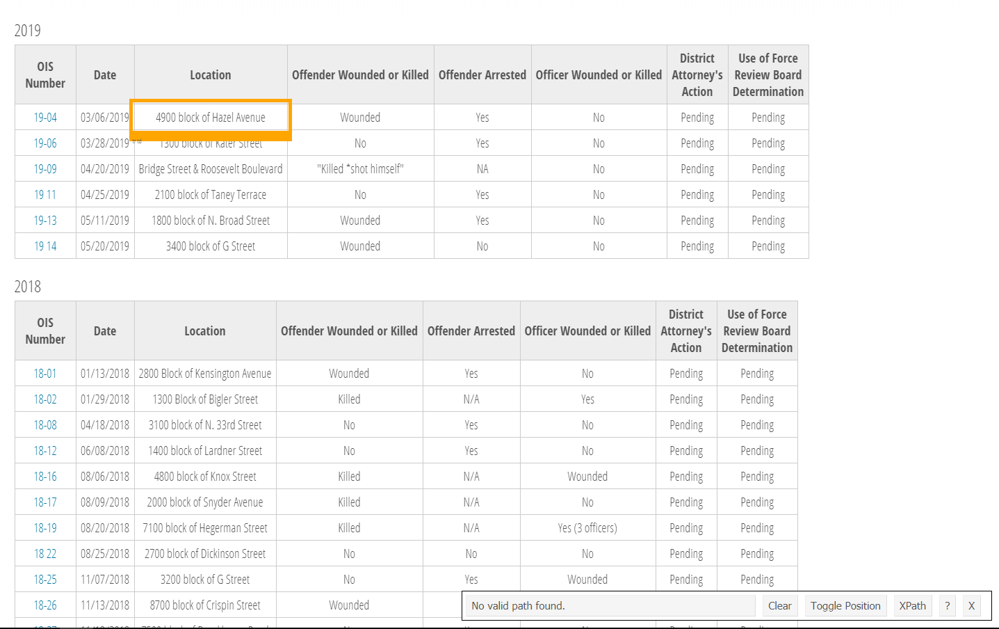
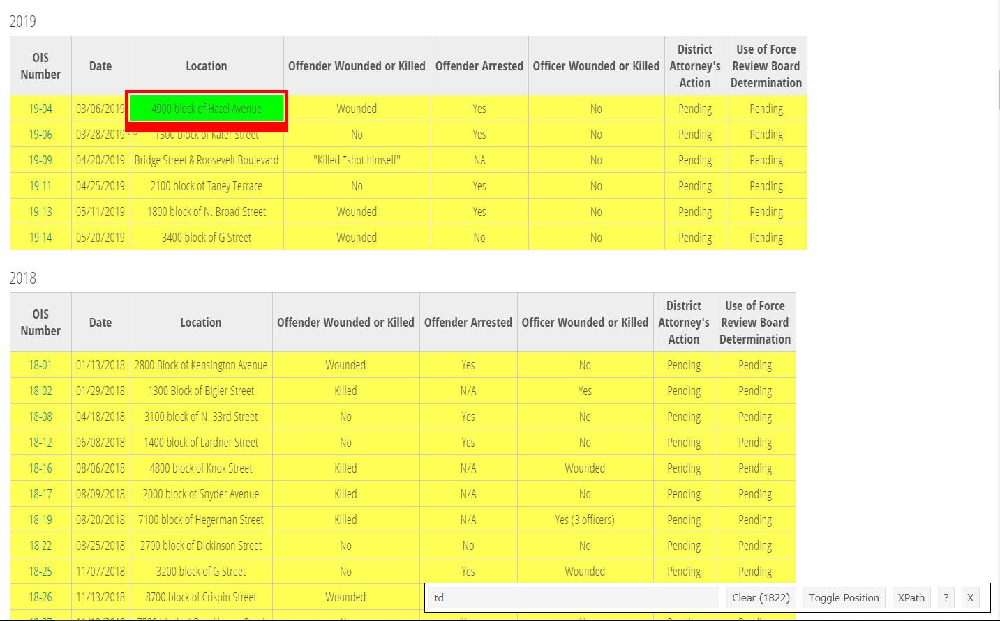
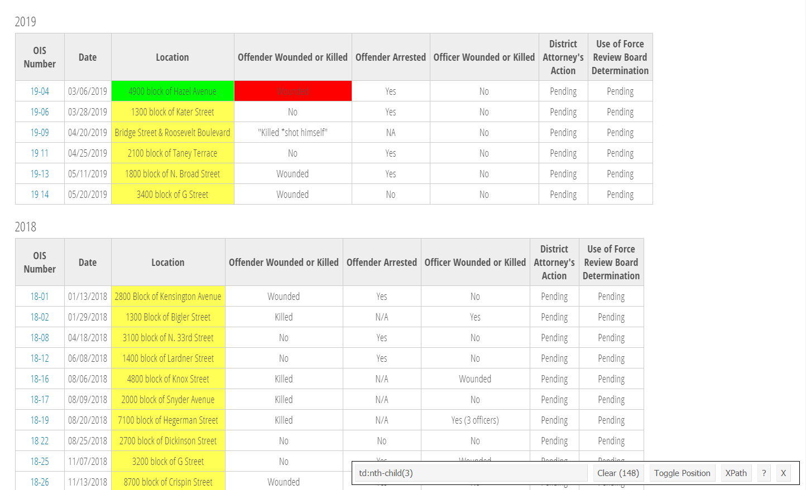
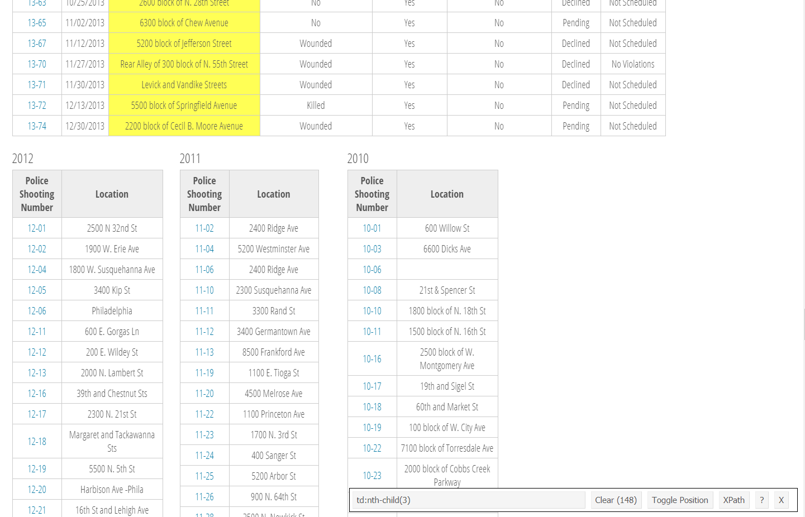
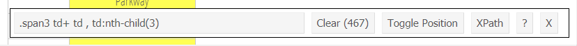

# Scraping data from PDFs

Many government agencies will release reports as PDF files with useful data included as tables in the PDF rather than in a more readily accessible form such as a .csv file. This makes it difficult to use as we can't simply load the PDF into R and start working on the data as we've done before. We need to take the data inside the PDF and turn it into a format that R can understand. In Chapter \@ref(#scrape-table) we will work on grabbing an entire table from a PDF, in this lesson we will just grab a line of text from the PDF. 

For this lesson we'll use data on officer-involved shootings from the Philadelphia Police Department's website available [here](http://www.phillypolice.com/ois/). The site contains information about each shooting such as the location and date - which we will scrape from the website - as well as information inside each shooting's descriptive PDF which we will learn to scrape here. 

Our goal here and in the following lessons is to see how the number of officer-involved shootings changed over time and see where in Philadelphia they occurred. For this we need two pieces of information: the date each shooting occurred, and the location of each shooting. 

## Downloading officer-involved Shooting Files

We will use the package `rvest` which we used to webscrape movie data to help download these files and to get some information off the web page.

As always, we need to use `library()` to tell R we are going to use functions from this package.

```{r}
library(rvest)
```

The last time we used `rvest` we did so to get information about movie ticket sales by grabbing data from a table on the page. In this case we are using it for two purposes: to get the link of each PDF on the page to download and to get the address of each incident. Each year of data has its own table with a link to the PDF and the street address of where the shooting took place. For years after 2012 it also includes some useful information about the shooting but we will not be using that information in this lesson.

First we need to get the links of each PDF to download. Since links are simply a special type of text on the page, we can use a similar method to webscraping movie data to get all of the links.

Again we start with using `read_html()` to read in the page to R and we will save that in an object called "links" since that is what we want to end up with. 

```{r}
links <- read_html("http://www.phillypolice.com/ois/")
```

In this case we don't need to look on the site to determine the CSS selector, we simply use "a" which will find all links on the page. `html_attr("href")` converts the XML code for the links to text which we can understand.

```{r}
links <- html_nodes(links, "a")
links <- html_attr(links, "href")
```

Now we can take a look at the results and check how many results there are.

```{r}
head(links)
length(links)
```

There are `r length(links)` results and of the first 6 none of them are PDFs. This makes sense as our code grabbed every single link on the page, PDF or not. We need a way to subset these links to just those that are PDFs. Since we know that every PDF will end with the text ".pdf" we can use `grep()` to subset the links to only return those which include ".pdf" in the name. Sometimes the .pdf extension is written .PDF so we will set the parameter `ignore.case` to TRUE to ignore capitalization.

```{r}
links <- links[grep(".pdf", links, ignore.case = TRUE)]
```

```{r}
head(links)
```

This looks better but there are still a few files we don't want even though they are PDFs. By looking through our list of links, and looking at the website as a comparison, it seems that the PDFs with information on officer shootings have the text "officer-involved-shootings" in the name. We can use `grep()` again to just grab those links.

```{r}
links <- links[grep("officer-involved-shootings", links)]
```

Let's look at the first 10 links to see what files we still have.

```{r}
links[1:10]
```

A few of these PDFs are general reports rather than descriptions of specific shootings. We could specifically delete these through subsetting them out but since it is only a few files we can just download them then not use them. 

Now that we have all the links we need, we can use a for loop to download them. To download files in R we will use the function `download.file()` which, as the name implies, just downloads a file from the internet to your computer. This function takes two inputs: the parameter `url` is the URL where the file to download is stored (the links in our case), and parameter `destfile` is the name we will call the file we download. 

The links we have do not actually have the full URL we need. Notice that they begin with "/assets" but if you click a link on the web page, the links all start "http://www.phillypolice.com/assets". In our code we can paste the "http://www.phillypolice.com" part to our link name to make a complete URL to download.

Since all the files have a similar pattern, we can use `gsub()` to make the name shorter than the long link it comes in. Note that for every link the pattern is the the real file name is at the very end and there are a number of categories broken up by forward slashes. For a quick `gsub()` can use the special character `.` (the period or dot) to indicate anything and the special character `*` (asterix) to indicate "0 or more of the previous character" to say find every character up to and including the forward slash and replace it with nothing.

Using the very first link as an example, the `gsub()` removes everything except the very last part of the link. It replaces every character up to and including the latest forward slash with an empty string, leaving a useful file name.

```{r}
gsub(".*/", "", links[1])
```

`download.file()`  downloads the file into the current working directory so make sure it is set to where you want the files to go (for this many files it is wise to make a new folder specifically to hold these files). We will set the parameter `mode` to "wb". This isn't strictly necessary but in some cases R has an issue downloading files and this seems to fix it. Since sometimes scraping data from the same page too often causes a download to fail, we will add the code `Sys.sleep(1)` which forces R to sleep for 1 second. This slows down the code and makes sure we don't overload the site.

There are `r length(links)` files so it will take some time to download them all. 

```{r eval = FALSE}
setwd("data/philly_officer_shootings")

for (file in links) {
   url <- paste("http://www.phillypolice.com", file, sep = "")
   save_name <- gsub(".*/", "", file)
   download.file(url = url, destfile = save_name, mode = "wb")
   Sys.sleep(1)
}

```

## Scraping information from the page

We also want the date and address of every shooting. While that data is available in the PDFs, it isn't in a consistent format which would make it difficult to get. The webpage we downloaded the PDFs from does contain the address of each shooting in a convenient table so we will scrape the data from there. While the PDFs have the date for every shooting, starting in 2017 the date isn't in an easy to scrape format so we will scrape the date column that is present for all years starting in 2013. Since we will want to merge the location with the data from the PDF, we will also scrape the Police Shooting Number column so we have something consistent in both the PDF and the scraped data to merge by. 

As before, we will start by using `read_html()` to read the page into R. We will call this object "page" as we are going to use it for scraping the location, date, and the shooting number so we don't want to overwrite the object.

```{r}
page <- read_html("http://www.phillypolice.com/ois/")
```

We need to find just which parts of the page to scrape. To do so we'll use the helper tool [SelectorGadget](https://selectorgadget.com/), a Google Chrome extension that lets you click on parts of the page to get the CSS selector code that we'll use. Install that extension in Chrome and go to the [officer-involved shooting page](http://www.phillypolice.com/ois/).



When you open SelectorGadget it allows you click on parts of the page and it will highlight every similar piece and show the CSS selector code in the box near the bottom. Here we clicked on the first row of the 2019 table in the Location column. The entire table is highlighted as it includes everything it finds that is part of a table.



We only want the Location column for now so if we click outside that column it will begin de-selecting things. There is a bit of trial and error in the process to make sure only the parts of the page we want are selecting, so you may need to spend some time experimenting. Our goal is to have every row in the Location column for all tables be highlighted - and nothing else highlighted. 



If you scroll down the page you'll see that the tables before 2013 are not highlighted at all. Click a row in the Location column in one of these tables to highlight them.



It looks like we have every row in the Location column highlighted so we are ready to get the CSS selector code it outputs in the bar to the bottom. We can copy the text in the bar on the bottom to our `html_nodes()` function and let `rvest` know which part of the page to return.




```{r}
location <- html_nodes(page, ".span3 td+ td , td:nth-child(3)")
```

To convert that into values we can read, we use the function `html_text()`. This is similar to `html_table()` we used before which told R to convert the data as a table. In this case the data are strings so we use `html_text()`.

```{r}
location <- html_text(location)
```

If we do the same thing for the Shooting Numbers we find that the CSS selector is "td:nth-child(1)"

```{r}
shooting_numbers <- html_nodes(page, "td:nth-child(1)")
shooting_numbers <- html_text(shooting_numbers)
```

Finally we can get the date information. Be careful when selecting date, if you just click on a row in the Date column, it will include the Location column for years 2007-2012. This is because SelectorGadget knows you clicked the second column in a table, but doesn't know that that means Date in certain tables in Location in others. Click one of the highlighted Location rows in 2007-2012 tables to deselect them. 

```{r}
dates <- html_nodes(page, ".span12 td:nth-child(2)")
dates <- html_text(dates)
```

Note that there are `r length(location)` values for location and shooting_numbers, `r length(dates)` values for dates, and `r length(links)` values for links of the PDFs we downloaded? Why is this? `r length(location) - length(links)` of the shootings do not have a PDF associated with the shooting so there is no link to that PDF to download. As data from 2007-2012 do not have dates on the table, there is nothing to scrape, leading to many fewer values than the location or shooting_numbers. 

### Combining the data sets

```{r error = TRUE}
officer_shootings <- data.frame(shooting_number = shooting_numbers,
                                location        = location,
                                dates           = date,
                                stringsAsFactors = FALSE)
```

Trying to make a data.frame this way returns an error because while there are `r length(location)` shootings, only the shooting number and location variable have all `r length(location)` values. Since the dates don't exist for 2007-2012, we only have `r length(dates)` values for that data. While there are a few ways to solve this (as is true with nearly every problem in R), we will expand the "dates" object to make it `r length(location)` values long. 

The function `rep()` is used to repeat values.

```{r}
rep("hello", 10)
```

Above we repeated the word "hello" 10 times. To solve our issue we need to repeat some value `r length(location) - length(dates)` times and add that to the end of the "dates" object to make it `r length(location)` values long. For our value we will use NA to indicate that those values are missing.

```{r}
rep(NA, (length(location) - length(dates)))
```

To combine the "dates" object with all these repeated NA's we will use `c()` which combines vectors. Make sure we put "dates" first to maintain the correct order.

```{r}
dates <- c(dates, rep(NA, (length(location) - length(dates))))
```

And we can now check the length of "dates".

```{r}
length(dates)
```

Since "dates" is `r length(dates)` values long now, let's try making the data.frame again.

```{r error = TRUE}
officer_shootings <- data.frame(shooting_number = shooting_numbers,
                                location        = location,
                                dates           = dates,
                                stringsAsFactors = FALSE)
```

It works. Let's look at the first 6 values. We can compare our results from the table on the page to make sure we did it correctly.

```{r}
head(officer_shootings)
```

And for good measure we can look at the bottom 6 rows, expecting NAs for the dates column.

```{r}
tail(officer_shootings)
```


## Extracting data from PDFs

We scraped dates for shootings from 2013 and more recent and now need to get the dates for 2012 and before. We will do so by scraping the PDFs and taking the line that says the date of the shooting.

For this we will use the package `pdftools` which lets R scrape PDFs.

```{r eval = FALSE}
install.packages("pdftools")
```

```{r}
library(pdftools)
```

### Scraping a single PDF

`pdf_text()` lets us scrape the text from a PDF. The input in the () is the name (in quotes as it is saying to R, go to the file on the computer) of the PDF to be read. Make sure your working directory is set to where the file is. As an example we will look at the last shooting in 2016 which we called "16-01.pdf".

```{r}
setwd("data/philly_officer_shootings")
pdf <- pdf_text("16-01.pdf")
```

```{r}
pdf
```

When we print the file we can see that it is a single big block of text. Near the beginning of the text we can see a date, 1/07/16. When comparing the PDF which we can read ourselves on Adobe Acrobat or a web browser, it is clear that all the line breaks in the PDF disappeared when we used `pdf_text()`. More specifically, the line breaks were replaced by `\n` which is R's way of saying "this is a line break".


We want to grab just the date from this file.  Since the file is in a single block of text, we need to break it up based on where there should be a line break (turning each line back into an individual part of the file) and grab only the line with the date.

When splitting up a string (which is just what the PDF is now), we can use the function `strsplit()` which splits up a string based on some pattern.

Let's see a simple example, splitting up the word "criminology" by the letter "n". Note that it deletes the character it is splitting by!

```{r}
strsplit("criminology", split = "n")
```

It now returns two words "crimi" amd "ology", the two parts of the word "criminology" on each side of the letter "n". It returns the value inside a list - which is why you see the [[1]] above the result. To get the value we actually want, we need to get the first element inside that list, using double bracket notation.

```{r}
split <- strsplit("criminology", split = "n")
split <- split[[1]]
split
```

From the pattern we see in the PDF we scraped, and comparing it to the PDF we can see in Adobe Acrobat or a web browser, it is clear that we can use split at the characters `\r\n` and it will give us each line in its own element (for Mac users you may need to split at `\n` rather than `\r\n`). Let's do that and just return the first element so we don't get a list. Let's call the object we make "pdf_split".

```{r}
pdf_split <- strsplit(pdf, split = "\r\n")
pdf_split <- pdf_split[[1]]
pdf_split
```

We need a way to only take the row with the date. In most cases the second row is the one with the date, however this isn't true in every case. Therefore, we can't just grab the second element. We can use `grep()` to search for a pattern that is unique to the row with the date to get that row. 

So what pattern does our date have? It is always one or two numbers followed by a / followed again by two numbers, another / and two more numbers.

1/07/16

So our pattern in `grep()` will be 

`^[0-9]+/[0-9]+/[0-9]+`

The `^` is a special character saying that whatever follows it is the start of the string. `[0-9]` means any number. The + is a special character which says "one or more of the previous character" so `[0-9]` means "one or more numbers". Some files (such as this one) have multiple dates in the text so we want to only get rows starting with a date. 

By default `grep()` will return a number indicating the element where it found a match. If we set the parameter `value` to TRUE, it will print out that element. 

```{r}
grep("^[0-9]+/[0-9]+/[0-9]+", pdf_split, value = TRUE)
```

### Making a function

Since we need to do this process for hundreds of PDFs we will make a function and then for loop through it for every PDF. Here we are following the same steps as scraping the movie data - make code work for a single file/date, turn it into a function to work for any file/date, and write a for loop so it works for every file/date we have. That's the general process you will use when writing code meant for multiple inputs. Make sure code works first in a specific case (a specific date), then make it work in the general case (any date).

When making a function from code you've already written, a good method is to just copy all the code so it is together, then start building the function. 

```{r}
setwd(here::here("data/philly_officer_shootings"))
pdf <- pdf_text("16-01.pdf")
pdf_split <- strsplit(pdf, split = "\r\n")
pdf_split <- pdf_split[[1]]
grep("^[0-9]+/[0-9]+/[0-9]+", pdf_split, value = TRUE)
```

Above is our code to scrape a specific PDF. Now let's make the standard function skeleton without including any code just yet. We can call the function "get_date_from_pdf" since that is a good description for what our function will do. We want to input a file name and get a date returned. So we will call our parameter in the () "file_name" and our return object "date".

```{r}
get_date_from_pdf <- function(file_name) {
   
   return(date)
}
```


Now we can add in our code. 

```{r}
get_date_from_pdf <- function(file_name) {
   setwd(here::here("data/philly_officer_shootings"))
   pdf <- pdf_text("16-01.pdf")
   pdf_split <- strsplit(pdf, split = "\r\n")
   pdf_split <- pdf_split[[1]]
   return(date)
}
```

There are two steps remaining to turn our code into a working function. As it is, the code still writes `pdf_text("16-01.pdf")`. We want it to run `pdf_text(file_name)` on any file we input so let's change "16-01.pdf" to say "file_name" (not in quotes since it is an object). And we want the function to return an object called "date" which has the date from the PDF. We know the date is printed by the `grep()` code we wrote, so let's save that as "date".

```{r}
get_date_from_pdf <- function(file_name) {
   setwd(here::here("data/philly_officer_shootings"))
   pdf <- pdf_text(file_name)
   pdf_split <- strsplit(pdf, split = "\r\n")
   pdf_split <- pdf_split[[1]]
   date <-  grep("^[0-9]+/[0-9]+/[0-9]+", pdf_split, value = TRUE)
   return(date)
}
```

Now let's try it our using another PDF, let's say "16-01.pdf".

```{r}
get_date_from_pdf("16-01.pdf")
```

### Looping through every PDF

Before we write the for loop let's think about what our goal is and what we currently have. We have a data set which has a single row for every shooting and information about when and where each shooting took place. The object "officer_shootings" that we made earlier has most of that. It contains the location for every shooting and the date for all of those from 2013-2019. So we want to scrape the PDFs for years prior to 2013 to get the date of each shooting. And we made a function that gives us the date in the file we input. Since we know the dates for 2013-2019 (and 2017-2019 make it hard to get the date from the PDF), we only want to scrape the PDFs from 2007-2012. 

We need to do two things now: 

1. Select only PDFs from 2007-2012

2. For each PDF figure out a way to select the right row in the "officer_shootings" object to add the date

We can take this one piece at a time. First we need to select only PDFs from 2007-2012. The function `list.files()` will provide a list of every file in the working directory. We will use it to get a list of all files in the folder we stored the PDFs and then subset it to just keep the files we want. Let's call the object "pdf_files". 

```{r}
setwd("data/philly_officer_shootings")
pdf_files <- list.files()
```

Looking at `head()` we can see it is a vector of file names. 

```{r}
head(pdf_files)
```

There is a pattern in these names where they start with two characters indicating the year (2016 starts with "PS" then "16" though since we don't need 2016 data that doesn't affect this process). We will use this pattern to just get files that start with "0" or begin "10", "11", or "12". We will use `grep()` and make use of the `^` special character which indicates that the characters following it are the start of the string. We will also use the `|` special character which indicates "thing on left or right" of the `|` are both a match.

```{r}
grep("^0|^10|^11|^12", pdf_files)
```

This prints out a list of which elements in "pdf_files" are a match. We can use square bracket notation `[]` subsetting to just keep the elements in "pdf_files" that we want. And let's save that object as "pdf_files", overwriting our initial object with just the values we want. This way we minimize the number of objects we need to keep track of. 

```{r}
pdf_files <- pdf_files[grep("^0|^10|^11|^12", pdf_files)]
```

We have accomplished our first task, getting just the PDFs from 2007-2012. Now we need to find a way to match the correct row in "officer_shootings" with each file. Let's think again about patterns in the file names.

```{r}
head(pdf_files)
```

Each file name starts with the same 5 character ("year-unique ID") value indicating the shooting number that we scraped from the table. The files then occasionally have the address of the shooting and end with ".pdf". This is our match. For each file we want to just keep the first 5 characters which are an exact match to the "shooting_number" column. There are a few ways to do this but we'll use the function `substr()` as it well-suited for this task.

`substr()` takes a string and returns nth-mth (inclusive) characters in that string. Let's see how this works using the word "apple".

```{r}
substr("apple", start = 1, stop = 3)
```

Here we input the word "apple" and set the parameter `start` to 1 and `stop` to 3. This says, take the word "apple" and return the 1st through the 3rd element (i.e. letter) in that string. This is very useful for taking only a small piece of a string. In our case we just want the first 5 characters in the PDF file name.

```{r}
substr(pdf_files[1], start = 1, stop = 5)
```

And here we have the officer shooting number for the first PDF which we can use to match with the correct row in the "officer_shootings" file.

We can now create the for loop. Let's start with a skeleton of the for loop then slowly add our code.

```{r}
for (file in pdf_files) {
   
}
```

For loops take the form "for x in some group of x, do this thing". In our case our "group of x" is the "pdf_files" object, a group of file names. We want the loop to go through every file in "pdf_files", find the police shooting number from the file name to match with the correct row in "officer_shootings", get the date from the file, and then put the date in the right row. 

We can add in the code we wrote to get the police shooting number.

```{r}
for (file in pdf_files) {
   police_shooting_number <- substr(file, start = 1, stop = 5)
}
```

And the code to get the date from the function we made.

```{r}
for (file in pdf_files) {
   police_shooting_number <- substr(file, start = 1, stop = 5)
   date <- get_date_from_pdf(file)
}
```

Finally we add in code that uses square bracket notation `[]` to say change the value in the "dates" column in the row where the shooting number matches the shooting number we made from the file name to the date we got from the PDF. 

The for loop is done and we can run it.

```{r}
for (file in pdf_files) {
   police_shooting_number <- substr(file, start = 1, stop = 5)
   date <- get_date_from_pdf(file)
   officer_shootings$dates[officer_shootings$shooting_number == police_shooting_number] <- date
}
```

We have one final thing to do, make the date column Date type. The date in the "dates" column aren't in the Date format for R which means that while we can easy read it, R doesn't know that it is a date and can't do any date-related functions like grabbing the year or months from it. We can use the `lubridate` package we worked with earlier to turn it into a date. Since this date is in the month-day-year order we will use the function `mdy()`.

```{r}
library(lubridate)
```

```{r}
officer_shootings$dates <- mdy(officer_shootings$dates)
```

Now our "officer_shootings" file contains the date and address of every officer-involved shooting in Philadelphia from 2007 to early 2019. `r sum(officer_shootings$shooting_number == "")` of the shootings do not have a PDF associated with it. Let's remove them since we are unable to verify information on the table. These rows have a value of "" in the "shooting_number" column so we'll subset the "officer_shootings" data.frame to keep only rows where the shooting number is not "".

```{r}
officer_shootings <- officer_shootings[officer_shootings$shooting_number != "", ]
```

We will save the file for now and in Chapter \@ref(geocoding) learn how to geocode the address into coordinates that allow us to plot the shootings onto a map of Philadelphia. 

```{r}
setwd(here::here("data"))
save(officer_shootings, file = "officer_shootings.rda")
```

