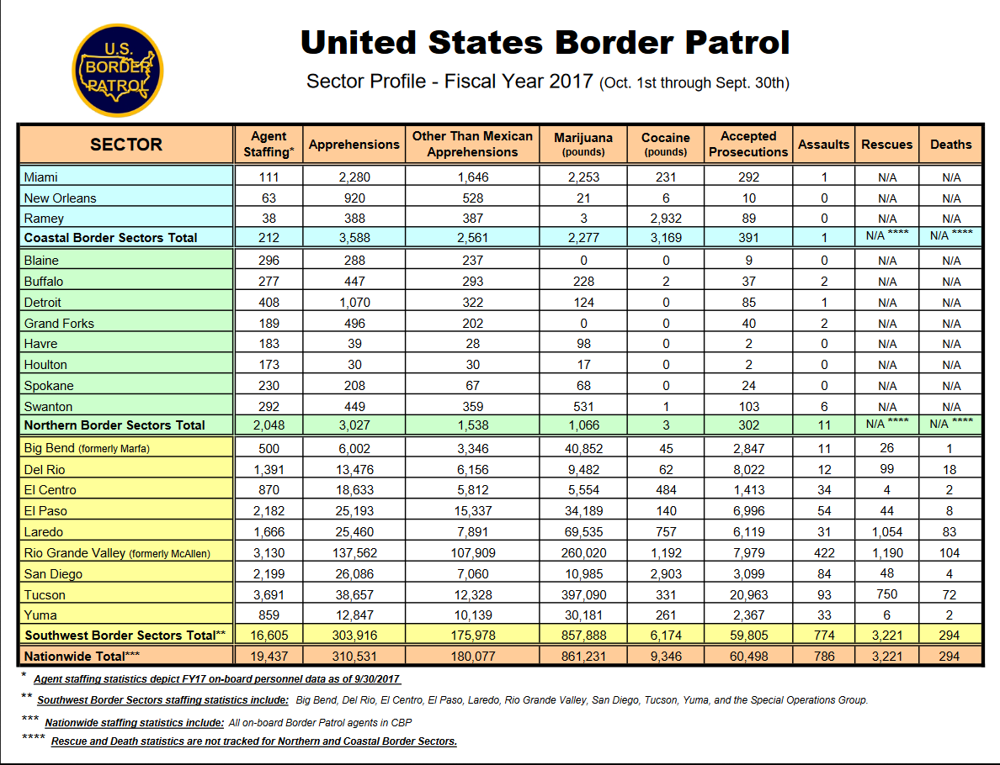
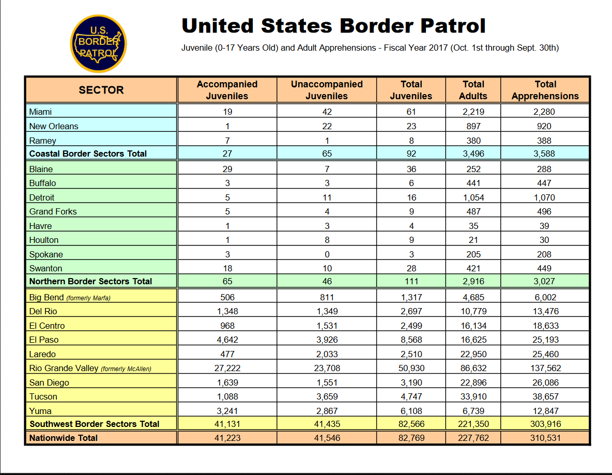
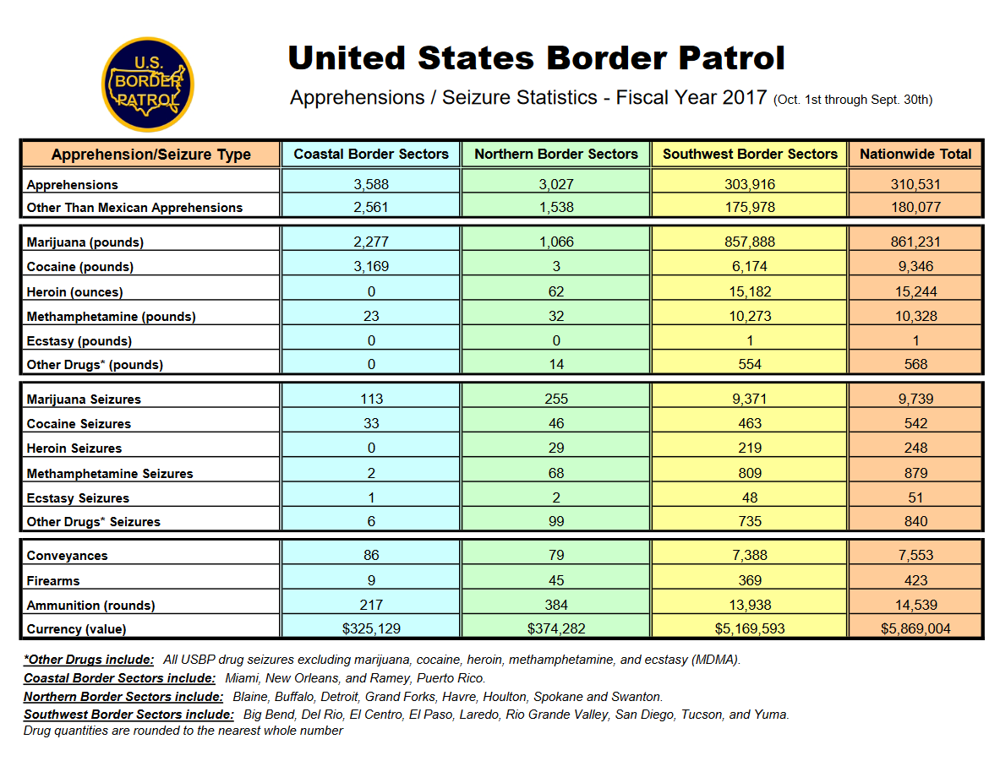

# Scraping Tables from PDFs {#scrape-table}

In Chapter \@ref(scraping-data-from-pdfs) we began working on scraping data from a PDF. We read in PDFs from Philadelphia's officer-involved shooting data and grabbed a single line of text from each PDF. That data was written up like a report, with the date of the incident followed by a description of what happened. In the majority of cases when you want data from a PDF it will be in a table rather than descriptive paragraph. Essentially the data will be an Excel file inside of a PDF. This format is not altogether different than what we did before. We will be using regular expressions and `strsplit()` again to handle this data. 

Let's first take a look at the data we will be scraping. The first step in any PDF scraping should be looking at the PDF and try to think about the best way to approach this particular problem - while all PDF scraping follows a general format you cannot necessarily copy and paste your code, each situation is likely slightly different. Our data is from the U.S. Customs and Border Protection (CBP) and contains a wealth of information about apprehensions and contraband seizures in border sectors. 

We will be using the Sector Profile 2017 PDF which has information in four tables which we'll scrape and then combine together. The data was downloaded on the U.S. Customs and Border Protection "Stats and Summaries" page [here](https://www.cbp.gov/newsroom/media-resources/stats). If you're interested in using more of their data, some of it has been cleaned and made available [here](https://www.openicpsr.org/openicpsr/project/109522/version/V2/view). 

The file we want to use is called "usbp_stats_fy2017_sector_profile.pdf" and has four tables in the PDF. Let's take a look at them one at a time, understanding what variable are available, and what units each row is in. Then we'll start scraping the tables.

The first table is "Sector Profile - Fiscal Year 2017 (Oct. 1st through Sept. 30th)". Before we even look down more at the table, the title is important. It is for fiscal year 2017, not calendar year 2017 which is more common in the data we usually use. This is important if we ever want to merge this data with other data sets. If possible we would have to get data that is monthly so we can just use October 2016 through September 2017 to match up properly.



Now if we look more at the table we can see that each row is a section of the U.S. border. There are three main sections - Coastal, Northern, and Southwest, with subsections of each also available as rows. The bottom row is the sum of all these sections and gives us nationwide data. Many government data will be like this form with sections and subsections in the same table. Watch out when doing mathematical operations! Just summing any of these columns will give you triple the true value due to the presence of nationwide, sectional, and subsectional data. 

There are 9 columns in the data other than the border section identifier. It looks like we have total apprehensions, apprehensions for people who are not Mexican citizens, marijuana and cocaine seizures (in pounds), the number of accepted prosecutions (presumably of those apprehended), and the number of CBP agents assaulted. The last two columns have the number of people rescued by CBP and the number of people who died (it is unclear from this data alone if this is solely people in custody or deaths during crossing the border). These two columns are also special as they only have data for the Southwest border. 

Table 2 has a similar format with each row being a section or subsection. The columns now have the number of juveniles apprehended, subdivided by if they were accompanied by an adult or not, and the number of adults apprehended. The last column is total apprehensions which is a duplicated column as in Table 1.



Table 3 follows the same format and the new columns are number of apprehensions by gender.


Finally, Table 4 is a bit different in it's format. The rows are now variables and the columns are the locations. In this table it doesn't include subsections, only border sections and nationwide total. The data it has available are partially a repeat of Table 1 but with more drug types and the addition of the number of drug seizures and some firearm seizure information.



## Scraping the first table

We've now seen all four of the tables that we want to scrape so we can begin the process of actually scraping them. Note that each table is similar (particularly Tables 1-3), meaning we can reuse code to scrape as well as clean the data. That means that we will want to write some functions to make our work easier and avoid copy and pasting code three times. As earlier, we will use the `pdf_text()` function from the `pdftools` package to scrape the PDFs. 


```r
library(pdftools)
```

We can save the output of the `pdf_text()` function as "border_patrol" and we'll use it for each table.


```r
border_patrol <- pdf_text("data/usbp_stats_fy2017_sector_profile.pdf")
```

We can take a look at the `head()` of the result.


```r
head(border_patrol)
#> [1] "                                                            United States Border Patrol\r\n                                                             Sector Profile - Fiscal Year 2017 (Oct. 1st through Sept. 30th)\r\n                                                  Agent                              Other Than Mexican           Marijuana          Cocaine         Accepted\r\n              SECTOR                            Staffing*\r\n                                                             Apprehensions\r\n                                                                                       Apprehensions                (pounds)          (pounds)    Prosecutions\r\n                                                                                                                                                                      Assaults Rescues       Deaths\r\n Miami                                             111               2,280                    1,646                   2,253             231              292               1           N/A     N/A\r\n New Orleans                                        63                920                      528                      21                6               10               0           N/A     N/A\r\n Ramey                                              38                388                      387                       3             2,932              89               0           N/A     N/A\r\n Coastal Border Sectors Total                      212               3,588                    2,561                   2,277            3,169             391               1        N/A **** N/A ****\r\n Blaine                                            296                288                      237                       0                0                9               0           N/A     N/A\r\n Buffalo                                           277                447                      293                     228               2                37               2           N/A     N/A\r\n Detroit                                           408               1,070                     322                     124               0                85               1           N/A     N/A\r\n Grand Forks                                       189                496                      202                       0                0               40               2           N/A     N/A\r\n Havre                                             183                 39                       28                      98                0                2               0           N/A     N/A\r\n Houlton                                           173                 30                       30                      17                0                2               0           N/A     N/A\r\n Spokane                                           230                208                       67                      68                0               24               0           N/A     N/A\r\n Swanton                                           292                449                      359                     531                1              103               6           N/A     N/A\r\n Northern Border Sectors Total                    2,048              3,027                    1,538                   1,066               3              302              11        N/A **** N/A ****\r\n Big Bend (formerly Marfa)                         500               6,002                   3,346                   40,852              45             2,847             11            26      1\r\n Del Rio                                          1,391             13,476                    6,156                   9,482              62             8,022             12            99     18\r\n El Centro                                         870              18,633                    5,812                   5,554             484             1,413             34             4      2\r\n El Paso                                          2,182             25,193                   15,337                  34,189             140             6,996             54            44      8\r\n Laredo                                           1,666             25,460                    7,891                  69,535             757             6,119             31          1,054    83\r\n Rio Grande Valley (formerly McAllen)             3,130            137,562                  107,909                260,020             1,192            7,979            422          1,190   104\r\n San Diego                                        2,199             26,086                    7,060                  10,985            2,903            3,099             84            48      4\r\n Tucson                                           3,691             38,657                   12,328                397,090              331            20,963             93           750     72\r\n Yuma                                              859              12,847                   10,139                  30,181             261             2,367             33             6      2\r\n Southwest Border Sectors Total**                16,605            303,916                  175,978                857,888             6,174           59,805            774          3,221   294\r\n Nationwide Total***                             19,437            310,531                  180,077                861,231             9,346           60,498            786          3,221   294\r\n* Agent staffing statistics depict FY17 on-board personnel data as of 9/30/2017\r\n** Southwest Border Sectors staffing statistics include: Big Bend, Del Rio, El Centro, El Paso, Laredo, Rio Grande Valley, San Diego, Tucson, Yuma, and the Special Operations Group.\r\n*** Nationwide staffing statistics include: All on-board Border Patrol agents in CBP\r\n**** Rescue and Death statistics are not tracked for Northern and Coastal Border Sectors.\r\n"
#> [2] "                                     United States Border Patrol\r\n                                     Juvenile (0-17 Years Old) and Adult Apprehensions - Fiscal Year 2017 (Oct. 1st through Sept. 30th)\r\n                                        Accompanied              Unaccompanied               Total           Total              Total\r\n              SECTOR                       Juveniles                 Juveniles             Juveniles        Adults        Apprehensions\r\nMiami                                            19                       42                   61            2,219              2,280\r\nNew Orleans                                       1                       22                   23              897               920\r\nRamey                                             7                        1                    8              380               388\r\nCoastal Border Sectors Total                     27                       65                   92            3,496              3,588\r\nBlaine                                           29                        7                   36              252               288\r\nBuffalo                                           3                        3                    6              441               447\r\nDetroit                                           5                       11                   16            1,054              1,070\r\nGrand Forks                                       5                        4                    9              487               496\r\nHavre                                             1                        3                    4              35                 39\r\nHoulton                                           1                        8                    9              21                 30\r\nSpokane                                           3                        0                    3              205               208\r\nSwanton                                          18                       10                   28              421               449\r\nNorthern Border Sectors Total                    65                       46                  111             2,916             3,027\r\nBig Bend (formerly Marfa)                       506                      811                 1,317           4,685              6,002\r\nDel Rio                                        1,348                    1,349                2,697           10,779             13,476\r\nEl Centro                                       968                     1,531                2,499           16,134             18,633\r\nEl Paso                                        4,642                    3,926                8,568           16,625             25,193\r\nLaredo                                          477                     2,033                2,510           22,950             25,460\r\nRio Grande Valley (formerly McAllen)          27,222                   23,708                50,930          86,632            137,562\r\nSan Diego                                      1,639                    1,551                3,190           22,896             26,086\r\nTucson                                         1,088                    3,659                4,747           33,910             38,657\r\nYuma                                           3,241                    2,867                6,108           6,739              12,847\r\nSouthwest Border Sectors Total                41,131                   41,435                82,566         221,350            303,916\r\nNationwide Total                              41,223                   41,546                82,769         227,762            310,531\r\n"                                                                                                                                                                                                                                                                                                                                                                                                                                                                                                                                                                                                                                                                                                                                                                                                                                                                                                                                                                                                                                                                                                                                                                                                                                                                                                                                                                                                                                                                                                                                                                                                                                                                                                                                                                                                                                                                                                                                                                                                                                                                                                                                                                                                                                                                                                                                                                                                
#> [3] "                                     United States Border Patrol\r\n                                     Apprehensions by Gender - Fiscal Year 2017 (Oct. 1st through Sept. 30th)\r\n             SECTOR                         Female                       Male            Total Apprehensions\r\nMiami                                          219                      2,061                     2,280\r\nNew Orleans                                    92                         828                      920\r\nRamey                                          65                         323                      388\r\nCoastal Border Sectors Total                   376                      3,212                     3,588\r\nBlaine                                         97                         191                      288\r\nBuffalo                                         69                        378                      447\r\nDetroit                                         78                        992                     1,070\r\nGrand Forks                                     56                        440                      496\r\nHavre                                           13                         26                       39\r\nHoulton                                         17                         13                       30\r\nSpokane                                         17                        191                      208\r\nSwanton                                        106                        343                      449\r\nNorthern Border Sectors Total                  453                       2,574                    3,027\r\nBig Bend (formerly Marfa)                      985                      5,017                     6,002\r\nDel Rio                                      2,622                      10,854                    13,476\r\nEl Centro                                    2,791                      15,842                    18,633\r\nEl Paso                                      7,364                      17,829                    25,193\r\nLaredo                                       3,651                      21,809                    25,460\r\nRio Grande Valley (formerly McAllen)         50,306                     87,256                   137,562\r\nSan Diego                                    4,117                      21,969                    26,086\r\nTucson                                       4,693                      33,964                    38,657\r\nYuma                                         4,328                      8,519                     12,847\r\nSouthwest Border Sectors Total               80,857                    223,059                   303,916\r\nNationwide Total                             81,686                    228,845                   310,531\r\n"                                                                                                                                                                                                                                                                                                                                                                                                                                                                                                                                                                                                                                                                                                                                                                                                                                                                                                                                                                                                                                                                                                                                                                                                                                                                                                                                                                                                                                                                                                                                                                                                                                                                                                                                                                                                                                                                                                                                                                                                                                                                                                                                                                                                                                                                                                                                                                                                                                                                                                                                                                                                                                                                                                                                                                                                                                                                                                                                                                                                                                                                                                                                                                                                                                                                                                                                              
#> [4] "                                              United States Border Patrol\r\n                                               Apprehensions / Seizure Statistics - Fiscal Year 2017 (Oct. 1st through Sept. 30th)\r\n     Apprehension/Seizure Type                  Coastal Border Sectors       Northern Border Sectors        Southwest Border Sectors Nationwide Total\r\n Apprehensions                                           3,588                           3,027                        303,916             310,531\r\n Other Than Mexican Apprehensions                        2,561                           1,538                        175,978             180,077\r\n Marijuana (pounds)                                      2,277                           1,066                        857,888             861,231\r\n Cocaine (pounds)                                        3,169                              3                          6,174               9,346\r\n Heroin (ounces)                                            0                              62                          15,182              15,244\r\n Methamphetamine (pounds)                                  23                              32                          10,273              10,328\r\n Ecstasy (pounds)                                           0                               0                             1                   1\r\n Other Drugs* (pounds)                                      0                              14                           554                 568\r\n Marijuana Seizures                                       113                             255                          9,371               9,739\r\n Cocaine Seizures                                          33                              46                           463                 542\r\n Heroin Seizures                                            0                              29                           219                 248\r\n Methamphetamine Seizures                                   2                              68                           809                 879\r\n Ecstasy Seizures                                           1                               2                            48                  51\r\n Other Drugs* Seizures                                      6                              99                           735                 840\r\n Conveyances                                               86                              79                          7,388               7,553\r\n Firearms                                                   9                              45                           369                 423\r\n Ammunition (rounds)                                      217                             384                          13,938              14,539\r\n Currency (value)                                      $325,129                       $374,282                      $5,169,593          $5,869,004\r\n*Other Drugs include: All USBP drug seizures excluding marijuana, cocaine, heroin, methamphetamine, and ecstasy (MDMA).\r\nCoastal Border Sectors include: Miami, New Orleans, and Ramey, Puerto Rico.\r\nNorthern Border Sectors include: Blaine, Buffalo, Detroit, Grand Forks, Havre, Houlton, Spokane and Swanton.\r\nSouthwest Border Sectors include: Big Bend, Del Rio, El Centro, El Paso, Laredo, Rio Grande Valley, San Diego, Tucson, and Yuma.\r\nDrug quantities are rounded to the nearest whole number\r\n"
```

If you look closely in this huge amount of text output, you can see that it is a vector with each element being an element in the vector. We can see this further by checking the `length()` of "border_patrol" and just looking at the first element.


```r
length(border_patrol)
#> [1] 4
```

It is four elements long, one for each table. 


```r
border_patrol[1]
#> [1] "                                                            United States Border Patrol\r\n                                                             Sector Profile - Fiscal Year 2017 (Oct. 1st through Sept. 30th)\r\n                                                  Agent                              Other Than Mexican           Marijuana          Cocaine         Accepted\r\n              SECTOR                            Staffing*\r\n                                                             Apprehensions\r\n                                                                                       Apprehensions                (pounds)          (pounds)    Prosecutions\r\n                                                                                                                                                                      Assaults Rescues       Deaths\r\n Miami                                             111               2,280                    1,646                   2,253             231              292               1           N/A     N/A\r\n New Orleans                                        63                920                      528                      21                6               10               0           N/A     N/A\r\n Ramey                                              38                388                      387                       3             2,932              89               0           N/A     N/A\r\n Coastal Border Sectors Total                      212               3,588                    2,561                   2,277            3,169             391               1        N/A **** N/A ****\r\n Blaine                                            296                288                      237                       0                0                9               0           N/A     N/A\r\n Buffalo                                           277                447                      293                     228               2                37               2           N/A     N/A\r\n Detroit                                           408               1,070                     322                     124               0                85               1           N/A     N/A\r\n Grand Forks                                       189                496                      202                       0                0               40               2           N/A     N/A\r\n Havre                                             183                 39                       28                      98                0                2               0           N/A     N/A\r\n Houlton                                           173                 30                       30                      17                0                2               0           N/A     N/A\r\n Spokane                                           230                208                       67                      68                0               24               0           N/A     N/A\r\n Swanton                                           292                449                      359                     531                1              103               6           N/A     N/A\r\n Northern Border Sectors Total                    2,048              3,027                    1,538                   1,066               3              302              11        N/A **** N/A ****\r\n Big Bend (formerly Marfa)                         500               6,002                   3,346                   40,852              45             2,847             11            26      1\r\n Del Rio                                          1,391             13,476                    6,156                   9,482              62             8,022             12            99     18\r\n El Centro                                         870              18,633                    5,812                   5,554             484             1,413             34             4      2\r\n El Paso                                          2,182             25,193                   15,337                  34,189             140             6,996             54            44      8\r\n Laredo                                           1,666             25,460                    7,891                  69,535             757             6,119             31          1,054    83\r\n Rio Grande Valley (formerly McAllen)             3,130            137,562                  107,909                260,020             1,192            7,979            422          1,190   104\r\n San Diego                                        2,199             26,086                    7,060                  10,985            2,903            3,099             84            48      4\r\n Tucson                                           3,691             38,657                   12,328                397,090              331            20,963             93           750     72\r\n Yuma                                              859              12,847                   10,139                  30,181             261             2,367             33             6      2\r\n Southwest Border Sectors Total**                16,605            303,916                  175,978                857,888             6,174           59,805            774          3,221   294\r\n Nationwide Total***                             19,437            310,531                  180,077                861,231             9,346           60,498            786          3,221   294\r\n* Agent staffing statistics depict FY17 on-board personnel data as of 9/30/2017\r\n** Southwest Border Sectors staffing statistics include: Big Bend, Del Rio, El Centro, El Paso, Laredo, Rio Grande Valley, San Diego, Tucson, Yuma, and the Special Operations Group.\r\n*** Nationwide staffing statistics include: All on-board Border Patrol agents in CBP\r\n**** Rescue and Death statistics are not tracked for Northern and Coastal Border Sectors.\r\n"
```

And this gives us all the values in the first table plus a few sentences at the end detailing some features of the table. At the end of each line (where in the PDF it should end but doesn't in our data yet) there is a `\r\n` indicating that there should be a new line. As we did last time, we want to use `strsplit()` to split at the `\n`. Let's save a new object with the value in the first element of "border_patrol", calling it "sector_profile" as that's the name of that table, and then using `strsplit()` on it. `strsplit()` returns a list so we will also want to keep just the first element of that using double square bracket [[]] notation.


```r
sector_profile <- border_patrol[1]
sector_profile <- strsplit(sector_profile, "\r\n")
sector_profile <- sector_profile[[1]]
```

Now we can look at the first six rows of this data.


```r
head(sector_profile)
#> [1] "                                                            United States Border Patrol"                                                                       
#> [2] "                                                             Sector Profile - Fiscal Year 2017 (Oct. 1st through Sept. 30th)"                                  
#> [3] "                                                  Agent                              Other Than Mexican           Marijuana          Cocaine         Accepted" 
#> [4] "              SECTOR                            Staffing*"                                                                                                     
#> [5] "                                                             Apprehensions"                                                                                    
#> [6] "                                                                                       Apprehensions                (pounds)          (pounds)    Prosecutions"
```

Notice that there is a lot of empty white space at the beginning of the rows. We want to get rid of that to make our next steps easier. We can use `trimws()` and put the entire "sector_profile" data in the () and it'll remove the white space at the ends of each line for us.


```r
sector_profile <- trimws(sector_profile)
```

We have more rows than we want so let's look at the entire data and try to figure out how to keep just the necessary rows.


```r
sector_profile
#>  [1] "United States Border Patrol"                                                                                                                                                                         
#>  [2] "Sector Profile - Fiscal Year 2017 (Oct. 1st through Sept. 30th)"                                                                                                                                     
#>  [3] "Agent                              Other Than Mexican           Marijuana          Cocaine         Accepted"                                                                                         
#>  [4] "SECTOR                            Staffing*"                                                                                                                                                         
#>  [5] "Apprehensions"                                                                                                                                                                                       
#>  [6] "Apprehensions                (pounds)          (pounds)    Prosecutions"                                                                                                                             
#>  [7] "Assaults Rescues       Deaths"                                                                                                                                                                       
#>  [8] "Miami                                             111               2,280                    1,646                   2,253             231              292               1           N/A     N/A"   
#>  [9] "New Orleans                                        63                920                      528                      21                6               10               0           N/A     N/A"   
#> [10] "Ramey                                              38                388                      387                       3             2,932              89               0           N/A     N/A"   
#> [11] "Coastal Border Sectors Total                      212               3,588                    2,561                   2,277            3,169             391               1        N/A **** N/A ****"
#> [12] "Blaine                                            296                288                      237                       0                0                9               0           N/A     N/A"   
#> [13] "Buffalo                                           277                447                      293                     228               2                37               2           N/A     N/A"   
#> [14] "Detroit                                           408               1,070                     322                     124               0                85               1           N/A     N/A"   
#> [15] "Grand Forks                                       189                496                      202                       0                0               40               2           N/A     N/A"   
#> [16] "Havre                                             183                 39                       28                      98                0                2               0           N/A     N/A"   
#> [17] "Houlton                                           173                 30                       30                      17                0                2               0           N/A     N/A"   
#> [18] "Spokane                                           230                208                       67                      68                0               24               0           N/A     N/A"   
#> [19] "Swanton                                           292                449                      359                     531                1              103               6           N/A     N/A"   
#> [20] "Northern Border Sectors Total                    2,048              3,027                    1,538                   1,066               3              302              11        N/A **** N/A ****"
#> [21] "Big Bend (formerly Marfa)                         500               6,002                   3,346                   40,852              45             2,847             11            26      1"    
#> [22] "Del Rio                                          1,391             13,476                    6,156                   9,482              62             8,022             12            99     18"    
#> [23] "El Centro                                         870              18,633                    5,812                   5,554             484             1,413             34             4      2"    
#> [24] "El Paso                                          2,182             25,193                   15,337                  34,189             140             6,996             54            44      8"    
#> [25] "Laredo                                           1,666             25,460                    7,891                  69,535             757             6,119             31          1,054    83"    
#> [26] "Rio Grande Valley (formerly McAllen)             3,130            137,562                  107,909                260,020             1,192            7,979            422          1,190   104"    
#> [27] "San Diego                                        2,199             26,086                    7,060                  10,985            2,903            3,099             84            48      4"    
#> [28] "Tucson                                           3,691             38,657                   12,328                397,090              331            20,963             93           750     72"    
#> [29] "Yuma                                              859              12,847                   10,139                  30,181             261             2,367             33             6      2"    
#> [30] "Southwest Border Sectors Total**                16,605            303,916                  175,978                857,888             6,174           59,805            774          3,221   294"    
#> [31] "Nationwide Total***                             19,437            310,531                  180,077                861,231             9,346           60,498            786          3,221   294"    
#> [32] "* Agent staffing statistics depict FY17 on-board personnel data as of 9/30/2017"                                                                                                                     
#> [33] "** Southwest Border Sectors staffing statistics include: Big Bend, Del Rio, El Centro, El Paso, Laredo, Rio Grande Valley, San Diego, Tucson, Yuma, and the Special Operations Group."               
#> [34] "*** Nationwide staffing statistics include: All on-board Border Patrol agents in CBP"                                                                                                                
#> [35] "**** Rescue and Death statistics are not tracked for Northern and Coastal Border Sectors."
```

Based on the PDF, we want every row from Miami to Nationwide Total. But here we have several rows with the title of the table and the column names, and at the end we have the sentences with some details that we don't need. 

To keep only the rows that we want, we can combine `grep()` and subsetting to find the rows from Miami to Nationwide Total and keep only those rows. We will use `grep()` to find which row has the text "Miami" and which has the text "Nationwide Total" and keep all rows between them (including those matched rows as well). Since each only appears once in the table we don't need to worry about handling duplicate results. 


```r
grep("Miami", sector_profile)
#> [1] 8
```


```r
grep("Nationwide Total", sector_profile)
#> [1] 31
```

We'll use square bracket notation to keep all rows between those two values (including each value). Since the data is a vector, not a data.frame, we don't need a comma. 


```r
sector_profile <- sector_profile[grep("Miami", sector_profile):grep("Nationwide Total", sector_profile)]
```

Note that we're getting rid of the rows which had the column names. It's easier to make the names ourselves than to deal with that mess. 


```r
head(sector_profile)
#> [1] "Miami                                             111               2,280                    1,646                   2,253             231              292               1           N/A     N/A"   
#> [2] "New Orleans                                        63                920                      528                      21                6               10               0           N/A     N/A"   
#> [3] "Ramey                                              38                388                      387                       3             2,932              89               0           N/A     N/A"   
#> [4] "Coastal Border Sectors Total                      212               3,588                    2,561                   2,277            3,169             391               1        N/A **** N/A ****"
#> [5] "Blaine                                            296                288                      237                       0                0                9               0           N/A     N/A"   
#> [6] "Buffalo                                           277                447                      293                     228               2                37               2           N/A     N/A"
```

The data now has only the rows we want but still doesn't have any columns, it's currently just a vector of strings. We want to make it into a data.frame to be able to work on it like we usually do. When looking at this data it is clear that where the division between columns is a bunch of white space. Take the first row for example, it says "Miami" then after lots of white spaces "111" than again with "2,280" and so on for the rest of the row. We'll use this pattern of columns differentiated by white space to make "sector_profile" into a data.frame. 

We will use the function `str_split_fixed()` from the `stringr` package. This function is very similar to `strsplit()` except you can tell it how many columns to expect. We could have used this package earlier in Section \@ref(scraping-data-from-pdfs) but chose not to to avoid introducing too many new packages in one lesson. 


```r
install.packages("stringr")
```


```r
library(stringr)
```

The syntax of `str_split_fixed()` is similar to `strsplit()` except the new parameter of the number of splits to expect. Looking at the PDF shows us that there are 10 columns so that's the number we'll use. Our split will be " {2,}". That is, a space that occurs two or more times. Since there are sectors with spaces in their name, we can't have only one space, we need at least two. If you look carefully at the rows with sectors "Coast Border Sectors Total" and "Northern Border Sectors Total", the final two columns actually do not have two spaces between them because of the amount of * they have. Normally we'd want to fix this using `gsub()`, but those values will turn to NA anyway so we won't bother in this case. 


```r
sector_profile <- str_split_fixed(sector_profile, " {2,}", 10)
```

If we check the `head()` we can see that we have the proper columns now but this still isn't a data.frame and has no column names. 


```r
head(sector_profile)
#>      [,1]                           [,2]  [,3]    [,4]    [,5]    [,6]   
#> [1,] "Miami"                        "111" "2,280" "1,646" "2,253" "231"  
#> [2,] "New Orleans"                  "63"  "920"   "528"   "21"    "6"    
#> [3,] "Ramey"                        "38"  "388"   "387"   "3"     "2,932"
#> [4,] "Coastal Border Sectors Total" "212" "3,588" "2,561" "2,277" "3,169"
#> [5,] "Blaine"                       "296" "288"   "237"   "0"     "0"    
#> [6,] "Buffalo"                      "277" "447"   "293"   "228"   "2"    
#>      [,7]  [,8] [,9]                [,10]
#> [1,] "292" "1"  "N/A"               "N/A"
#> [2,] "10"  "0"  "N/A"               "N/A"
#> [3,] "89"  "0"  "N/A"               "N/A"
#> [4,] "391" "1"  "N/A **** N/A ****" ""   
#> [5,] "9"   "0"  "N/A"               "N/A"
#> [6,] "37"  "2"  "N/A"               "N/A"
```

We can make it a data.frame just by putting it in `data.frame()`. To avoid making the columns into factors, we'll set the parameter `stringsAsFactors` to FALSE. And we can assign the columns names using a vector of strings we can make. We'll use the same column names as in the PDF but in lowercase and replacing spaces and parentheses with underscores.


```r
sector_profile <- data.frame(sector_profile, stringsAsFactors = FALSE)
names(sector_profile) <- c("sector",
                           "agent_staffing",
                           "apprehensions",
                           "other_than_mexican_apprehensions", 
                           "marijuana_pounds",
                           "cocaine_pounds",
                           "accepted_prosecutions",
                           "assaults",
                           "rescues",
                           "deaths")
```

We have now take a table from a PDF and successfully scraped it using R to make a data.frame with all of it's information. 


```r
head(sector_profile)
#>                         sector agent_staffing apprehensions
#> 1                        Miami            111         2,280
#> 2                  New Orleans             63           920
#> 3                        Ramey             38           388
#> 4 Coastal Border Sectors Total            212         3,588
#> 5                       Blaine            296           288
#> 6                      Buffalo            277           447
#>   other_than_mexican_apprehensions marijuana_pounds cocaine_pounds
#> 1                            1,646            2,253            231
#> 2                              528               21              6
#> 3                              387                3          2,932
#> 4                            2,561            2,277          3,169
#> 5                              237                0              0
#> 6                              293              228              2
#>   accepted_prosecutions assaults           rescues deaths
#> 1                   292        1               N/A    N/A
#> 2                    10        0               N/A    N/A
#> 3                    89        0               N/A    N/A
#> 4                   391        1 N/A **** N/A ****       
#> 5                     9        0               N/A    N/A
#> 6                    37        2               N/A    N/A
```

To really be able to work on this we'll want to clean the columns to turn the values to numeric type but we can leave that until later. For now let's write a function that replicates much of this work for the next tables. 

## Making a function

As we've done before, we want to take the code we wrote for the specific case of the first table in this PDF and turn it into a function for the general case of other tables in the PDF. Let's copy the code we used above then convert it to a function.


```r
sector_profile <- border_patrol[1]
sector_profile <- strsplit(sector_profile, "\r\n")
sector_profile <- sector_profile[[1]]
sector_profile <- sector_profile[grep("Miami", sector_profile):grep("Nationwide Total", sector_profile)]
sector_profile <- str_split_fixed(sector_profile, " {2,}", 10)
sector_profile <- data.frame(sector_profile, stringsAsFactors = FALSE)
names(sector_profile) <- c("sector",
                           "agent_staffing",
                           "apprehensions",
                           "other_than_mexican_apprehensions", 
                           "marijuana_pounds",
                           "cocaine_pounds",
                           "accepted_prosecutions",
                           "assaults",
                           "rescues",
                           "deaths")
```


