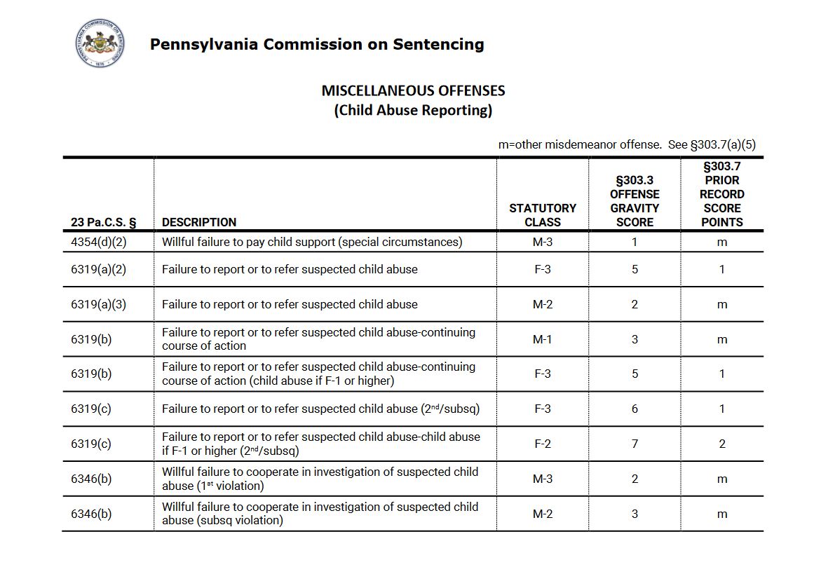

# More Scraping tables from PDFs {#scrape-table2}

In  Chapter \@ref(scrape-table) we used the package `pdftools` to scrape tables on arrests/seizures from the United States Border Patrol that were only available in a PDF. Given the importance of PDF scraping - hopefully by the time you read this chapter more data will be available in reasonable formats and not in PDFs - in this chapter we'll continue working on scraping tables from PDFs. Here we will use the package `tabulizer` which has a number of features making it especially useful for grabbing tables from PDFs. One issue which we saw in Chapter \@ref(scrape-table) is that the table may not be the only thing on the page - the page could also have a title, page number etc. When using `pdftools` we use regular expressions and subsetting to remove all the extra lines. Using `tabulizer` we can simply say (through a handy function) that we only want a part of the page, so we only scrape the table itself.  For more info about the `tabulizer` package please see their site [here](https://docs.ropensci.org/tabulizer/). 

For this chapter we'll scrape data from the Texas Commission on Jail Standards - Abbreviated Population Report for xxx. This is a report that shows monthly data on people incarcerated in jails for counties in Texas.


(available [here](https://github.com/jacobkap/crimebythenumbers/blob/master/data/7th%20Edition%20Amendment%205%20Complete%20Manual%202020.pdf).

This PDF is 9 pages long because of how many counties there are in Texas. Lets take a look at what the first page looks like. If you look at the PDF yourself you'll see that every page follows the format of the 1st page, which greatly simplifies our scrape. The data is in county-month units which means that each row of data has info for a single county in a single month. We know that because the first column is "County" and each row is a single county (this is not true is every case. For example, on page 3 there are the rows 'Fannin 1(P)' and 'Fannin 2(P)', possibly indicating that there are two jails in that county. It is unclear from this PDF what the '(P)' means.). For knowing that the data is monthly, the title of this document says 'for 06/01/2020' indicating that it is for that date, though this doesn't by itself mean the data is monthly - it could be daily based only on this data. To know that it's monthly data we'd have to go to the original source on the Texas Commisssion on Jail Standards website [here](https://www.tcjs.state.tx.us/historical-population-reports/#1580454195676-420daca6-0a306). On this page it says that 'Monthly population reports are available for review below," which tells us that the data is monthly. It's important to know the unit so you can understand the data properly - primarily so you know what kinds of questions you can answer. If someone asks whether yearly trends on jail incarceration change in Texas, you can answer that with this data. If they ask whether more people are in jail on a Tuesday than on a Friday, you can't. Just to understand what units our data is in we had to look at both the PDF itself and the site it came from. This kind of multi-step process is tedious but often necessary to truly understand your data. And even now we have questions - what does the (P) that's in some rows mean? For this we'd have to email or call the people who handle the data and ask directly. This is often the easiest way to answer your question, though different organizations have varying speeds in responding - if ever. 

Now lets look at what columns are available. 




Now lets begin scraping this data using `tabulizer`. If you don't have this package installed you'll need to install it using `install.packages("tabulizer")`. Then we'll need to run `library(tabulizer)`.

```{r}
library(tabulizer)
```


