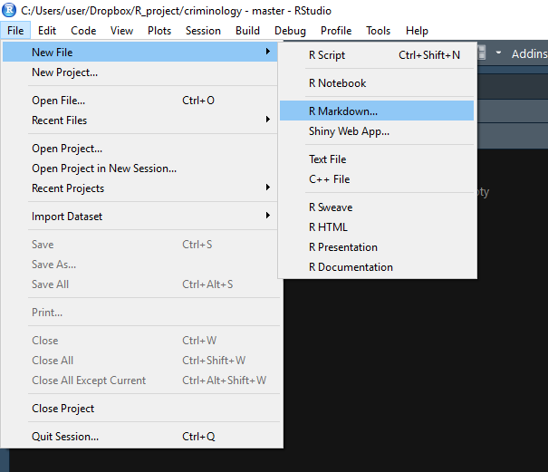
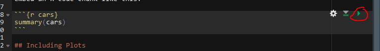
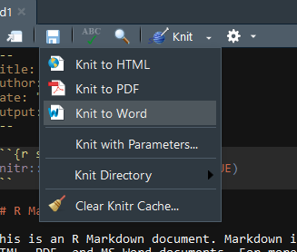

# Using R Markdown

R Markdown can help by reducing the number of things you have to think about. This guide can be used as an introduction to R Markdown, specifically for people working on a research thesis.

Markdown works nearly identical to Word. The major difference is that it allows R code and you have to do more formatting yourself. If you do use Markdown, the main advice is to **ignore formatting until the end!** Just ignore formatting until you absolutely need to. It is easiest to output to an HTML file until you are ready to format. HTML generally ignores formatting issues (such as figure alignment) that PDF or Word encounter. 

That said, let's start with making a Markdown file in RStudio.



As seen above, you make a new R Markdown file using the same menu as making an R Script file, but now select `R Markdown...`. From here it'll open up a window where you select the title, author, and type of output. You can always change all three of these selections right in the Markdown file. Selecting PDF may require you to download additional software to get it to output - some OS may already have the software installed. For a nice guide to using PDF with R Markdown, see  [here](https://medium.com/@sorenlind/create-pdf-.reports-using-r-r-markdown-latex-and-knitr-on-windows-10-952b0c48bfa9). Formatting is also trickier in PDF than in HTML or Word.


When you click OK, it will open a new R Markdown file that is already populated with example plain text and code. You can delete this entirely or modify what's there to work with what you need. 


Let's start with the text and its formatting. The first line of text shows two pound signs (#) followed by "R Markdown". When a line start with # it means that that line is a header. Sections of the thesis should start with an # to indicate a new section. There are 6 types of headers and each is smaller than the previous one (1 is biggest, 6 is smallest). Header 1 has one # (e.g. # Header 1), header 6 has 6 # (e.g. ###### Header 6). Headers after header 1 are good for making subsections.  

New paragraphs can be made by ending a line with two spaces (or, for simplicity you can just have an entire blank line between paragraphs). Though it is not common in academic writing, you can make a word (or words) italic by surrounding it by a single asterix or underscore, like *so* (\*so\*) and _so_ (\_so\_). To bold a word (or words), use two asterix, like **so** (\*\*so\*\*) and __so__ (\_\_so\_\_). Include a block quote by starting a line with > followed by your quote

> This is a block quoted. Good for multiline quotes. 

You can make tables using formatting in the text, but it's easier to do so using code. We will see that soon.

Remembering all the formatting rules gets tricky and is not a good use of your time or effort. Refer to this [reference guide](https://www.rstudio.com/wp-content/uploads/2015/03/rmarkdown-reference.pdf) for all the rules (such as how to include links in text). The reference guide includes more formatting options than noted here. [This section](http://r4ds.had.co.nz/r-markdown.html) of the free book R for Data Science is also an excellent resource. 

Again, focus on the content - write as if you were just using Word. Worry about formatting last. 

## Code

The reason R Markdown is useful is because you can include code output in the file. Here is an example before we get into using code in Markdown. Below is an arbitrary graph.

```{r}
plot(1:100, type = "h", col = "yellow",
     main = "Awful graph title")
```

If you had put this graph in your Word document and decided to change it you would have to replace it every time you made a change. While this is a minor procedure, it adds up if you have many graphs or decide to change the graph frequently. Below is the same graph with just the title and color changed. If this were my thesis, I could have changed the original code and been assured that the most up-to-date graph (or table, etc.) is always the one included with the thesis. Change the code and never think about it. 

```{r}
plot(1:100, type = "h", col = "blue",
     main = "Great graph title!")
```

### Only use code to make output

Code in R Markdown is for showing results. This means only include the code that makes the graphs, tables (including regression output), etc.. The code to read in data and clean it should remain in your R Scripts. The code you do include here should only read in the cleaned data and create the output to include in the document. 

The terminology used here will be `chunks`. This just means pieces of R code included among the plain text. All code must be in these chunks to be run. Inside a chunk, you can run any code you like. To make a chunk, click `Insert` and then `R`. It will add a chunk wherever your cursor is.

If you do not have the R Markdown file in the same folder as your data, you'll need to set the working directory in a chunk before reading the data. However, once a working directory is set, or data is read, it applies for all following chunks. You will also need to run any packages (using library()) to use them in a chunk.


```{r}

```


Notice the three \` at the top and bottom of the chunk. Don't touch these! They tell R that anything in it is a chunk (i.e. that R should run the code). Inside the squiggly brackets are instructions about how the code is outputted. Here you can specify, among other things (see reference guide for more), if the code will be outputted or just the output itself, captions for tables or graphs, and formatting for output. Include all of these options after the `r` in the squiggly brackets. Multiple options must be separated by a comma (just like options in normal R functions). The most common option is `echo` which says whether to show the code in the document or not. For the thesis you only want to show the output, not the code so include `echo = FALSE`. 

Here's an example, first with default options then with `echo = FALSE`.

```{r}
print("Hello")
```

```{r, echo = FALSE}
print("Hello")
```

Though you can't see it unless looking at the Markdown file, there are two code chunks, the second which has the `echo = FALSE` option. That is why you only see the code "print("Hello")" above the first result. 
When you make the output file (called "knitting" the file), all code chunks will run and you will see the output included in the document. To run the code inside of RStudio, click the green right-arrow at the top-right of each chunk. This will run all code in that chunk.



## Figures and Tables

Above was a code chunk that makes a graph. The only addition you will likely make to this type of code is to add a caption. Do this by adding the option `fig.cap = ""` with the caption in the quotes.

```{r, echo = FALSE, fig.cap = "This is an example figure caption"}
plot(1:100, type = "h", col = "blue",
     main = "Great graph title!")
```


There a number of packages that change how tables are displayed. We will use the basic `knitr` package. The easiest way to make a table in Markdown is to make a data.frame with all the data (and column names) you want and then show that data.frame. For this example we will subset the mtcars data (which is included in R) to just the first 5 rows and columns. The `kable` function from the `knitr` package will then make a nice looking table. With `kable` you can add the caption directly in the `kable()` function rather than using `fig.cap =""` in the chunk. The option `echo` is set to TRUE here so you can see the code without looking at the Markdown file itself. 

```{r, echo = TRUE}
library(knitr)
mtcars_small <- mtcars[1:5, 1:5]
kable(mtcars_small, caption = "This is an example table caption")
```


## Finally, making the output file

To create the Word or PDF output click `Knit` and it will create the output in the format set in the very top. To change this format click the white down-arrow directly to the right of `Knit` and it will drop-down a menu with output options. Click the option you want and it will output it in that format and change that to the new default. Sometimes it takes a while for it to output, so be patient. And sometimes it fails so just try to output again. 



Markdown has many more options than presented here. This lesson should get you through the thesis. If you are interested in Markdown, there are great resources online.
