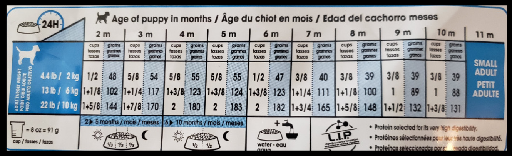

# (PART) Clean {-}

# Subsetting: Making big things small {#subsetting-intro}

For this chapter you'll need the following file, which is available for download [here](https://github.com/jacobkap/r4crimz/tree/master/data): offenses_known_yearly_1960_2020.rds.

Subsetting data is a way to take a large data set and reduce it to a smaller one that is better suited for answering a specific question. This is useful when you have a lot of data in the data set that isn't relevant to your research - for example, if you are studying crime in Colorado and have every state in your data, you'd subset it to keep only the Colorado data. Reducing it to a smaller data set makes it easier to manage, both in understanding your data and avoiding have a huge file that could slow down R. 

## Select specific values

```{r}
animals <- c("cat", "dog", "gorilla", "buffalo", "lion", "snake")
```

```{r}
animals
```

Here we have made an object called *animals* with a number of different animals in it (we'll explain what it really means to "make an object" soon). In R, we will use square brackets `[]` to select specific values in that object, something called "indexing". Put a number (or numbers) in the square bracket and it will return the value at that "index". The index is just the place number where each value is. "cat" is the first value in *animals* so it is at the first index, "dog" is the second value so it is the second index or index 2. "snake" is our last value and is the 6th value in *animals* so it is index 6 (some languages use "zero indexing" which means the first index is index 0, the second is index 1. So in our example "cat" would be index 0. R does not do that and the first value is index 1, the second is index 2 and so on.).

The syntax (how the code is written) goes

`object[index]`

First, we have the object and then we put the square bracket `[]`. We need both the object and the `[]` for subsetting to work. Let's say we wanted to choose just the "snake" from our *animals* object. In normal language we say "I want the 6th value from *animals*. We say where we're looking and which value we want. 

```{r}
animals[6]
```

Now let's get the third value.

```{r}
animals[3]
```

If we want multiple values, we can enter multiple numbers. If you have multiple values, you need to make a vector using `c()` and put the numbers inside the parentheses separated by a comma. If we wanted values 1-3, we could use `c(1, 2, 3)`, with each number separated by a comma.

```{r}
animals[c(1, 2, 3)]
```

When making a vector of sequential integers, instead of writing them all out manually we can use `first_number:last_number` like so

```{r}
1:3
```

To use it in subsetting we can treat `1:3` as if we wrote `c(1, 2, 3)`.

```{r}
animals[1:3]
```

The order we enter the numbers determines the order of the values it returns. Let's get the third index, the fourth index, and the first index, in that order.

```{r}
animals[c(3, 4, 1)]
```

Putting a negative number inside the `[]` will return all values **except** for that index, essentially deleting it. Let's remove "cat" from *animals*. Since it is the 1st item in *animals*, we can remove it like this 

```{r}
animals[-1]
```

Now let's remove multiple values, the first 3.

```{r}
animals[-c(1, 2, 3)]
```

## Assigning values to objects (Making "things") {#assignment}

Earlier we wrote `animals <- c("cat", "dog", "gorilla", "buffalo", "lion", "snake")` to make the object *animals* with the value of each of the different animals we wrote. 

We say`<-` as "gets". So above "animals gets the values cat, dog, etc.". This is read from left to right as thing on left (the name of the object) "gets" the value of the thing on the right of the `<-`. The proper terminology is that the "thing" on the left is an "object". So if we had `x <- 5` the object *x* gets the value 5. We could also say "five was assigned to x". 

The terminology is "object gets value" or "value assigned to object", both work. 

You can use the `=` instead of `<-`. Again, the thing on the left gets the value of the thing on the right even when using `=`.

```{r}
x = 2
```

*x* now has the value of the number 2.

```{r}
x
```

It is the convention in R to use `<-` instead of `=` and in some cases the `=` will not work properly. For those reasons we will use `<-` for this class. 

Earlier I said we can remove values with using a negative number and that index will be removed from the object. For example, `animals[-1]` prints every value in *animals* except for the first value.

```{r}
animals[-1]
```

However, it doesn't actually remove anything from *animals*. Let's print *animals* and see which values it returns.

```{r}
animals
```

Now the first value, "cats", is back. Why? To make changes in R you need to tell R very explicitly that you are making the change. If you don't save the result of your code (by assigning an object to it), R will run that code and simply print the results in the console panel without making any changes. 

This is an important point that a lot of students struggle with. R doesn't know when you want to save (in this context I am referring to creating or updating an object that is entirely in R, not saving a file to your computer) a value or update an object. If *x* is an object with a value of 2, and you write `x + 2`, it would print out 4 because 2 + 2 = 4. But that won't change the value of *x*. *x* will remain as 2 until you explicitly tell R to change its value. If you want to update *x* you need to run `x <- somevalue` where "somevalue" is whatever you want to change *x* to. 

So to return to our *animals* example, if we wanted to delete the first value and keep it removed, we'd need to write `animals <- animals[-1]`. Which is essentially making a new object, also called *animals* (to avoid having many, slightly different objects that are hard to keep track of we'll reuse the name) with the same values as the original *animals* except this time excluding the first value, "cats".

## Logical values and operations

We also frequently want to conditionally select certain values. Earlier we selected values indexing specific numbers, but that requires us to know exactly which values we want. We can conditionally select values by having some conditional statement (e.g. "this value is lower than the number 100") and keeping only values where that condition is true. When we talk about logical values, we mean TRUE and FALSE - in R you must spell it in all capital letters.

First, we will discuss conditionals abstractly and then we will use a real example using data from the FBI to make a data set tailored to answer a specific question.

We can use these TRUE and FALSE values to index and it will return every element which we say is TRUE. 

```{r}
animals[c(TRUE, TRUE, FALSE, FALSE, FALSE, FALSE)]
```

This is the basis of conditional subsetting. If we have a large data set and only want a small chunk based on some condition (data in a single state (or multiple states), at a certain time, at least a certain population) we need to make a conditional statement that returns TRUE if it matches what we want and FALSE if it doesn't. There are a number of different ways to make conditional statements. First let's go through some special characters involved and then show examples of each one.

For each case you are asking: does the thing on the left of the conditional statement return TRUE or FALSE compared to the thing on the right. 

  + `==  ` Equals (compared to a single value)
  + `%in%` Equals (one value match out of multiple comparisons)
  + `!=  ` Does not equal
  + `<   ` Less than
  + `>   ` Greater than
  + `<=  ` Less than or equal to
  + `>=  ` Greater than or equal to
  
Since many conditionals involve numbers (especially in criminology), let's make a new object called *numbers* with the numbers 1-10.

```{r}
numbers <- 1:10
```

### Matching a single value

The conditional `==` asks if the thing on the left equals the thing on the right. Note that it uses two equal signs. If we used only one equal sign it would assign the thing on the left the value of the thing on the right (as if we did `<-`). 

```{r}
2 == 2
```

This gives `TRUE` as we know that 2 does equal 2. If we change either value, it would give us `FALSE`.

```{r}
2 == 3
```

And it works when we have multiple numbers on the left side, such as our object called *numbers*.

```{r}
numbers == 2
```

This also works with characters such as the animals in the object we made earlier. "gorilla" is the third animal in our object, so if we check animals == "gorilla" we expect the third value to be `TRUE` and all others to be `FALSE`. Make sure that the match is spelled correctly (including capitalization) and is in quotes. 

```{r}
animals == "gorilla"
```

The `==` only works when there is one thing on the right hand side. In criminology we often want to know if there is a match for multiple things - is the crime one of the following crimes..., did the crime happen in one of these months..., is the victim a member of these demographic groups...? So we need a way to check if a value is one of many values. 

### Matching multiple values

The R operator `%in%` asks each value on the left whether or not it is a member of the set on the right. It asks, is the single value on the left hand side (even when there are multiple values such as our *animals* object, it goes through them one at a time) a match with any of the values on the right hand side? It only has to match with one of the right hand side values to be a match.

```{r}
2 %in% c(1, 2, 3) 
```

For our *animals* object, if we check if they are in the vector `c("cat", "dog", "gorilla")`, now all three of those animals will return `TRUE`.

```{r}
animals %in% c("cat", "dog", "gorilla")
```


### Does not match

Sometimes it is easier to ask what is not a match. For example, if you wanted to get every month except January, instead of writing the other 11 months, you just ask for any month that does not equal "January". 

We can use `!=`, which means "not equal". When we wanted an exact match, we used `==`, if we want a not match, we can use `!=` (this time it is only a single equals sign). 

```{r}
2 != 3
```

```{r}
"cat" != "gorilla"
```

Note that for matching multiple values with `%in%`, we cannot write `!%in%` but have to put the `!` before the values on the left.

```{r}
!animals %in% c("cat", "dog", "gorilla")
```

### Greater than or less than

We can use R to compare values using greater than or less than symbols. We can also express "greater than or equal to" or "less than or equal to."

```{r}
6 > 5
```

```{r}
6 < 5
```

```{r}
6 >= 5
```

```{r}
5 <= 5
```

When used on our object *numbers* it will return 10 values (since *numbers* is 10 elements long) with a `TRUE` if the condition is true for the element and `FALSE` otherwise. Let's run `numbers > 3`. We expect the first 3 values to be `FALSE` as 1, 2, and 3 are not larger than 3.

```{r}
numbers > 3
```

### Combining conditional statements - or, and

In many cases when you are subsetting you will want to subset based on more than one condition. These "conditional statements" can be tricky for new R users since you need to remember both what conditions you need *and* the R code to write it. For a simple introduction to combining conditional statements, we'll first start with the dog food instructions for my new puppy Peanut.


Here, the instructions indicate how much food to feed your dog each day. Then instructions are broken down into dog age **and** expected size (in pounds/kilograms) and the intersection of these tells you how much food to feed your dog. Even once you figure out how much to feed the dog, there's another conditional statement to figure out whether you feed them twice a day or three times a day. 




This food chart is basically a conditional statement matrix where you match the conditions on the left side with those on the right side to figure out how much to feed your dog.^[If you encounter some conditional statements that confuse you - which will be more common and you combine many statements together - I encourage you to make a matrix like this yourself. Even if it isn't that complicated, I think it's easier to see it written down than to try to keep all of the possible conditions in your head.] 

So if we wanted to figure out how much to feed a dog that is three months old and will be 4.4 pounds, we'd use the first row on the left (which says 4.4 pounds/2.2 kilograms) and the second columns (which says three months old). When the dog gets to be four months old we'd keep the same row but now move one column to the right. In normal English you'd say that the dog is four months old and their expected size is 4.4 pounds (2 kg). The language when talking about (and writing code for) a conditional statement in programming is a bit more formal where every condition is spoken as a yes or no question. Here we ask is the dog four months old? **and** is the expected weight 4.4 pounds. If both are true, then we give the dog the amount of food shown for those conditions. If only one is true, then the whole thing is wrong - we wouldn't want to underfeed or overfeed our dog. In this example, a two four old dog can eat between 5/8th of a cup of food and two cups depending on their expected size. So having only one  condition be true isn't enough. 

Can you see any issue with this conditional statement matrix? It doesn't cover the all possible choices for age and weight combinations. In fact, it is really quite narrow in what it does cover. For example, it covers two and three months, but not any age in between. We can assume that a dog that is 2.5 months old would eat the average of two and three month meal amounts, but wouldn't know for sure. When making your own statements please consider what conditions I am checking for - and, importantly, what I'm leaving out.

For a real data example, let's say you have crime data from every state between 1960 and 2017. Your research question is "did Colorado's marijuana legalization affect crime in the state?" In that case you want only data from Colorado. Since legalization began in January 2014, you wouldn't need every year, only years some period of time before and after legalization to be able to measure its effect. So you would need to subset based on the state and the year. 

To make conditional statements with multiple conditions we use `|` for "or" and `&` for "and". 

`Condition 1 | Condition 2 `

```{r}
2 == 3 | 2 > 1
```

As it sounds, when using `|` as long as at least one condition is true (we can include as many conditions as we like)  it will return `TRUE`. 

`Condition 1 & Condition 2`

```{r}
2 == 3 & 2 > 1
```

For `&`, all of the conditions must be true. If even one condition is not true it will return `FALSE`.

## Subsetting a data.frame 

Earlier we were using a simple vector (collection of values). In this class - and in your own work - you will usually work on an entire data set. These generally come in the form called a "data.frame" which you can imagine as being like an Excel file with multiple rows and columns. 

Let's load in data from the Uniform Crime Report (UCR), an FBI data set that we'll work on in a later lesson. This data has crime data every year from 1960-2020 and for nearly every agency in the country.

```{r}
offenses_known_yearly_1960_2020 <- readRDS("data/offenses_known_yearly_1960_2020.rds")
```

Let's peak at the first 6 rows and 6 columns using the square bracket notation `[]` for data.frames which we'll explain more below.

```{r}
offenses_known_yearly_1960_2020[1:6, 1:6]
```

The first 6 rows appear to be agency identification info for Anchorage, Alaska from 2017-2012. For good measure let's check how many rows and columns are in this data. This will give us some guidance on subsetting which we'll see below. `nrow()` gives us the number of rows and `ncol()` gives us the number of columns.

```{r}
nrow(offenses_known_yearly_1960_2020)
```

```{r}
ncol(offenses_known_yearly_1960_2020)
```

This is a large file with 159 columns and nearly a million rows. Normally we wouldn't want to print out the names of all 159 columns but let's do this here as we want to know the variables available to subset.

```{r}
names(offenses_known_yearly_1960_2020)
```

Now let's discuss how to subset this data into a smaller data set to answer a specific question. Let's subset the data to answer our above question of "did Colorado's marijuana legalization affect crime in the state?" Like mentioned above, we need data just from Colorado and just for years around the legalization year - we can do 2011-2017 for simplicity. 

We also don't need all 159 columns in the current data. Let's say we're only interested in if murder changes. We'd need the column called *actual_murder*, the *state* column (as a check to make sure we subset only Colorado), the *year* column, the *population* column, the *ori* column, and the *agency_name* column (a real analysis would likely grab geographic variables too to see if changes depended on location but here we're just using it as an example). The last two columns - *ori* and *agency_name* - aren't strictly necessary but would be useful if checking if an agency's values are reasonable when checking for outliers, a step we won't do here. 

Before explaining how to subset from a data.frame, let's write pseudocode (essentially a description of what we are going to do that is readable to people but isn't real code) for our subset.

We want 

  * Only rows where the state equals Colorado
  * Only rows where the year is 2011-2017
  * Only the following columns: *actual_murder*, *state*, *year*, *population*, *ori*, *agency_name*

### Select specific columns

The way to select a specific column in R is called the dollar sign notation. 

`data$column`

We write the data name followed by a `$` and then the column name. Make sure there are no spaces, quotes, or misspellings (or capitalization issues). Just the `data$column` exactly as it is spelled. Since we are referring to data already read into R, there should not be any quotes for either the data or the column name. 

We can do this for the column *agency_name* in our UCR data. If we wrote this in the console it would print out every single row in the column. Because this data is large (nearly a million rows), I am going to wrap this in `head()` so it only displays the first 6 rows of the column rather than printing the entire column.

```{r}
head(offenses_known_yearly_1960_2020$agency_name)
```

They're all the same name because Anchorage Police reported many times and are in the data set multiple times. Let's look at the column *actual_murder* which shows the annual number of murders in that agency. 

```{r}
head(offenses_known_yearly_1960_2020$actual_murder)
```

One hint is to write out the data set name in the console and hit the Tab key. Wait a couple of seconds and a popup will appear listing every column in the data set. You can scroll through this and then hit enter to select that column.


### Select specific rows

In the earlier examples we used square bracket notation `[]` and just put a number or several numbers in the `[]`. When dealing with data.frames, however, you need an extra step to tell R which columns to keep. The syntax in the square bracket is 

`[row, column]`

As we did earlier, we start in the square bracket by saying which row we want. Now, since we also have to consider the columns, we need to tell it the number or name (in a vector using `c()` if more than one name and putting column names in quotes) of the column or columns we want. 

The exception to this is when we use the dollar sign notation to select a single column. In that case we don't need a comma (and indeed it will give us an error!). Let's see a few examples and then explain why this works the way it does. 


```{r}
offenses_known_yearly_1960_2020[1, 1]
```

If we input multiple numbers, we can get multiple rows and columns.

```{r}
offenses_known_yearly_1960_2020[1:6, 1:6]
```

The column section also accepts a vector of the names of the columns. These names must be spelled correctly and in quotes.

```{r}
offenses_known_yearly_1960_2020[1:6, c("ori", "year")]
```


In cases where we want every row or every column, we just don't put a number. By default, R will return every row/column if you don't specify which ones you want. However, you will still need to include the comma.

Here is every column in the first row.

```{r}
offenses_known_yearly_1960_2020[1, ]
```

Since there are 159 columns in our data, normally we'd want to avoid printing out all of them. And in most cases, we would save the output of subsets to a new object to be used later rather than just printing the output in the console. 

What happens if we forget the comma? If we put in numbers for both rows and columns but don't include a comma between them it will have an error.

```{r error = TRUE}
offenses_known_yearly_1960_2020[1 1]
```

If we only put in a single number and no comma, it will return the column that matches that number. Here we have number 1 and it will return the first column. We'll wrap it in `head()` so it doesn't print out a million rows.

```{r}
head(offenses_known_yearly_1960_2020[1])
```

Since R thinks you are requesting a column, and we only have 159 columns in the data, asking for any number above 159 will return an error.

```{r error = TRUE}
head(offenses_known_yearly_1960_2020[1000])
```

If you already specify a column using dollar sign notation `$`, you do not need to indicate any column in the square brackets`[]`. All you need to do is say which row or rows you want. 

```{r}
offenses_known_yearly_1960_2020$agency_name[15]
```

So make sure when you want a row from a data.frame you always include the comma!

### Subset Colorado data

Finally we have the tools to subset our UCR data to just be Colorado from 2011-2017. There are three conditional statements we need to make, two for rows and one for columns.

  * Only rows where the state equals Colorado
  * Only rows where the year is 2011-2017
  * Only the following columns: actual_murder, state, year, population, ori, agency_name

We could use the `&` operator to say rows must meet condition 1 and condition 2. Since this is an intro lesson, we will do them as two separate conditional statements. For the first step we want to get all rows in the data where the state equals "colorado" (in this data all state names are lowercase). And at this point we want to keep all columns in the data. So let's make a new object called *colorado* to save the result of this subset.

Remember that we want to put the object to the left of the `[]` (and touching the `[]`) to make sure it returns the data. Just having the conditional statement will only return TRUE or FALSE values. Since we want all columns, we don't need to put anything after the comma (but we must include the comma!).

```{r}
colorado <- offenses_known_yearly_1960_2020[offenses_known_yearly_1960_2020$state == "colorado", ]
```

Now we want to get all the rows where the year is 2011-2017. Since we want to check if the year is one of the years 2011-2017, we will use `%in%` and put the years in a vector `2011:2017`. This time our primary data set is *colorado*, not *offenses_known_yearly_1960_2020* since *colorado* has already subsetted to just the state we want. This is how subsetting generally works. You take a large data set, subset it to a smaller one and continue to subset the smaller one to only the data you want. 

```{r}
colorado <- colorado[colorado$year %in% 2011:2017, ]
```

Finally we want the columns stated above and to keep every row in the current data. Since the format is `[row, column]` in this case we keep the "row" part blank to indicate that we want every row.

```{r}
colorado <- colorado[ , c("actual_murder", "state", "year", "population", "ori", "agency_name")]
```

We can do a quick check using the `unique()` function. The `unique()` prints all the unique values in a category, such as a column. We will use it on the *state* and *year* columns to make sure only the values that we want are present.

```{r}
unique(colorado$state)
```

```{r}
unique(colorado$year)
```

The only state is Colorado and the only years are 2011-2017 so our subset worked! This data shows the number of murders in each agency. We want to look at state trends so in Section \@ref(aggregate) we will sum up all the murders per year and see if marijuana legalization affected it. 