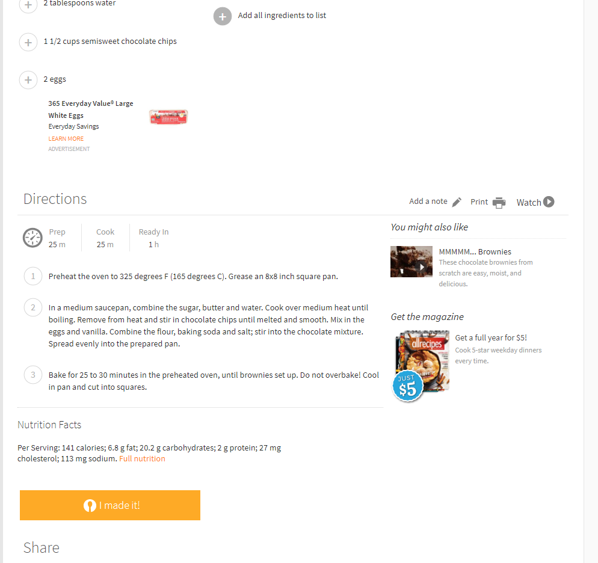
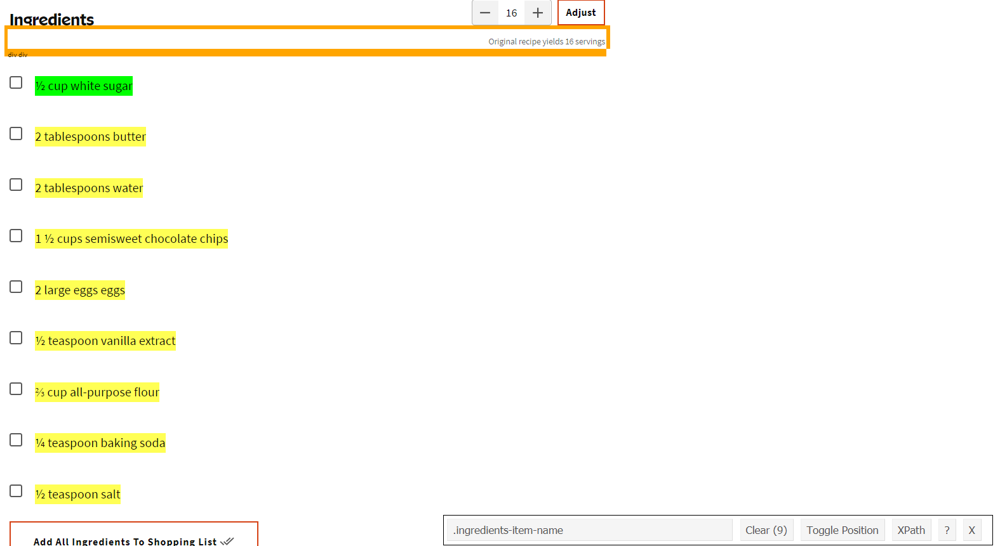
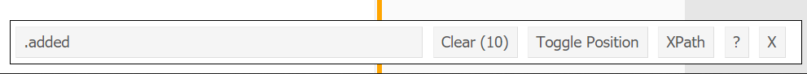
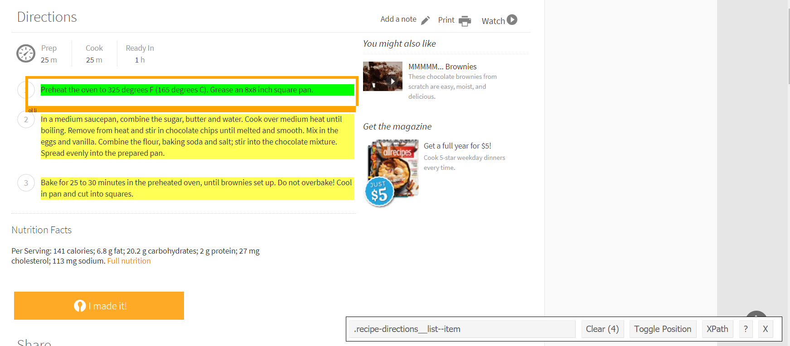

# (PART) Collect {-}

# Webscraping with `rvest`

If I ever stop working in the field of criminology, I would certainly be a baker. So for the next few chapters we are going to work working with "data" on baking. What we'll learn to do is find a recipe from the website [All Recipes](https://www.allrecipes.com/) and webscrape the ingredients and directions of that recipe.     

For our purposes we will be using the package [`rvest`](https://github.com/tidyverse/rvest). This package makes it relatively easy to scrape data from websites, especially when that data is already in a table on the page as our data will be.

If you haven't done so before, make sure to install `rvest`.

```{r eval = FALSE}
install.packages("rvest")
```

And every time you start R, if you want to use `rvest` you must tell R so by using `library()`.

```{r}
library(rvest)
```

Here is a screenshot of the recipe for "MMMMM... Brownies" (an excellent brownies recipe) [that page](https://www.allrecipes.com/recipe/25080/mmmmm-brownies/?internalSource=hub%20recipe&referringContentType=Search).





## Scraping one page

In later lessons we'll learn how to scrape the ingredients of any recipe of the site. For now, we'll focus on just getting data for our brownies recipe.

The first step to scraping a page is to read in that page's information to R using the function `read_html()` from the `rvest` package. The input for the () is the URL of the page we want to scrape. In a later lesson, we will manipulate this URL to be able to scrape data from many pages. 

```{r}
read_html("https://www.allrecipes.com/recipe/25080/mmmmm-brownies/")
```

When running the above code, it returns an XML Document. The `rvest` package is well suited for interpreting this and turning it into something we already know how to work with. To be able to work on this data, we need to save the output of `read_html()` into an object which we'll call *brownies* since that is our end goal. 

```{r}
brownies <- read_html("https://www.allrecipes.com/recipe/25080/mmmmm-brownies/")
```

We now need to select only a small part of page which has the relevant information - in this case the ingredients and directions.

We need to find just which parts of the page to scrape. To do so we'll use the helper tool [SelectorGadget](https://selectorgadget.com/), a Google Chrome extension that lets you click on parts of the page to get the CSS selector code that we'll use. Install that extension in Chrome and go to the [brownie recipe page](https://www.allrecipes.com/recipe/25080/mmmmm-brownies/?internalSource=hub%20recipe&referringContentType=Search).

When you open SelectorGadget it allows you click on parts of the page and it will highlight every similar piece and show the CSS selector code in the box near the bottom. Here we clicked on the first ingredient - "1/2 cup white sugar". Every ingredient is highlighted in yellow as (to oversimplify this explaination) these ingredients are the same "type" in the page. It also highlighted the text "Add all ingredients to list" which we don't want. As it is always the last line of text in ingredients, we'll leave it in for now and practice subsetting data through R to remove it.



Note that in the bottom right of the screen, the SelectorGadget bar now has the text ".added". This is the CSS selector code we can use to get all of the ingredients. 



We will use the function `html_nodes()` to grab the part of the page (based on the CSS selectors) that we want. The input for this function is first the object made from `read_html()` (which we called *brownies*) and then we can paste the CSS selector text - in this case, ".added". We'll save the resulting object as *ingredients* since we want to use *brownies* to also get the directions. 

```{r}
ingredients <- html_nodes(brownies, ".added")
```

Since we are getting data that is a text format, we need to tell `rvest` that the format of the scraped data is text. We do with using `html_text()` and our input in the () is the the object made in the function `html_text()`.  

```{r}
ingredients <- html_text(ingredients)
```

Now let's check what we got. 

```{r}
ingredients
```

We have successfully scraped the ingreidents for this brownies recipes - plus the "Add all ingredients to list" (copied twice for some reason). 

Now let's do the same process to get the directions for baking. 

In SelectorGadget click clear to unselect the ingredients. Now click one of in lines of directions. It'll highlight all three directions as they're all of the same "type" (to be slightly more specific, when the site is made it has to put all of the pieces of the site together, such as links, photos, the section of ingredients, the section on directions, the section on reviews. So in this case we selected a "text" type in the section on directions and SelectorGadget then selected all "text" types inside of that section.). 



The CSS selector code this time is ".recipe-directions__list--item" so we can put that inside of `html_nodes()`. Let's save the output as *directions*.

```{r}
directions <- html_nodes(brownies, ".recipe-directions__list--item")
directions <- html_text(directions)
```

Did it work?

```{r}
directions
```

Yes! The final value in our vector is blank so we will have to remove that. 

## Cleaning the webscraped data

We only have three things to do to clean the data. First, we need to remove the "Add all ingredients to list" from the *ingredients* object. Second, we will remove the blank value ("") from the *directions* object. For both tasks we'll do conditional subsetting to keep all values that do *not* equal those values. Finally, the directions print out with the text `\n` at the end. This indicates that it is the end of the line but we'll want to remove that, which we can do using `gsub()`. 

For let's try out the condition of *ingredients* that do not equal the string "Add all ingredients to list".

```{r}
ingredients != "Add all ingredients to list"
```

It returns TRUE for all values except the last two, the ones which do equal "Add all ingredients to list". Let's only keep the elements without this string. 

```{r}
ingredients <- ingredients[ingredients != "Add all ingredients to list"]
```

And we can do the same thing for the empty string in *directions*.

```{r}
directions <- directions[directions != ""]
```

To remove the `\n` we simple find that in `gsub()` and replace it with a blank string. 

```{r}
directions <- gsub("\n", "", directions)
```

And let's print out both objects to make sure it worked. 

```{r}
ingredients
directions
```

Now *ingredients* is as it should be but *directions* has a bunch of space at the end of the string. Let's use `gsub()` again to remove multiple spaces.

We'll search for anything with two or more spaces and replace that with an empty string.

```{r}
directions <- gsub(" {2,}", "", directions)
```

And one final check to make sure it worked.

```{r}
directions
```


In your own research, you will want to create a data.frame (or equivalent) for nearly all data - this is also the way most statistical analysis packages expect data. In our case it doesn't make sense to do so. We'll keep them separate for now and in Chapter \@ref(functions) we'll learn to make a function to scrape any recipe using just the URL and to print the ingredients and directions in the console.  